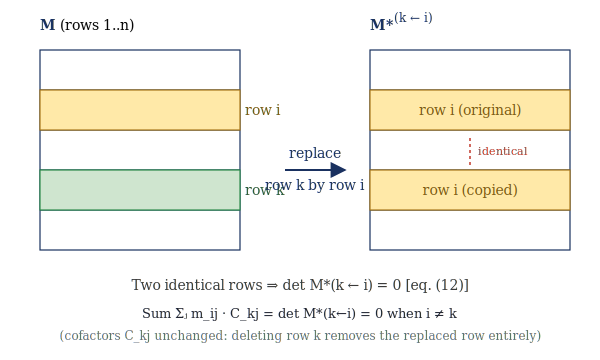
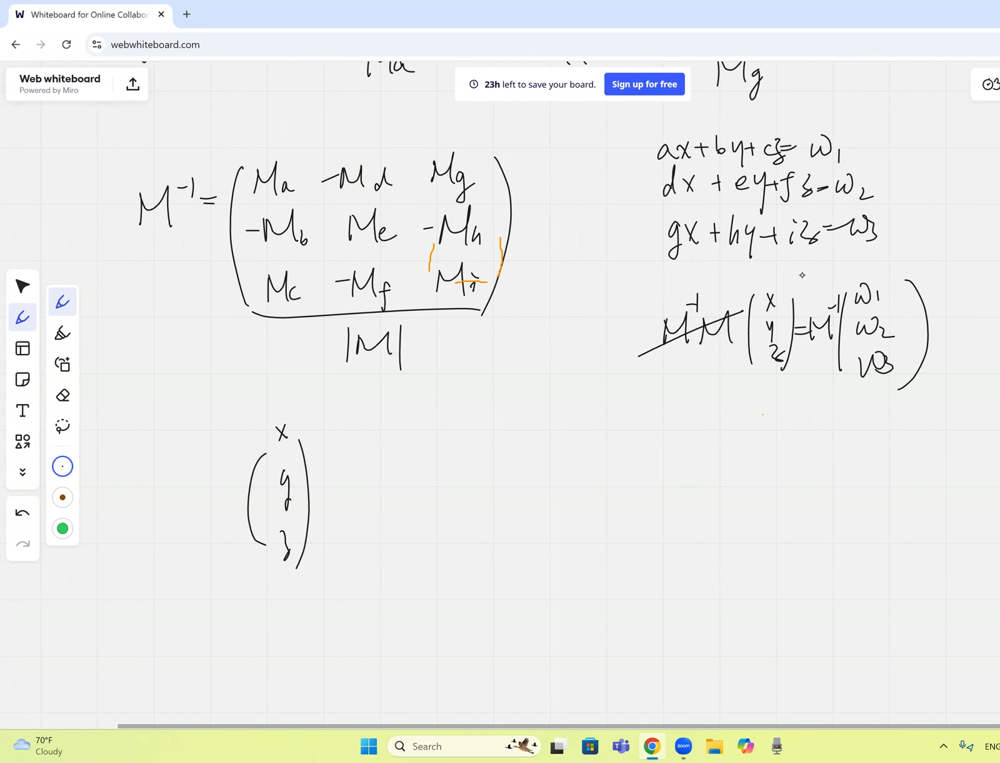
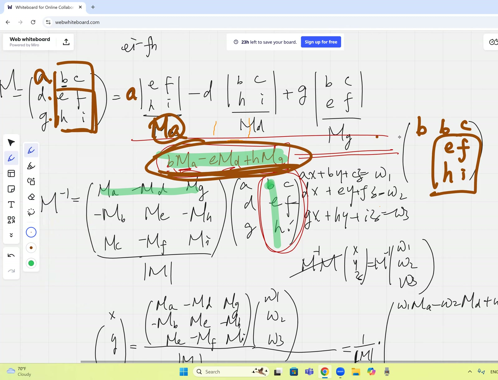
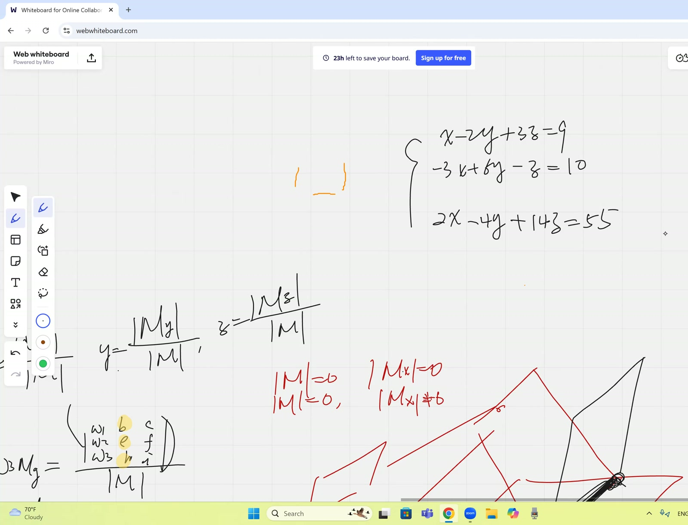
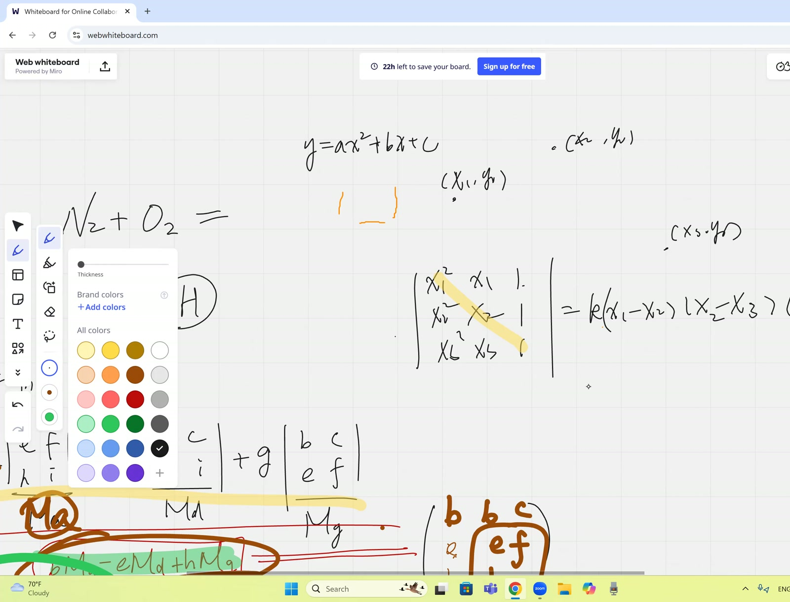

## Lead

Continuation of the [morning session](2025-10-11-morning.html): completes the cofactor inverse formula proof by showing the **off-diagonal entries of $M \cdot \operatorname{adj}(M)$ are zero** via the determinant-with-repeated-columns trick, then derives **Cramer's rule explicitly** by reading off $\mathbf{x} = M^{-1}\mathbf{w}$ component by component. Closes by introducing the **classification of linear systems** by the determinant of $M$ and the numerator determinants $\det M^{(j\leftarrow\mathbf{w})}$ — unique / no / infinite solutions — and works a concrete $3 \times 3$ singular consistent example.

## Symbol dictionary

Same conventions as the [morning session](2025-10-11-morning.html); we restate only the symbols actually used below.

::: {.symbol-dictionary}
| Symbol | Meaning |
|---|---|
| $M \in \mathbb{R}^{n\times n}$, $m_{ij}$ | matrix and its scalar entries |
| $C_{ij} = (-1)^{i+j}\det\widetilde{M}_{ij}$ | cofactor of $m_{ij}$ |
| $\operatorname{adj}(M)$ | adjugate: $[\operatorname{adj}(M)]_{ij} = C_{ji}$ |
| $\mathbf{w} \in \mathbb{R}^n$ | RHS of the linear system |
| $M^{(j\leftarrow \mathbf{w})}$, $M_x, M_y, M_z$ | $M$ with column $j$ (resp. $x$, $y$, $z$) replaced by $\mathbf{w}$ |
| $M^*_{(k \to i)}$ | $M$ with row $k$ replaced by row $i$ — contains *two identical rows* |
| $\operatorname{col}(M)$, $\operatorname{rank}(M)$ | column space and its dimension |
:::

## Primitive notions and assumptions

1. Field is $\mathbb{R}$; $n$ finite. Statements work over $\mathbb{C}$ unchanged.
2. **Cofactor expansion** of $\det M$ along any row or column is valid (imported).
3. **Determinant with two identical rows/columns is zero** — geometrically, the parallelepiped collapses.
4. The morning session's diagonal-entry computation $\sum_j m_{ij} C_{ij} = \det M$ — we re-use it here.

::: {.callout-note collapse="true"}
## Prerequisites

- Cofactor inverse construction (morning session, eq. (16) — diagonal part proved, off-diagonal pending here)
- Cramer's rule statement (morning session, eq. (15))
- 3-plane intersection geometry as the geometric picture of three linear equations in three unknowns
:::

## Topics covered

- Off-diagonal proof: $\sum_j m_{ij} C_{kj} = 0$ for $i \ne k$ via the $M^*$ construction
- Explicit derivation of Cramer's rule by reading $\mathbf{x} = M^{-1}\mathbf{w}$ component by component
- Classification of $M\mathbf{x} = \mathbf{w}$ by $(\det M, \det M^{(j\leftarrow\mathbf{w})})$
- Geometric picture: three planes in $\mathbb{R}^3$ and the configurations that produce 1, 0, or $\infty$ solutions
- Worked example: $\,x - 2y + 3z = 9$, $-3x + 6y - z = 10$, $2x - 4y + 14z = 55$ — singular, classified

## Theorems

::: {.theorem}
**(Off-diagonal cofactor identity).** For any $M\in\mathbb{R}^{n\times n}$ and any $i \ne k$,
$$
\sum_{j=1}^{n} m_{ij}\,C_{kj} \;=\; 0. \tag{21}
$$
Combined with the diagonal identity $\sum_j m_{ij} C_{ij} = \det M$ from the morning, this gives $M \cdot \operatorname{adj}(M) = (\det M) \cdot I$, hence
$$
M^{-1} \;=\; \frac{\operatorname{adj}(M)}{\det M}. \tag{22}
$$
:::

::: {.theorem}
**(Cramer's rule, derived).** For $M\in\mathbb{R}^{n\times n}$ with $\det M\ne 0$ and $\mathbf{w}\in\mathbb{R}^n$, the unique solution of $M\mathbf{x}=\mathbf{w}$ satisfies
$$
x_j \;=\; \frac{\det M^{(j\leftarrow\mathbf{w})}}{\det M},\qquad j=1,\dots,n. \tag{23}
$$
:::

::: {.theorem}
**(Existence/uniqueness classification).** Let $M\in\mathbb{R}^{n\times n}$ and $\mathbf{w}\in\mathbb{R}^n$. The system $M\mathbf{x} = \mathbf{w}$ has:

- **(a) a unique solution**, iff $\det M \ne 0$;
- **(b) no solution**, if $\det M = 0$ but some $\det M^{(j\leftarrow\mathbf{w})} \ne 0$;
- **(c) infinitely many solutions**, if $\det M = 0$ and *all* $\det M^{(j\leftarrow\mathbf{w})} = 0$ — *provided* the system is consistent. (The teacher gives the consistent case in class; the rank-deficient inconsistent edge case is flagged in fragility below.)
:::

## Derivation of Theorem 21 (off-diagonal cofactor identity)

Construct the auxiliary matrix
$$
M^*_{(k \to i)} \;:=\; \text{matrix }M\text{ with row $k$ replaced by row $i$ of }M.
$$
After the substitution, $M^*$ has row $i$ and row $k$ both equal to row $i$ of $M$ — two identical rows. By the determinant-with-repeated-rows lemma, $\det M^*_{(k\to i)} = 0$.

Now expand $\det M^*_{(k\to i)}$ along *row $k$*:
$$
\det M^*_{(k\to i)} \;=\; \sum_{j=1}^{n}\,(\text{row $k$ entry of }M^*)_j \cdot C^*_{kj}. \tag{24}
$$
The row-$k$ entries of $M^*$ are $m_{i1}, m_{i2}, \dots, m_{in}$ (we replaced row $k$ with row $i$). The cofactors $C^*_{kj}$ are computed from $M^*$ by deleting row $k$ and column $j$ — but **deleting row $k$ removes the substituted row entirely**, leaving exactly the same $(n-1)\times(n-1)$ submatrix as deleting row $k$ from the original $M$. Hence $C^*_{kj} = C_{kj}$ (the original cofactor).

Combining: $\sum_j m_{ij}\,C_{kj} = \det M^*_{(k\to i)} = 0$. $\quad\blacksquare$



## Derivation of Theorem 22 (cofactor inverse formula completed)

Diagonal entries of $M \cdot \operatorname{adj}(M)$: $\sum_j m_{ij} C_{ij} = \det M$ (morning session).
Off-diagonal entries: $\sum_j m_{ij} C_{kj} = 0$ for $i \ne k$ (Theorem 21).

So $M \cdot \operatorname{adj}(M) = (\det M) \cdot I$. Dividing by $\det M$ (non-zero by hypothesis) gives (22). $\quad\blacksquare$

## Derivation A of Theorem 23 (Cramer via $\mathbf{x} = M^{-1}\mathbf{w}$)

Apply (22) to $M\mathbf{x} = \mathbf{w}$: $\mathbf{x} = M^{-1}\mathbf{w} = \tfrac{1}{\det M}\operatorname{adj}(M)\,\mathbf{w}$. The $j$-th component:
$$
x_j \;=\; \frac{1}{\det M}\sum_{k=1}^{n}[\operatorname{adj}(M)]_{jk}\,w_k \;=\; \frac{1}{\det M}\sum_{k=1}^{n} C_{kj}\,w_k. \tag{25}
$$
The sum $\sum_k C_{kj} w_k$ is the cofactor expansion along column $j$ of the matrix $M^{(j\leftarrow\mathbf{w})}$ (replace column $j$ entries by $w_1,\dots,w_n$; cofactors along that column are unchanged from $M$ because deleting column $j$ removes the replaced column). So the sum equals $\det M^{(j\leftarrow\mathbf{w})}$, giving (23). $\quad\blacksquare$

## Derivation B of Theorem 23 (independent — direct elimination at $n = 2$ then induction)

For $n = 2$: $M = \begin{pmatrix}a&b\\c&d\end{pmatrix}$, $\mathbf{w} = \begin{pmatrix}w_1\\w_2\end{pmatrix}$. Solving by elimination:
$$
x_1 = \frac{w_1 d - b w_2}{ad-bc}, \qquad x_2 = \frac{a w_2 - c w_1}{ad-bc}.
$$
The numerator of $x_1$ is $\det\begin{pmatrix}w_1&b\\w_2&d\end{pmatrix} = \det M^{(1\leftarrow\mathbf{w})}$; numerator of $x_2$ is $\det\begin{pmatrix}a&w_1\\c&w_2\end{pmatrix} = \det M^{(2\leftarrow\mathbf{w})}$; denominator is $\det M$. (23) holds.

For general $n$: induction on $n$, expanding $\det M^{(j\leftarrow\mathbf{w})}$ along the $\mathbf{w}$-column and applying the inductive hypothesis to each $(n-1)\times(n-1)$ minor. *Note on independence.* Derivation A imports Theorem 22 (the just-proved inverse formula); Derivation B uses only cofactor expansion and elimination. No circular dependency.

## Derivation of Theorem 24 (classification)

**Case (a) $\det M \ne 0$:** $M^{-1}$ exists by (22), so $\mathbf{x} = M^{-1}\mathbf{w}$ is the unique solution. Cramer's rule (23) gives an explicit formula. ✓

**Case (b) $\det M = 0$ but some $\det M^{(j\leftarrow\mathbf{w})} \ne 0$:** From the singular-dichotomy analysis (cf. [2026-03-07-cramer-review](2026-03-07-cramer-review.html), Theorem 10), this happens iff $\mathbf{w} \notin \operatorname{col}(M)$ and $\operatorname{rank}(M) = n-1$. Cramer's formula gives $x_j = (\text{nonzero})/0$, geometrically interpreted as $x_j = \infty$ — no solution exists. ✓

**Case (c) $\det M = 0$ and all $\det M^{(j\leftarrow\mathbf{w})} = 0$:** The teacher describes this as "$0/0$, indeterminate" and asserts (provided the system is consistent — see fragility below) it implies infinitely many solutions. Geometrically: the three planes share a common line, or all coincide.

The lesson works the example
$$
\begin{cases} x - 2y + 3z = 9\\ -3x + 6y - z = 10\\ 2x - 4y + 14z = 55 \end{cases}
$$
with $\det M = 0$ (verified by direct expansion). Computing $\det M^{(1)}, \det M^{(2)}, \det M^{(3)}$ all give zero, and the teacher confirms in class that the system is consistent. Conclusion: **infinitely many solutions**. $\quad\blacksquare$ (modulo consistency check; see fragility)

## Verification audit

::: {.audit}

- **$n=2$ off-diagonal check.** For $M = \begin{pmatrix}a&b\\c&d\end{pmatrix}$: $\sum_j m_{1j} C_{2j} = a \cdot (-b) + b \cdot a = 0$. ✓ Matches (21).
- **Cramer at $n=2$ unique case.** $M = \begin{pmatrix}2&1\\1&3\end{pmatrix}$, $\mathbf{w} = (5, 6)$: $\det M = 5$, $\det M_x = \det\begin{pmatrix}5&1\\6&3\end{pmatrix} = 9$, $\det M_y = \det\begin{pmatrix}2&5\\1&6\end{pmatrix} = 7$. So $x = 9/5, y = 7/5$. Substituting: $2(9/5) + 7/5 = 25/5 = 5$ ✓; $9/5 + 3(7/5) = 30/5 = 6$ ✓.
- **Classification at $\det M = 0$ inconsistent case.** $M = \begin{pmatrix}1&2\\2&4\end{pmatrix}$, $\mathbf{w} = (1, 3)$: $\det M = 0$, $\det M_x = \det\begin{pmatrix}1&2\\3&4\end{pmatrix} = -2 \ne 0$. Case (b): no solution. Substitute candidate: from row 1, $x + 2y = 1$, so $2x + 4y = 2 \ne 3$ — inconsistent. ✓
- **Classification at $\det M = 0$ consistent case.** Same $M$, $\mathbf{w} = (1, 2)$: $\det M = 0$, $\det M_x = \det\begin{pmatrix}1&2\\2&4\end{pmatrix} = 0$, $\det M_y = \det\begin{pmatrix}1&1\\2&2\end{pmatrix} = 0$. Case (c): infinitely many. Verify: $x + 2y = 1$, $2x + 4y = 2$ — same line, $x = 1 - 2t, y = t$. ✓
- **Dependency check.** Theorem 21 uses determinant-with-repeated-rows. Theorem 22 uses 21 + morning diagonal. Theorem 23 (A) uses 22; (B) uses elimination only. Theorem 24 uses 22 and (for case b) the rank-deficiency analysis from the cramer-review session. No circularity. ✓

:::

## Lecture video

```{=html}
<video controls width="100%" preload="metadata" style="border-radius:6px;">
  <source src="https://github.com/chyj2026/linalg/releases/download/v0.2/2025-10-11-afternoon.mp4" type="video/mp4">
  Your browser does not support HTML5 video.
</video>
<p style="text-align:center;font-size:0.85em;color:#6b7280;margin-top:0.4em;">
  60 min · H.264 3240×2160 · 102 MB · hosted on
  <a href="https://github.com/chyj2026/linalg/releases/tag/v0.2" target="_blank">GitHub Release v0.2</a>
  · also viewable in <a href="https://drive.google.com/file/d/161t2BKBd9ehRYbzvu6zTEBtruROP45KB/view" target="_blank">Google Drive</a>
</p>
```

## Key frames









## Dependency map

```{mermaid}
flowchart TB
    A["Diagonal: Σⱼ m_ij C_ij = det M<br/><i>(morning session)</i>"] --> F
    B["Determinant with repeated rows = 0<br/><i>(imported)</i>"] --> C["Construct M*(k→i):<br/>replace row k by row i"]
    C --> D["det M*(k→i) = 0<br/>(two equal rows)"]
    C --> E["Cofactor expansion along row k:<br/>det M*(k→i) = Σⱼ m_ij C_kj<br/>eq. (24)"]
    D --> G["Σⱼ m_ij C_kj = 0 for i≠k<br/>Theorem 21 (eq. 21)"]
    E --> G
    G --> F["M·adj(M) = det(M)·I<br/>⇒ M⁻¹ = adj(M)/det M<br/>Theorem 22 (eq. 22)"]
    F --> H["x = M⁻¹·w component-wise<br/>eq. (25)"]
    H --> I["Cramer's rule:<br/>x_j = det M^(j←w) / det M<br/>Theorem 23 (eq. 23)"]
    F --> J["det M ≠ 0 ⇒ unique solution<br/>Case (a)"]
    K["Singular dichotomy<br/><i>(developed Mar 7)</i>"] --> L["det M = 0:<br/>(b) some det M^(j) ≠ 0 ⇒ no solution<br/>(c) all det M^(j) = 0 ⇒ infinite (if consistent)"]
    J --> M["Classification Theorem 24"]
    L --> M
```

## Worked Socratic exchanges

::: {.exchange}
<span class="speaker">Teacher:</span> "Look at this sum $b \cdot M_a - e \cdot M_d + h \cdot M_g$. Does it look like a determinant?"
<br><span class="speaker">Helms:</span> "Yes, but there's a mismatch. The $M_a$ goes with $a$, but it's multiplied by $b$."
<br><span class="speaker">Teacher:</span> "Right. So *what matrix* would have this sum as its column expansion?"
<br><span class="speaker">Helms:</span> *(after thought)* "The matrix with the first column replaced by $b, e, h$ — same as the second column of $M$."
<br><span class="speaker">Teacher:</span> "Two identical columns. Hence zero. Brilliantly recovered."

*Teaching move:* the "force the sum into a determinant" pattern — when an expression *looks* like a column expansion, fabricate the smallest matrix that exhibits it, then exploit a structural symmetry.
:::

::: {.exchange}
<span class="speaker">Teacher (to Elaine):</span> "If $\det M = 0$, when do we have infinitely many vs no solutions?"
<br><span class="speaker">Elaine:</span> "If the determinant of $M_x$ is also zero, infinitely many; otherwise, no solution."
<br><span class="speaker">Teacher:</span> "Right. The dichotomy holds on a single $M_x$ — it propagates to all $M_y, M_z, \dots$ automatically."

*Teaching move:* you only need to test *one* coordinate to classify the entire system. The teacher previews this as a homework theorem (proved in [2026-03-07 cramer-review](2026-03-07-cramer-review.html), Theorem 10).
:::

## Exercises given

::: {.callout-important}
**Homework.**

1. Verify the $3\times 3$ worked example (the system above): independently compute $\det M$, $\det M_x$, $\det M_y$, $\det M_z$ and confirm the system has infinitely many solutions.
2. *Implicit / preview for later:* prove that if $\det M = 0$, then $\det M_x = 0 \Leftrightarrow \det M_y = 0 \Leftrightarrow \det M_z = 0$ (the "singular dichotomy" — fully addressed in [2026-03-07 cramer-review](2026-03-07-cramer-review.html), Theorem 10).
:::

## Fragility summary

::: {.fragility}

- **Weakest step in Theorem 24.** Case (c) — "$\det M = 0$ and all numerator determinants zero" — claims *infinitely many solutions*. This is true *only if the system is consistent*. The teacher silently assumes consistency in the worked example; the rank-deficient inconsistent edge case ($\operatorname{rank} M < n-1$) reports the same "all zeros" signature but has no solution. This subtlety is properly addressed in [2026-03-07 cramer-review](2026-03-07-cramer-review.html) (Theorem 10, fragility summary).
- **Imported facts:** cofactor expansion (any row/column); determinant-with-repeated-rows lemma. Both are scheduled for "determinants from scratch" later in the course.
- **Worked example consistency** was checked numerically in class — teacher confirmed "$0/0$, indeterminate, infinitely many" without separately proving consistency. Re-verify before relying on the example as a definitive case-(c) instance.
- **Confidence.** Theorem 21, 22 statements + proofs: high (textbook-standard). Theorem 23 statement + proof: high. Theorem 24 cases (a) and (b): high. Case (c): medium — depends on the implicit consistency assumption.

:::

## Explorative directions

- **Next brick (Oct 18 morning):** discriminant classification of conics — the determinant reappears as $\det M$ for symmetric matrix $M = \begin{pmatrix}a & b\\ b & c\end{pmatrix}$, signed by sign of $b^2 - ac$.
- **Forward (Mar 7):** rigorous re-derivation of the cofactor inverse formula — today's argument is one of two derivations; Mar 7 covers the second.
- **Forward (Mar 28):** $M^{-1}$ via **Gauss-Jordan elimination** — algorithmic alternative to cofactor formula. Same result; different computational complexity ($O(n^3)$ Gauss-Jordan vs. $O(n!)$ cofactors).
- **Open question:** for *non-square* matrices, the **Moore-Penrose pseudoinverse** generalises $M^{-1}$. The cofactor formula uses $\det M$, which is undefined for non-square; the pseudoinverse uses singular value decomposition.
- **Forward pointer (Feb 21):** the singular dichotomy ($\det M = 0$ iff system has either no or infinitely many solutions) becomes the geometric *spectral degeneracy* — eigenvalue zero.
- **Connection back to Oct 11 morning:** the Vandermonde determinant from morning is one specific case of today's general cofactor expansion. Today's framework subsumes that example.
- **Pedagogical thread:** two-independent-proofs (Derivation A + Derivation B) for Theorem 23 demonstrates the **resilience** of mathematical truth — multiple proofs confirm not just the *what* but the *why*.

## Related sessions

- **Precursor:** [2025-10-11 morning](2025-10-11-morning.html) — sets up Cramer's rule and constructs the cofactor inverse formula; the off-diagonal proof started there is *completed here*.
- **Re-derivation later in the year:** [2026-03-07 Cramer review](2026-03-07-cramer-review.html) covers the *same content* with different students (Catherine joining), making the proofs more accessible. The "singular dichotomy" (Theorem 10 in cramer-review) makes the fragility flagged here rigorous.
- **Application:** the cofactor inverse formula proved here is *used* in [2026-03-07 LVS](2026-03-07-LVS.html) to define $M^{-1}$ and prove the two-sided inverse equivalence.

## Full transcript

::: {.callout-note collapse="true"}
## Verbatim transcript of the session

```{.txt}
一定，and let me send out a quick note. All right, I'm gonna continue from what we did in the morning, which is study more about solving linear system of equations.Elaine， could I have your video please? Alright, now we were in the place where we actually figured out how to take the inverse of a matrix. Let me summarize. If you're given the nine numbers a, b, c, d, e, f, g, h, i, well, to begin with, do we know how to calculate the determinants? Do we know how to write the inverse of this? Elaine, because you actually you're missing.Some vocabulary now, and have you found out how the determinants defined? It's like a scaling factor for the matrix, right? It's not a scaling factor; it's a scalar, meaning it's a single number. It is actually the volume of of the three vectors we put into a matrix. So, if that's what you mean, you're right. Yeah, I think that's what I meant.But how do we calculate it? Uh, we take the first row and the first column, and we ignore them, and we take this first two by two matrix, uh, e f and h i. Oh, you are saying we grab the number a and we multiply by what we call the cofactor, which is a smaller matrix, e f i. Oh, how do we calculate the determinant of this smaller matrix?呃，你 do e i minus h f， yeah， that's correct。 Okay， let's continue。 And then you go down to the second row。 and that would be b i minus c h。 uh huh， so we're getting this remaining little cofactor now， but it's multiplied by what？呃，d。Plus or minus。嗯，minus。And yeah, indeed, we're actually minusing the D here. All right, and then continue to the third one. And then it's G times BF minus EC. All right, now we're actually adding the G now, and with the cofactor which is B C E F. Well.Done. That's the definition of the determinant. This one gives me a convenience of finding somehow the inverse now. And Holmes, and could you quickly help me recap how do we write the inverse of this matrix now? Feel free to use the notation of cofactor. For example, this I'll just call that M a, and that whole matrix is called M now. And this I'll call that M d, the corresponding cofactor when you eliminate the occupied row and column of the d. And this is a MG， alright， so Helms， how do we end up writing the inverse of that matrix？ Um， do we have like， um， it's a two by two matrix？
And it's M A and then negative M E M I negative M B M F negative M J and then F. You're saying, please don't just copy it. In fact, it's made up of these cofactors, right? And on that corner, just M itself. But what about the second one, negative M E?Negative M which, I mean M D, ah M dog. In fact, we're talking about in the position of the B, but actually, we're not doing M B. We're talking about it's transposed the location. If you go down the row, eventually the column would be matched with the row. So you actually rather go for the column. Brilliant, that's very good. And you have a negative M D. And then the next one would be the M G. I heard what you read here, they're all correct. This is a negative M B, and we're just alternating.And between the positive and negatives, adding in a negative in this checkerboard location, right? And that's a positive ME and negative MH, and this is the positive MC and negative MF, and the positive and negative. Oh, sorry, positive MI. Correct. So fundamentally, we know how to write the inverse. Then, in fact, we have solved a linear system of equations. Why? Because the system of equations can be written if I started off by saying.the a x and the plus the b y plus the c equal to the f one, and the d x plus the e y plus the f oh sorry that's z uh oh shoot maybe I shouldn't call that f one I'll call that I I'll call that the w one okay oh equal to the w two and then the g x plus the h y plus the i z equal to a w three we understand it in matrix form we're really just multiplying the matrix M now byThis xyz to achieve a set of numbers on the right-hand side equation, which is w one, w two, w three. And in order to isolate my all the solutions here, instead of dividing, we can't divide by matrix. Instead, we multiply by the inverse. Oh, hold on, there's a major, major detail, Holmes. Did you give me the entire solution though? Would this actually be the inverse of the M? Or there's some detail you forgot? This matrix.Yes, that's not exactly the inverse yet. Oh, um, times A B just times the original matrix. 啊，What do you mean? We're looking for just the inverse. Is this actually the inverse? Meaning, when you multiply by the original matrix here, would you get identity? Yeah.哼，really? Try it. If I'm going to write my a b c and d e f here and g h i, we just even try out the first element now. If you match them in such a manner, are you going to get one? No, divided by um m. Good. Well, we have to divide by the determinant of m, not divide by m. M refers to the matrix itself, and when you add the two bars, it means the determinant. That's what we have to divide, isn't it?Yeah. Okay, very good. So this is determinant matrix, and that's actually the inverse, including that denominator. All right, then we can actually multiply both sides by the inverse now, and they cancel. Now remember that must be multiplied onto the inverse now, and voila, you have your solution. Let's do it. I actually want you to recognize what those numbers are. So if I write out my solution x, y, z, I'm using this determinant matrix now.
Would equal to that's a scaling factor on the bottom, and I'm copying. What do we have on the top? It's the m a negative. Please take your pencil, do the pencil work yourself, because in the second you have to work out what the answers are. m e a negative m h, and this is m c. These are the cofactors minus m f and m i, and multiplied by that omega one, omega two, omega three. This is what we're getting, isn't it?The result will be simply a column matrix containing x, y, z vectors, coordinates. So, first of all, what is my x? Meaning, I'm looking for. We do know everything is scaled by one over the magnitude or determinant of M naught, but then what's the x here?哦。嗯。喂，亲爱的，What's going on?First of all, what is x? X would be w1 times ma minus w2 md and plus w3 mg, correct? We did something like that before. How do we interpret this number? How do we make sense of that number?First of all, are you getting the same as I'm getting? Uh, yeah. And actually, Elaine, could you help me recall when we try to confirm this is indeed the inverse of the matrix ABCB? Now, I write it out: ABCDEF and GHI. Now, we have to confirm. Well, basically, by matching this column, or actually, let me do the second one. If I want to find what's the resultant element here, I'm grabbing the second column match.with the first row, how did we prove that's guaranteed to give us zero? How did we prove that this morning? I remember we.
We didn't check term by term, but I think we just I still wrote it out though, and I said it looks awfully like another calculation of the determinant, right? You see what we did earlier. I think you factored out something. I remember you saying it was another way to calculate.啊，no， that's whenever it's easy to eyeball the roots. What's going to make the determinant zero? Right now, these letters are abstract. I don't even know what they are, so we can't eyeball anything to make that determinant zero. You're remembering the wrong place. This should actually tie into your recognizing when you do calculate that number. Don't we get really the b m a under minus the e and d under plusH of the MG, right? Does that look like the calculation of a determinant? Oh, yeah. But then the question is, what matrix? What determinant are we calculating? Because there is a mismatch. I am not multiplying. If it is genuinely a determinant, now the MA should be matched with A, like what we had above, right? MD should be matched with D, MG should be matched with G. Now here is a mismatch.So, what kind of a determinant did that equal to? How did that immediately tell us it must be zero?嗯。Does that have something to do with the vectors in the matrix? No, well, it depends on what you mean. It actually depends on what you mean. It's actually invented a form fitting, and you're seeing something that's very much reminiscent of a determinant of a matrix. Now, we want to force it into the determinant of a matrix by keeping those three cofactors. So that means I can't change the numbers.In those cofactor locations. Well, cofactors are the b negative e and the h, right? Uh, yes, that's right. They're actually in this section of the matrix. That's how we found the three cofactors, correct? Uh huh. Okay, looks like they can't change, but they're not multiplied by the right numbers.Holmes， what's going on here？ I'm just thinking how we got that. Did you take notes in the morning？ Yeah. And what happened earlier when we did this? Now, how did I say this would equal to zero？
So we found the matrix of it. I we I think. Yeah, we call that determinant of another matrix. And what is that matrix? And why? Uh, was the matrix we found the.Identity matrix， I think. Because identity matrix certainly doesn't contain B, C, E, F, H, I, meaning these cofactors won't even appear in it. An identity matrix certainly doesn't have the determinant of zero; it will have determinant of one. What are you talking about? Sorry, I think it looks like a matrix, but I think.It was like the first row was the determinant of M and then zero zero and then zero the determinant of M and then zero. The third row was zero zero and then the determinant of M. That's what happens when you multiply them together, guys. You're not even looking at the right place. Can we use some logic here instead of just piling some remotely related images together? You remember shards of the memory, but they are not answering the current question. I need.You to think like a mathematician. Do we realize this here is the determinant? I mean, above now, when you have a correct match, a multiplied by the cofactor of the a minus d multiplied by the cofactor of the d plus g multiplied by the cofactor of the g would result in the determinant matrix, where these are the cofactors and those are the elements, right? And you get the determinant. Right now, this looks awfully like the above. It looks like we just need to fill in different numbers.在对应的 locations。 now， if you really want to force it into the determinant of a matrix， now， what is that matrix？ It's all in the notes。 I talked about it rather in detail in the morning。 I'm not beating you up if you don't understand it， but you go figure it out。 I'm not going to tell you， because it's all in there。 Use your mind。It looks like the.The same as before, except the W one, W two, and W three are replaced by B, E, and H. I'm not talking about that one. I'm talking about this one. I want you to write the matrix whose determinant equals to that: B times the MA minus the E times the MD plus H times the MG. If you can do this one, you surely could do anything after that.嗯。
嗯。Wouldn't that be the matrix of, um, basically the same matrix as the original one, but replace the first column with the second column? Why do we replace it with the second column? Because it's the determinant of this matrix. You're giving me circular logic. I want you to explain from this now.You're right, Holmes. Wonderfully done, but I want to know why that is so. Um, because originally, it's the three elements are the um first column, and now it's B, E, and H, so these three would be the first first column. Hmm. Meaning the location of the M A now is referring to that corner that hasn't changed. By the correct definition of the matrix, it needs to be multiplied by this corner element, right?Which used to be a, but now that's being replaced with a b. Therefore, I'm writing the b here. If I write the b there by copying these elements now, so the effect will be I have not changed the definition of the m a here because it's still going to be made up of this, but it will be correctly multiplied onto the b now. Right, Holmes, wonderfully done. Elen, can you pick up from here and tell me what's going to happen next? Since the two vectors are the喂喂，don't you want to fill up the the other two elements first? B E H. Yeah, and because they are right there. And since they're on the same plane, the volume is zero. Beautiful. Any matrix with two a scaling factor, or rather the linearly dependent vectors, now would naturally have a zero volume. It has a zero determinant. Then that's how you could prove this is actually indeed the.The inverse, because the other locations, whenever there's a mismatch between the column and the row, for example, I want to find what is the third elements on the top. This column match with the row by the same logic, also gives you zero. You would have only non-zero elements on the major diagonal, where we actually have a matching correspondence between the elements and the cofactor, so they're not going to be zero. They're going to be actually the determinant. So that's a necessary recap now, and the good.Elen， you're ready to tell me what is this now? Does that also mean a determinant of some kind of matrix? And what is that matrix? The first column of the matrix that that's the turn of would be w one, w two, and w three. Uh-huh. Meaning now we're replacing not the b e d h anymore, but instead the w one, w two. So those are.Are going to be appearing on the first column. This the x coordinate, x solution, really just equals to the determinant of w one, w two, w three. But I would copy the other two columns, the b h and the c f i. Correct. And then don't forget though, and everything is divided by the denominator, which is the determinant of the original M. Therefore, you got your Cramer's rule. We have proven it, have we not?
We're anticipating the y works out exactly the same. We're still doing the w1, w2, w3, but they're multiplied onto the negative m b, and then plus the w2 times m e, and then minus the w3 times m h. So, what kind of a determinant would that actually yield, Helms? You do this one for me.嗯，所以会是，取代中间列，W1、W2、W3。Indeed，Why？ Because in fact， they're multiplied onto the BEH， which identifies the correct places for the W1、W2、W3 are actually here， right？ You're multiplying their corresponding cofactors. There， as you said， that's actually the formula I gave you guys. This is when you calculate theThe number of the y, you copy the rest of the matrix, which is a ADG, and then followed by the W1, W2, W3, and then the CFI. Very good, and you still divided by the determinant of the original matrix. So that's Cramer's rule. Let's pause for a second for you to gather all your notes, write it down, and ask your questions if you have any. If you don't, I have to ask you.嗯。嗯。克莱默's rule is just the way to solve linear equations by the the matrix divided by the determinant we just wrote, right? Indeed. It's just a quick way to plug into you calculate four determinant.你取的 ratios，你得到的 solution to the x, y, z。 It is generalizable onto even higher dimensions. For example, you have seven equations and seven variables. Yeah, by all means, we just need to calculate a much higher determinant. You might be thinking, well, this is totally programmable. Solving linear system is reduced to trivial. It is, except for calculating the determinant of a matrix, it's not easy.I mean, it's it's easy, but it's tedious and it's computationally time-consuming and resource-consuming. Because remember, determinant scales with n factorial. That's why, although conceptually it's very easy, but numerically it's still pretty hard when you have a a big number of variables. Even if you write a program to do it.
Are we good? Okay. Well, let me ask you. Well, knowing this is a conceptual structure, very often I wouldn't require you to actually plug in and calculate the numbers, yeah. But instead, I want you to know from the concept here. Later, if you just have a system of equations here, how do you judge that we necessarily have a a unique solution, infinite many solutions, or no solutions at all?多，How would you judge? Could we tell based on the determinant of the matrix? Spell it out for us. You seem to be right on the on the right track. How specifically? If the determinant was zero, would there be one solution? Which one? Because we got four determinants now. In fact, you could call them. This is called Mx, which is the original matrix with the x column replaced by the.右端 side of the equation over the determinant of the M itself. This is my X, and the Y would really just equal to the determinant of the M Y, which actually means the original matrix with actually the Y column replaced out by the right hand side equation and Z likewise. Yeah. So when you say when the determinant equal to zero, which matrix are you referring to?And Helms, also, what's your opinion? How do we know in the future without having to calculate the solutions? Here, I just want to evaluate by some kind of a determined.Whether we have infinitely many solutions, or non solution, or one unique solution. Hmm, wouldn't be the m x to be zero? Well, if the m x. Well, if you have the determinant of m m m x equal to zero, that just tells you x is zero.I want to find the the existence of the solutions. Does it depend on the determinant of M? Yeah, it does. Very good. How? If the determinant of M is zero, would there be no solution? Infinitely many solutions? I you are you seem to be debating between the two, but we do know for sure we can't have.a unique solution because you're dividing by zero under denominators, which make x, y, z undefined. Except for, you know, if the numerator is not zero. Okay. At the same time, if the numerator is not zero, and that does actually convince you, you you don't have any solutions at all because basically zero over a sorry a non-zero number over zero would give you infinity. That actually means in geometry the three planes are parallel to each other. They're inIntersection would be at infinity. That's why we say there are no solutions. You can't say infinity would be the solution. But if you actually have a the denominator is indeed zero, but the numerator is also zero, that doesn't necessarily mean you have to have infinity. This is what we call indeterminate, meaning you just can't tell what the solution is judging from zero over zero. That just means it is possible to have solution, but
They will be infinite many. You have to specifically reduce the equations to try to find them out. Graphically, I'll tell you what that means. It means the intersection themselves would be either a straight line, meaning the three planes are intersecting like this. That's one plane, and you got your second plane. They intersect at one line now. So far, we're good. And if you have your third plane intersecting slant with a basically this is my third plane, you know, going.Going through like that, that just means they share only one single point, and that would be our unique solution. However, though, my third plane could actually be like this. It is also going through exactly the same line, but it's leaning toward a different direction. Could you visualize what's happening to the three planes? They all share one single line, and that's where you have infinite many solutions. But how does that related solve back?两个矩阵，它 just means 这三个 planes here they're so called linearly dependent. That means one of the equation is actually redundant. Let me actually give you an example. If I actually have a a x minus a two y plus a three z equal to a nine, and negative three x and plus a six y and minus z equals to a ten, and at the same time we actually have a嗯，a x minus a two， no no no， sorry。 Let me do a two x minus four y。And plus, let me see, fourteen z equals to fifty five.Because I told you, I wanted to give you an example with infinite many solutions here. Try it out. Meaning, if you want to judge, it's not enough to calculate only one determinant. You have to calculate two determinants. See what you're getting.嗯。嗯。
嗯。嗯。嗯。嗯。Tell me what you're calculating. Right now, I'm finding the det like the determinant of the M. Uh huh. Are we getting zero? Let me write down that determinant we're calculating. We're having actually one negative two.Two, three. Here, there are actually tricks. Remember, we're calculating the volume, so subtracting or adding some multiples of a vector onto the others won't change the total volume, right? So these are the numbers. Can we do it cleverly to to do the well? Of course, it's only three by three, so the worst you can do is to add six numbers, which is not a big deal. So do it whichever you want.嗯。Yeah, I got zero. And Holmes, do you? Yeah. So we're having zero here. And do we fall into the case where there are no solutions or infinite many solutions?
是的，零 over 零 one， right? Yes. So, and the help, yep. And give us a second help. Are you reaching the same conclusion? Meaning, if you're calculating the IMAX now, I think there will be infinite solutions. Yeah, in this case, there are infinite many solutions. All right, and we come to a closure now. We finished discussing how to find out.the existence and uniqueness of the system of linear equations, judging only by the determinant, and how to write out the solutions only in terms of the determinant. Now, but let's go back to the original context. We were discussing it in order to validate that I want to do some curve fitting. You're given three points now. That's basically the x one, y one, and you got actually x two, y two, and then there's going to be the x three, y three, and I want to say there's all.Always going to be unique, a parabola that fits into it. Meaning, generically, I could always so choose my a, b, c to make that work, right? And in fact, we can plug in a number. We can understand that a, b, c as the the variables we're solving. They are the unknowns, and we have proven the determinant of this matrix. Now, when I should just listing the coefficient matrix would be actually the x one squared, x one one.x two squared, x two one, and x three squared, x three one. Notice here, that's not even dependent on the y. This is necessarily not zero. Can we quickly recap? How do we know that's necessarily not zero? It was zero.row， when two of the vectors were the same， but， I think for this one， the two vectors don't have to be the same。 meaning， what do you mean by the two vectors don't have to be the same？ Can they be the same？ What are you referring to as the two vectors？ The x one squared， x two squared， x three squared， and x one， x two， and x three。 So those columns。 Uh huh。They're not the same. But is it sufficient to say if the columns are not the same, the determinant can't be zero? No. Plenty of matrices don't have the same columns, but the determinants still turn out to be zero. Even the one we just calculated a moment ago. Where did I do that? Oh, sorry. Where did I?And that for this one, the columns are still not the same, but determinant is indeed zero. The answer is write your notes. We covered this in the morning. How do we know immediately? This is Elaine. That's what you remembered earlier. We can actually write out.What the determinant is? Oh yeah, we factored it. How did that? Good. X one minus x two times x two minus x three times x three minus x one. And how do we know for sure the leading coefficient is simply one? We know eyeballing, these are the roots. These are the solutions. It's going along.
Long way, teasing out the determinant, but there's still going to be a coefficient k though. I can add an arbitrary number there; that's not going to mess up my roots. So we have to separately determine what that number is, right?嗯。嗯。嗯。嗯。嗯。Are you guys even thinking? I'm checking the notes from the morning. Good, Helms. Are you doing the same? Yeah. Well, if not, I'm not forcing you to do so. When usually do you do that?To make sure that you fully understand the the lectures, I mean, when do you usually do it? Like review my notes? Yes. Normally, usually I do it like after like tomorrow or one one day. I mean Tuesday. Hmm. I well, within forty eight hours before your memory degrades, but you don't get to do it on the same day. Is that the case?
Yeah. Okay. Well, do you usually find a huge amount of information that you don't remember at all after the meeting? No, like the last few sessions, I remember like pretty well. I think. Okay. Well, then, uh, do you remember we discussed in great detail how to nail that coefficient k? I remember in class we got.嗯，The Matrix we got was like the coefficient was like one， and how did we determine it? I'm not blaming you, Helms. I'm asking you to exercise your right to ask your questions.阿米，please。 I think we got one because the， um。The third column, column is all one. The what? The search column. The search column. What do you mean by that? The third one. The third column. Oh, because these numbers are one. Oh, you probably remember what Toby said. He said if those are K, then you would have a K. No, that's one of the accidental consequences. That's not how we got the one here.At this moment, here they're still going to unknown coefficient. You can't tell from the third column. Well, then they're almost equal to each other now. Maybe you can just look at a single term and try to match the current coefficients. The point is, we don't need to expand the.The whole thing, but we can just check one term. Try check one. Expand one term out. What do you mean by check one? Meaning, and instead of doing the whole determinant, at least we can do what is the first term. And when you multiply these three together, you're going to get one term in the determinant.哎，哦，and we want to locate the corresponding term when you foil out all these parentheses.嗯。
嗯。嗯。So, what conclusion are we reaching?When I check the determinant, like a term of the determinant, like the diagonal you drew, I got x one squared times x two minus one. So, do we expand out the right-hand side and compare the terms? And in fact, you just need to focus on one kind of a term, and otherwise, you might as well expand out everything. That's that would bebe tedious. We're comparing one term on the left. We just have x one squared times x two, right? And Holmes, what product on the right would give you that term, which is x one squared times x two? Um, the the first x one and the first um negative x two and the. 哎，喂喂喂喂。The first negative two， where is that？ I mean， you can't pick both terms from one parenthesis， can you？ So what are we multiplying together？ X one squared， x two term。 Um， the x one， x two and negative x one。 Well， I don't know which ones you're referring to。 SoCan you be more explicit? For example, the first x one from the first parenthesis, and what x two from which parenthesis? The first x one from the first parenthesis, the first x two from the second parenthesis, and the x one from the third parenthesis. Right. What are we getting? Um, negative x one square times two. So, what is our k?Okay, will be negative one. Yeah, it's negative one. Why is that not a positive one? Did I make a mistake in in the morning? No. Explain it to me. Why now the coefficient becomes negative one? Since the right
Right hand side is a way to calculate the determinant. It has to follow the checkerboard pattern, right? Which means the negatives alternate. I don't know what your final conclusion is. This right, or what we did in the morning, right, or both are right.Check your notes. Why do we have to spend so much time on this kind of a trivia?嗯。嗯。It's a combination between rigor, attention, and common sense. In fact, I'm telling you the answer. Both are right. Can you tell the difference how I wrote it?嗯，The Matrix you wrote in the morning is like um upside down of this Matrix. Meaning, I put X three on the top. Yeah. Well, then, what about on the right hand side? Did I wrote it? Did I write it in a similar manner as what I did in the morning? No, what I wrote in the morning would be you're right.It's upside down, or rather, just the x three in the order of x three, x two, x one. And on the right, what I wrote is x two minus x one, x three minus x two, x one minus x three. That's how I wrote in the morning. Clear? Yeah. Both are right. Okay. Keep in mind here, I'm using so much time just to nail. It's important to double check the coefficient, and you can't assume it's one. It's not one.It's actually ninety one in our case. Okay, so now we know what to do with the parabola. We know uniquely, we could always find the solution. Next session, I'll give you a shortcut, a very easy way to actually write out what that parabola is without having to solve your ABCs. That's called interpolation. Keep up your good work. Take care. Bye. 对，我是 homework。 Homework, in fact, just make sure that you review everything and write your I.
gather, reorganize all the notes correctly. Okay, because this is a not we're not the end of the. I haven't finished teaching yet. So, okay, take care. Okay, thank you. Of course.
```
:::
