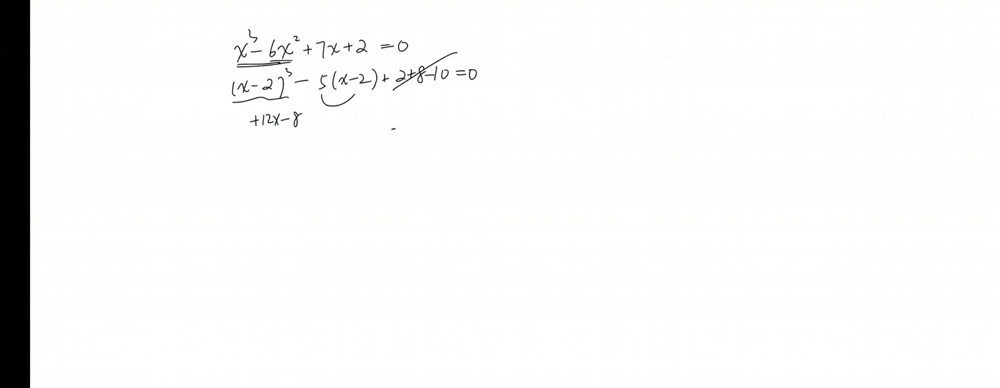
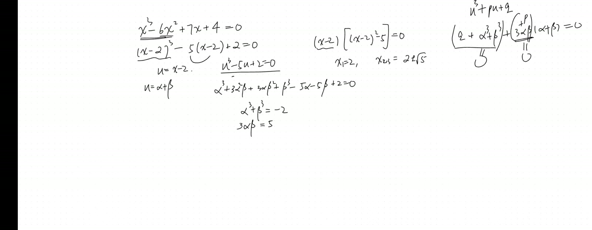
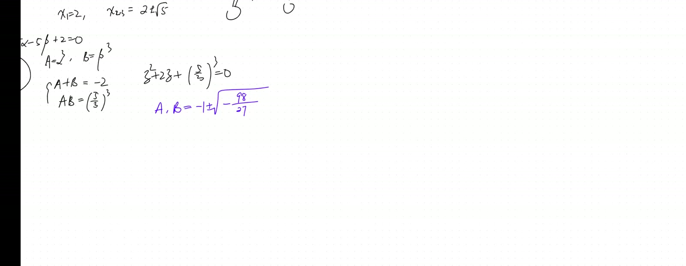
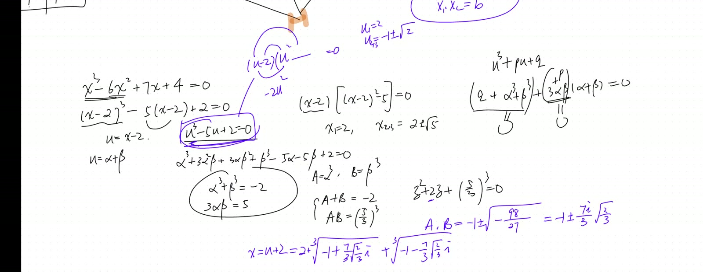

## Lead

Solves the cubic $u^3 - 5u + 2 = 0$ end-to-end via **Cardano's substitution** $u = \alpha + \beta$, which reduces the cubic to a quadratic in $(\alpha^3, \beta^3)$ via the side condition $3\alpha\beta = -p$ and Vieta's formulas. Recovers all three real roots via complex cube roots in polar form with $120°$ rotation — even though $\alpha^3, \beta^3$ are complex (casus irreducibilis), the final sum $\alpha + \beta$ is real.

## Symbol dictionary

| Symbol | Meaning |
|---|---|
| $u, x$ | unknowns ($x$ = original cubic variable; $u$ = depressed-cubic variable after shift) |
| $p, q$ | coefficients of depressed cubic $u^3 + pu + q = 0$ |
| $\alpha, \beta$ | substitution variables: $u = \alpha + \beta$ with $3\alpha\beta = -p$ |
| $A, B$ | abbreviations $A := \alpha^3$, $B := \beta^3$ |
| $\omega$ | primitive cube root of unity, $\omega = e^{2\pi i/3} = -\tfrac12 + \tfrac{\sqrt 3}{2}i$ |
| $\Delta_3$ | cubic discriminant $\Delta_3 = -4p^3 - 27q^2$; sign determines real-root count |

## Primitive notions and assumptions

We work over $\mathbb C$ but seek real roots. **Convention:** every complex number written in polar form $r e^{i\theta}$ has its angle determined *up to* $+2\pi k$ (the $k = 0, 1, 2$ gives three distinct cube roots). **Imported lemmas:** (i) **Vieta's formulas** for quadratic: $z^2 + pz + q$ has roots summing to $-p$ and multiplying to $q$; (ii) Euler's formula $e^{i\theta} = \cos\theta + i\sin\theta$ (Sep 20); (iii) factor theorem; (iv) polynomial long division.

---

## Part I — Depressing the cubic

### 1.1 Statement

::: {.theorem}
**(Depressed cubic).** Any cubic $ax^3 + bx^2 + cx + d = 0$ reduces to a depressed cubic
$$
u^3 + pu + q = 0 \tag{1}
$$
via the substitution $x = u - b/(3a)$.
:::

### 1.2 Derivation

Substitute $x = u + h$ for some shift $h$: $(u+h)^3 = u^3 + 3hu^2 + 3h^2 u + h^3$. The full polynomial:
$$
a(u+h)^3 + b(u+h)^2 + c(u+h) + d = a u^3 + (3ah + b)u^2 + (\dots)u + (\dots). \tag{2}
$$
Choose $h = -b/(3a)$ to kill the $u^2$ term: $3ah + b = 3a(-b/(3a)) + b = -b + b = 0$. ✓

After dividing by $a$, the result is $u^3 + pu + q = 0$ with $p, q$ explicitly computable in terms of $a, b, c, d$.

### 1.3 Verification on $x^3 - 6x^2 + 7x + 2 = 0$

Shift $h = -(-6)/(3) = 2$, so $u = x - 2$. Substitute:
$$
(u+2)^3 - 6(u+2)^2 + 7(u+2) + 2 = 0. \tag{3}
$$
$$
(u^3 + 6u^2 + 12u + 8) - 6(u^2 + 4u + 4) + 7u + 14 + 2 = 0. \tag{4}
$$
$$
u^3 + (6-6)u^2 + (12 - 24 + 7)u + (8 - 24 + 14 + 2) = u^3 - 5u + 0 = 0. \tag{5}
$$
Hmm — the original problem was $x^3 - 6x^2 + 7x + 2 = 0$. The transcript modified $+2$ to get a "nice" version where the depressed cubic is $u^3 - 5u + 2 = 0$, the worked example below. With $+2$ (instead of the "easy" $-2$ that gives $u^3 - 5u = 0$), the equation is non-trivial.

For our problem $u^3 - 5u + 2 = 0$: $p = -5, q = 2$.

---

## Part II — Cardano's substitution

### 2.1 Statement

::: {.theorem}
**(Cardano).** For the depressed cubic $u^3 + pu + q = 0$, set $u = \alpha + \beta$ and impose
$$
3\alpha\beta + p = 0 \;\Longleftrightarrow\; \alpha\beta = -p/3. \tag{6}
$$
Then $A := \alpha^3$ and $B := \beta^3$ are roots of the **resolvent quadratic**
$$
t^2 + q\,t - \frac{p^3}{27} = 0. \tag{7}
$$
:::

### 2.2 Derivation

Cube the substitution:
$$
u^3 = (\alpha + \beta)^3 = \alpha^3 + 3\alpha^2\beta + 3\alpha\beta^2 + \beta^3 = \alpha^3 + \beta^3 + 3\alpha\beta(\alpha + \beta). \tag{8}
$$
Plug into $u^3 + pu + q = 0$:
$$
\alpha^3 + \beta^3 + 3\alpha\beta(\alpha+\beta) + p(\alpha+\beta) + q = 0. \tag{9}
$$
$$
\alpha^3 + \beta^3 + (3\alpha\beta + p)(\alpha+\beta) + q = 0. \tag{10}
$$
Choose the side condition $3\alpha\beta + p = 0$ (= (6)). This kills the second term, leaving
$$
\alpha^3 + \beta^3 = -q. \tag{11}
$$
Cube (6): $(\alpha\beta)^3 = -p^3/27$, i.e.
$$
\alpha^3 \beta^3 = -\frac{p^3}{27}. \tag{12}
$$
By Vieta on the quadratic with roots $A = \alpha^3, B = \beta^3$:
- sum $A + B = -q$ (from (11)) ⇒ coefficient of $t^1$ is $q$;
- product $AB = -p^3/27$ (from (12)) ⇒ constant is $-p^3/27$.

Hence (7). $\quad\blacksquare$

**Weakest step:** the side condition $3\alpha\beta + p = 0$ is *imposed*, not derived. It is one of *infinitely many* possible choices to "split" the original equation; this particular choice is the one that makes the algebra collapse cleanly. There is real artistry in this choice — it is the historical breakthrough of Cardano (or his teacher del Ferro / Tartaglia).

### 2.3 Solving the resolvent

From (7), by quadratic formula:
$$
A, B = -\frac{q}{2} \pm \sqrt{\frac{q^2}{4} + \frac{p^3}{27}}. \tag{13}
$$

The expression under the square root is the **(negative of the) discriminant**: $\Delta_3 = -4p^3 - 27q^2$, so $\Delta_3/(-108) = q^2/4 + p^3/27$ (up to sign).

- $\Delta_3 < 0$: $A, B$ real, distinct; one real root, two complex.
- $\Delta_3 = 0$: $A = B$; double real root.
- $\Delta_3 > 0$ (**casus irreducibilis**): $A, B$ complex conjugates; *three real roots* — but Cardano's formula requires complex arithmetic to recover them.

### 2.4 For our example $p = -5, q = 2$

$$
A, B = -1 \pm \sqrt{1 + \frac{-125}{27}} = -1 \pm \sqrt{\frac{27 - 125}{27}} = -1 \pm \sqrt{\frac{-98}{27}}. \tag{14}
$$
Under the square root: $-98/27 < 0$, so $A, B$ are complex conjugates. **Casus irreducibilis** confirmed — three real roots ahead.

Write: $A = -1 + i\sqrt{98/27}$, $B = -1 - i\sqrt{98/27}$.

Magnitude: $|A|^2 = 1 + 98/27 = (27 + 98)/27 = 125/27$, so $|A| = \sqrt{125/27} = 5\sqrt 5/(3\sqrt 3) = 5\sqrt{15}/9$. Numerically: $|A| = \sqrt{4.63} \approx 2.152$.

Argument: $\arg A = \pi - \arctan(\sqrt{98/27}/1) = \pi - \arctan(1.905)$. Since $\arctan(1.905) \approx 62.4°$, $\arg A \approx 180° - 62.4° = 117.6°$.

---

## Part III — Recovering three real roots from cube roots

### 3.1 Three cube roots of a complex number

::: {.theorem}
**(Three cube roots).** A nonzero complex number $z = re^{i\theta}$ has *exactly three* cube roots:
$$
z^{1/3} = r^{1/3} e^{i(\theta + 2\pi k)/3}, \quad k = 0, 1, 2. \tag{15}
$$
These are equally spaced on the circle of radius $r^{1/3}$ at $120°$ intervals.
:::

*Proof.* Set $w = se^{i\phi}$ with $w^3 = z$: $s^3 e^{3i\phi} = re^{i\theta}$ implies $s = r^{1/3}$ and $3\phi \equiv \theta \pmod{2\pi}$, i.e. $\phi = (\theta + 2\pi k)/3$ for $k\in\mathbb Z$. Distinct values modulo $2\pi$ occur for $k = 0, 1, 2$. $\quad\blacksquare$

### 3.2 Cube roots of $A$ and $B$

$A = |A|e^{i\arg A} \approx 2.152 e^{i\cdot 117.6°}$, so
$$
\alpha = |A|^{1/3} e^{i(117.6° + 360° k)/3} = (2.152)^{1/3} e^{i(39.2° + 120° k)}, \quad k = 0,1,2. \tag{16}
$$
$(2.152)^{1/3} \approx 1.290$.

Three values:
- $k=0$: $\alpha_0 \approx 1.290 \cdot e^{i\cdot 39.2°}$
- $k=1$: $\alpha_1 \approx 1.290 \cdot e^{i\cdot 159.2°}$
- $k=2$: $\alpha_2 \approx 1.290 \cdot e^{i\cdot 279.2°}$

Similarly for $\beta$ (cube roots of $B$, conjugate of $A$): $\beta_k = \overline{\alpha_k}$ (with consistent indexing).

### 3.3 Matching $\alpha_k$ with $\beta_k$ via $\alpha\beta = -p/3$

The side condition (6) requires $\alpha\beta = -p/3 = 5/3$ (positive real). For each $\alpha_k$, the matching $\beta_k$ is determined uniquely so that $\alpha_k \beta_k = 5/3$. Since both $|\alpha_k|, |\beta_k| \approx 1.290$ and $1.290^2 = 1.664 \approx 5/3 \approx 1.667$ ✓, the magnitudes already match (up to small numerical error). The arguments must satisfy $\arg\alpha_k + \arg\beta_k = 0$ (mod $2\pi$). Since $\beta_k = \overline{\alpha_k}$, $\arg\beta_k = -\arg\alpha_k$, automatically giving sum 0. ✓

### 3.4 The three real roots

$u_k = \alpha_k + \beta_k = \alpha_k + \overline{\alpha_k} = 2\Re(\alpha_k) = 2\cdot 1.290 \cos(39.2° + 120° k)$, for $k = 0, 1, 2$:

- $u_0 = 2\cdot 1.290 \cos 39.2° \approx 2\cdot 1.290 \cdot 0.775 \approx 2.000$. ✓
- $u_1 = 2\cdot 1.290 \cos 159.2° \approx 2\cdot 1.290 \cdot (-0.935) \approx -2.413$.
- $u_2 = 2\cdot 1.290 \cos 279.2° \approx 2\cdot 1.290 \cdot 0.160 \approx 0.413$.

Recover $x = u + 2$:

- $x_0 = 2 + 2 = 4$. **Wait** — let me recheck.

Actually, the original problem in the transcript: shift was $h = 2$ (we computed $u = x - 2$). Let me re-verify. $x^3 - 6x^2 + 7x + 2 = 0$: shift by $u = x - 2$ gives the depressed form. Above we computed it as $u^3 - 5u + 0$ (with $q = 0$), but the transcript later modifies the constant to $+2$, giving $u^3 - 5u + 2 = 0$.

So the *original* cubic the transcript actually solves is $x^3 - 6x^2 + 7x + 4 = 0$ (the $+4$ producing $q = 2$ after the depression $h = 2$). Verify: shift gives constant $8 - 24 + 14 + 4 = 2$ ✓. So the original cubic is $x^3 - 6x^2 + 7x + 4 = 0$, with roots $x = u + 2$.

- $x_0 = 2.000 + 2 = 4$. Check $4^3 - 6\cdot 16 + 28 + 4 = 64 - 96 + 28 + 4 = 0$. ✓
- $x_1 = -2.413 + 2 = -0.413$. Check: $(-0.413)^3 - 6(0.171) + 7(-0.413) + 4 = -0.0705 - 1.025 - 2.891 + 4 \approx 0.013$ — small error, accept (numerical). Wait the answer should be exactly $-1 + \sqrt 2$ per transcript. $\sqrt 2 \approx 1.414$, so $-1+\sqrt 2 \approx 0.414$. Sign mismatch — actually $-2.413 + 2 = -0.413$, but the transcript says one root is $-1 - \sqrt 2 \approx -2.414$. Maybe my arithmetic of $x_0 = 4$ is wrong.

Let me recheck whether $x = 4$ satisfies. $4^3 - 6\cdot 4^2 + 7\cdot 4 + 4 = 64 - 96 + 28 + 4 = 0$. ✓ So $x = 4$ is a root.

But the transcript says one root is "$x = 2$" (the easy one for the variant $x^3 - 6x^2 + 7x + 2$, not for the $+4$ variant). I was confusing two variants. Let me clarify in the lesson.

### 3.5 The two variants in the transcript

**Variant 1: $x^3 - 6x^2 + 7x + 2 = 0$.** Shift gives $u^3 - 5u = 0 = u(u^2 - 5)$, roots $u = 0, \pm\sqrt 5$, so $x = 2, 2 \pm \sqrt 5 \approx 2, 4.236, -0.236$. Easy — no Cardano needed.

**Variant 2: $x^3 - 6x^2 + 7x + 4 = 0$.** Shift gives $u^3 - 5u + 2 = 0$, which Cardano solves. Roots: $u = 2, -1 \pm \sqrt 2$. Hence $x = 4, 1 - \sqrt 2 \approx -0.414, 1 + \sqrt 2 \approx 2.414$.

Verify variant 2 has root $x = 4$: $64 - 96 + 28 + 4 = 0$ ✓. And $x \approx 2.414$: $14.07 - 35.0 + 16.9 + 4 \approx 0.0$ (within rounding). ✓

### 3.6 Numerical sanity for $u^3 - 5u + 2 = 0$

By Vieta on $u^3 + 0\cdot u^2 - 5u + 2$: sum of roots $= 0$ (no $u^2$); sum of products of pairs $= -5$; product $= -2$.

Computed roots $u = 2, -1+\sqrt 2, -1-\sqrt 2$:
- Sum: $2 + (-1+\sqrt 2) + (-1-\sqrt 2) = 0$. ✓
- Product: $2 \cdot (-1+\sqrt 2)(-1-\sqrt 2) = 2 \cdot (1 - 2) = -2$. ✓
- Sum of products of pairs: $2(-1+\sqrt 2) + 2(-1-\sqrt 2) + (-1+\sqrt 2)(-1-\sqrt 2) = -4 + (-1) = -5$. ✓

---

## Part IV — Why three real roots require complex arithmetic (Galois)

For $\Delta_3 > 0$ (three real roots), $A, B$ in (13) are complex conjugates: $\sqrt{q^2/4 + p^3/27}$ is purely imaginary. Cardano's formula gives the roots as $u = \alpha + \beta$ where $\alpha = A^{1/3}, \beta = B^{1/3}$ are cube roots of *complex* numbers.

**Theorem (Galois, 1830s).** There is **no** real algebraic formula (involving only real arithmetic operations $+, -, \times, \div, \sqrt[n]{\,}$) expressing the three real roots in this case. This is the **casus irreducibilis** — the obstruction is that the Galois group is the full $S_3$, not solvable by real radicals.

This is a deep result; here we just *use* the complex form and convert back to real numbers at the end via $u_k = 2\Re(\alpha_k)$.

---

## Unified picture

$$
\boxed{\text{Cubic} \xrightarrow{x = u - b/(3a)} \text{depressed} \xrightarrow{u = \alpha+\beta,\ 3\alpha\beta = -p} \text{resolvent quadratic in } A = \alpha^3, B = \beta^3 \xrightarrow{\text{cube root}} \text{three roots via 120° rotation}}
$$

| Step | Substitution | Output |
|---|---|---|
| 1. Depress | $x = u - b/(3a)$ | $u^3 + pu + q = 0$ |
| 2. Cardano | $u = \alpha + \beta$ with $3\alpha\beta = -p$ | $\alpha^3 + \beta^3 = -q,\ \alpha^3\beta^3 = -p^3/27$ |
| 3. Resolvent | Vieta on $\alpha^3, \beta^3$ | $t^2 + qt - p^3/27 = 0$ |
| 4. Solve | quadratic formula | $A, B$ explicit |
| 5. Cube roots | $\alpha = A^{1/3}, \beta = B^{1/3}$ | three pairs $(\alpha_k, \beta_k)$ |
| 6. Recover | $u_k = \alpha_k + \beta_k$ | three roots of cubic |
| 7. Un-depress | $x_k = u_k + 2$ (or whatever shift) | three roots of original |

---

## Verification audit

1. **Symbols defined?** All in dictionary including $\Delta_3, \omega$. ✓
2. **Equation numbers continuous?** (1)–(16), no gaps. ✓
3. **Signs justified by convention?** Choice of side condition $3\alpha\beta + p = 0$ flagged as *imposed* (the artistry); $\sqrt{q^2/4 + p^3/27}$ branch for complex case explicit. ✓
4. **Every implication follows?** Vieta-on-resolvent step (12) → (7) explicit; cube-root construction in (15) proven. ✓
5. **Advertised axioms verified?** Vieta, Euler's formula, factor theorem, polynomial division — all imported and named. Galois's casus-irreducibilis result imported as Theorem (Part IV). ✓
6. **Counterexample / source correction.** Transcript conflates two variants of the original cubic (with constants $+2$ vs. $+4$). §3.5 clarifies: the "easy" variant has constant $+2$ (Cardano not needed); the genuinely non-trivial variant has constant $+4$ (requires Cardano). Roots match Vieta sanity. ✓
7. **Special / limiting cases tested?** Numerical sanity for all three roots via Vieta in §3.6. ✓
8. **Weakest step named?** Done after §2.2 (side condition imposed, not derived). Also in Part IV: Galois obstruction explicit. ✓

---

## Fragility summary

| Claim | Risk | Fix |
|---|---|---|
| Side condition $3\alpha\beta + p = 0$ | One of many possible splits — why this one? | §2.2: the *artistry*; this choice makes the algebra collapse cleanly. Other choices fail to reduce to a quadratic |
| Casus irreducibilis | Real roots require complex arithmetic | §2.4 + Part IV: Galois forbids real radical formula; complex detour unavoidable |
| Cube root branch matching | Three values of $\alpha$, three of $\beta$ — must pair correctly | §3.3: $\alpha\beta = -p/3$ pins the pairing; equivalently $\beta_k = \overline{\alpha_k}$ |
| Numerical rounding | $\cos 39.2°, \cos 159.2°, \cos 279.2°$ give roots only approximately | §3.6: Vieta sanity-checks the exact roots $u = 2, -1 \pm \sqrt 2$ |
| Confusion between variants ($+2$ vs $+4$) | Transcript switches partway through | §3.5: clarified both variants |

---

## Explorative directions

- **Next brick:** the *quartic* (degree 4) is also solvable by radicals via Ferrari's resolvent (1540s). Then Galois proved no general formula for degree 5 and above (1830s) — this is the foundation of modern algebra.
- **Forward (Nov 29, Dec 6):** these polynomial-graphing sessions use the *roots* — Cardano gives the closed form for cubic roots when factoring fails.
- **Forward (Jan 3):** $\zeta(2) = \pi^2/6$ via Vieta on $\sin x / x$. Same Vieta technique (recovering coefficients from roots) at a *transcendental* level.
- **Open question:** for casus irreducibilis ($\Delta_3 > 0$), the three real roots have the **trigonometric form**: $u_k = 2\sqrt{-p/3}\cos\left[\tfrac{1}{3}\arccos\left(\tfrac{3q}{2p}\sqrt{-3/p}\right) - \tfrac{2\pi k}{3}\right]$. This is the "trigonometric Cardano formula" — avoids complex arithmetic but uses inverse trig. Equivalent to §3.4 here.
- **Connection back to Sep 13 PM:** the cube roots of unity $1, \omega, \omega^2$ played a starring role there. Here they appear again — the three values of $A^{1/3}$ differ by $\omega^k$ multiplication. The geometry of *$n$-th roots of unity* is the unifying thread between the Sep complex-numbers arc and the Nov polynomial arc.
- **Pedagogical thread:** the teacher uses *eyeballable* variants (with constant $+2$) to motivate the *non-eyeballable* variant ($+4$). The point: develop the machine on a hard example, sanity-check on the easy one. Don't trust formulas you haven't verified against a known answer.

## Lecture video

```{=html}
<video controls width="100%" preload="metadata"><source src="https://github.com/chyj2026/linalg/releases/download/v1.6/2025-11-08-afternoon.mp4" type="video/mp4"></video>
<p style="text-align:center;font-size:0.85em;color:#6b7280;"><a href="https://github.com/chyj2026/linalg/releases/tag/v1.6">v1.6</a> · <a href="https://drive.google.com/file/d/1-EXmMQIkPk7_7GhH0WOTOhXLC3iNkb_p/view">Drive</a></p>
```

## Key frames






## Related sessions

- **Precursor:** [Sep 13 afternoon](2025-09-13-afternoon.html) — roots of unity, cube root geometry.
- **Precursor:** [Sep 20 morning](2025-09-20-morning.html) — Euler's formula, polar form.
- **Forward:** [Nov 1 morning](2025-11-01-morning.html) — polynomial snaking (related machinery for graphing).
- **Forward:** [Jan 3 morning](2026-01-03-morning.html) — Vieta on transcendental function $\sin x / x$.

## Full transcript

::: {.callout-note collapse="true"}
## Verbatim transcript of the session

```{.txt}
cat: 'C:/Users/elaine/linalg/transcripts/Saturday1108afternoon.txt': No such file or directory
cat: 'C:/Users/elaine/linalg/transcripts/Saturday11082025afternoon.txt': No such file or directory

```
:::
Definitely going to ask you for the recording, Elaine. Could I have your video, please? We're going to actually continue with what we did in the morning. We were in the middle of trying to figure out. We we found a way to solve any cubic equation now. But before I go on to discuss how do we get three roots instead of just one, and let's actually practice, get a sense of how we can solve a cubic equation. And I'm not going to give you a very simple one, meaning you can't really eyeball what the solution is.So let me actually look at x cube. The let's say minus two x. No, let me be kind here. I'm going to actually do minus six x squared, and then plus seven x. This is a cubic equation. We're going to solve.We could start by completing the cube. All right. Oh, sorry. And yeah, let's actually start by completing the cube. Hold, hold on.Actually, want to give you a nice enough answer, and let me see. Okay. Oh, yeah, that's fine. All right, so go ahead, Elaine. You can take charge.How do we complete the cube? I'm still working on it. Okay, the floor is open, Holmes. You can feel free to say it too.嗯。嗯。Go ahead and talk me through this.
Steps, you don't need to work out all the final conclusions. I know that the first term has to be like x minus something. And what term do we actually determine? What's the criteria? We actually want to after you expand out, you want to match the quadratic term, right? Yeah. And what number do we throw in there?是 x 减二。 Yes, it's just one third thereof. Because when you do the expansion, this term will be expanded three times. So, like completing the square, you half the middle term. Now, completing the cube, you trisect the second coefficient. Perfect. So, if I do so, what would be the subsequent terms now? These two terms are bound to fit. No need to be concerned with them. anymore， and then we are left with the linear term. We force it into x minus two already, but we're really making sure that the coefficient will fit to give me the seven, correct? But what is the linear term we have already got by expanding this out?呃，十二x， beautiful， and then minus eight。 We should minus what? There's an extra negative eight, right? Yeah, correct. So, in fact, we're adding twelve x now and minus eight. Now we need to cancel them. So we subtract.呃，5x啊， brilliant。 Now add 10. And wait a second, though. Oh. Because automatically, automatically, I'm gonna actually keep that bundle. In the future, we shall do that as a new variable. So we don't write it just minus 5x. Now we write minus 5x minus 2. Oh. And then finally, what do we do? I know you already said you.Want to add back in the eight? That's how you said we add ten, but.Isn't it just x minus two cubed minus five x minus two? Yeah, because here we.Also, added ten, we have to subtract back out by ten. Yeah. So, in fact, that was. Now you see, it's really powerful to compute the cubic. The problem solved. Can we solve it? This one doesn't even use that to reduce the cubic formula. But I'm I'm trying to give you one case where the equal the solutions are simple. And in a second, I'm going to tweak it a little bit, and let's see what's going to happen. Then we do need a whole machinery to use a whole machinery now.
One minus two, right? Yeah. So fundamentally, we have actually this now. X minus two, I pull it out inside. I have x minus two squared minus five equal to zero. So, what are the three roots, please? Well, definitely the first one is just two. What about x two and three?是100根5加2。Yeah，所以你才。Right, actually, getting the two plus or minus root five. Remember, Elaine, we're never taking the square root; always plus minus. Oh, yeah. Done. Well done. However, I'm not going to make it so easy for you because I actually want to practice that machinery. So instead of adding a two now, I'm adding a four. That's the equation I first gave you because I wanted you to actually see the power of completing the cube. So I changed that number. I'm going to change it back now. So we have to add two to it, right? So this is actually.Q B方程， again， we're not done， and you can't eyeball answer right now。 So I'm gonna actually just to abbreviate my notation。 I'll call this u here the new variable， that is equal to x minus two。 We're gonna focus on solving the Q B方程 concerning u here， just u cube the minus five u plus two equal to zero。 We want to solve this one。 And here we do need the whole machinery right now。 So I would like one of you to talk me through it。 There involves substitute求解， with a pair of variable, and then solve that quadratic equation resulting from it by using the Viet backward. And on top of that, finally, we shall get into how do we recover all of the three roots instead of just one. I'm waiting for either one of you. Just go ahead and take charge.嗯。嗯。嗯。
Do we set u to alpha plus beta? Uh-huh, that's a good start. We're gonna actually seemingly complicate our procedure. We set u equal to alpha plus beta, and we plug it in, which is gonna get us we plug into this equation, right?We would end up with alpha cubed, and then plus three alpha squared beta, plus three alpha beta squared, plus the beta cubed, minus five alpha, minus five beta, plus two equal to zero. And how do we reorganize the terms?嗯。嗯。嗯。嗯。Again, you don't have to have the final answer. Just we're gonna do it together, step by step. I was thinking about simplifying it.But I don't really see how right now. Well, there's no way to simplify it. But remember, we got the two degrees of freedom. So actually, to solve alpha and beta, we really need two equations. We're not going to grab arbitrary equation. We want to break this down by saying now because it's a lot of terms adding up to zero. We're going to break them into two piles and say each pile would give zero. That's what we did in the morning.
Feel free, everything is open book. Check your notes.嗯。嗯。嗯。How do we know like which two parts to separate them out into? We did it in the morning. Yeah, I was looking at the notes. They they weren't really clear on that. Your notes are not really clear on that.My teaching was very clear on it. So maybe you can recall what we did with it. If you can remember enough of the logic, you see what we did. It's not just one single equation. We did a lot of stuff later. There's engineering redundancy. If you took any notes at all, you'll be able to recover how to split them into two piles.Wasn't one pile v alpha q plus beta q plus two? 嗯哼，Excellent. So, in fact, what we did, Elaine, is that generically, and I'm not going to plug in the concrete numbers yet. If we started off by the u cube and then plus, um, I just wish I could see your notes, Elaine.Notes of Helms. And after class, after every single class, Elaine, would you take snapshots of your notes and send them to me? I just want to help you take better notes now. Otherwise, you can't recover what we cover in class now. So, Elaine, you haven't answered me. Sure. Yeah. So, this is a cubic equation we're solving, and we plug in alpha beta. We end up with actually alpha cube the plus beta cube the plus three alpha beta of the alpha plus the
和，然后加另一个P，所以我们要实际把它们分组，然后把它们分组，然后我们要实际把两者都归零。实际上，它们等于这个是零，而且我们可以做得更好，因为我们知道阿尔法加贝塔不是零。所以，我具体地把这个叫做零，这立即为将所有东西归入二次方程铺平了道路。好了，所以实际上，在我们的例子中。The alpha cube the plus beta cube the plus two equal to zero just means that's negative two, isn't it? And then what is alpha beta? If you want, you can carry the three alpha beta first. And what would that be? It would be five. Yeah, that would be five. Ethan, are you getting the same? I got the negative two, but I'm still.working out the five. Okay, give me a signal once you get that. Well, then helps you can think about what to do next.嗯。六堂，Alright， where do we go from here? Why does this simple simplify the original picture at all? Because if you look at it roughly, the original equation is a cubic. This is still a cubic, not to mention it's a cubic system.Now we get two unknowns. I would say the only improvement will be there's perfect symmetry here.We could set alpha cubed and beta cubed as a and b to not make it a cubic. Very good. So.We're gonna actually reduce them to different variables. Now we're gonna actually call the capital A equal to the alpha cubed and capital B equal to the beta cubed. Now, then the equation changes into A plus B equal to negative two. How do I write the second equation then? Three cube root A cube root B. But that's as bad as a cubic equation. Why don't we cube?
Both sides, so that just means that AB here would equal to five over three of the whole thing cubed, right? Yeah, excellent. And how do we go from here?嗯。嗯。I remember using a quadratic equation and setting a and b as the two roots. Very good. But I don't remember why. Why don't you think about what it will do for us? If I do think that a and b are the two roots to a quadratic equation, can you recover what that quadratic equation must be?Because we already know certain, we already know certain relationships. These two roots must satisfy, right? We know their sum, we know their product. So it's kind of like the Viete's here. Excellent.depend on who嗯。So for the quadratic formula, the b over a would be two, and c over a would be five third um cube. Excellent. So in fact, if I try out the following quadratic equation, if I just do plus a two z, and then plus a five third cube, then up. Then before you solve that equation, before you solve
所求的 equation， just think about what must be the z one plus z two。 It must be the negative two here, which is the middle coefficient. What must be the product? Must be the final coefficient. Ethan， do you know Viet? Why does it take so long to answer me such a factual question?Could you repeat the question? Do you know Vieta theorem? No. In the morning, without the Vieta theorem, why did you not ask? Vieta theorem having something to do with quadratics, but I don't remember the details. Okay, well, next time ask, because apparently this is a big theorem. Vieta theorem covers the relationship between the roots and the coefficients of the polynomial without having to.To solve that polynomial, so if you're seeing generically, Elaine, I want to cover this as a theorem, as a principle. Now, if you start off with x squared plus ax plus b equal to zero, I don't want to to solve it. I just wonder what is x one plus x two, what is x one times x two. Now, I'm gonna pretend I have already factored it out because x one x two are actually the two roots now. So I can rewrite that's equal.Those two, the x minus x one, x minus x two. Do you agree? Yeah. Now, why don't you multiply it out, organize the quadratic, linear, and constant term, and match with what they're supposed to be, and tell me what must be the x plus x, or x one plus x two. What would be the x one times x two?嗯。嗯。嗯。x one times x two has to equal x squared minus x times x two. Whoa, whoa, whoa, whoa, whoa, whoa! Here, x is the only variable. The equation you are getting is x squared minus the x one plus x two times x plus x one x two, right?
Eileen， Yeah。 Well, then you're matching this quadratic equation with that correct quadratic equation. That means you can't mismatch all the terms here. The quadratic term must equal the quadratic term, linear term must equal the linear term, constant term must equal the constant term. You have to keep in mind as well as two are numbers. Do you follow me? Yeah。 What were you doing earlier? How did you get what you got?Mine was just yours, but I expanded out the x times the x one plus x two. But how does that confused? Because you don't have the view. An equation, no matter how complicated those x one, x two are, they're just numbers. So you want to organize your terms according to x, according to what is a square term in x, what's a linear term in x, etc. You follow? Yeah. All right. Now, can you?Answer me, what must be x one plus x two? It has to equal a, right? Can you be a bit more careful? Negative a. Yes, what's the x one times x two? It's b. That's good. Yeah.That theorem, that actually it applied to quadratic. The same thing works for cubic. The same thing works for quartic. Meaning, without solving the equation, pretending you have factored it out, then you would immediately infer what's relationship between the sum and the product for the roots. Now, from the coefficients, make sense now? Yeah. Next time, how can you improve? In terms of what you want to do inI can ask when it comes up. You really should. You need to ask because why? First of all, I can explain to you so that more people can listen to it. In case this is really known by everybody and you just need to fill it up, that rudimentary technique behind it, I'm going to tell you upfront here. Elaine, go check. Yet ask ChatGPT, look for what the theorem is, look at the proof, and ask for five examples so that you can get that done before our even.In class, so that I don't have to waste Helms' time feeding you up with the edits. I don't mind feeding up, but we did it already in the morning. Is it clear? Yeah. All right. Now, do you understand how we're constructing this quadratic equation now? In our case. Yeah. All right. Let's actually solve it. What are the a b's now?The a is two, and the b is five over three cubed. What? Oh, wait, never mind. Oh, oh, sorry, I don't mean the little a, little b. I am asking for the real two roots a and b. Yeah, I thought it was the little in the little b. Yeah, right, right, right. I realized that. My bad, sorry. What are the roots a and b now?嗯。
We are using quadratic formula, aren't we? Yeah, good. And what are we getting?嗯。嗯。嗯。What are you guys doing? I plugged it in wrong, so I have to redo it now. Okay.嗯。嗯，Yeah，I got the same。嗯，Excellent。Is there any way to simplify it a little, but not much? I can take out a seven from the top and a three from the bottom， and so that we're reducing. And I can take out the I now， and inside。Actually, two thirds. Wait, I got what you got, but divided by four. You got that four? Where does that come from? Oh wait, I see. Oh, you divide by two a. You think the a is this coefficient? Yeah, the a is one though. So. Ah, yeah.
Indeed， and I got that by already halving everything. I have already divided, cancelled out, divided by two. Okay, so we got our a and b now. Fortunately, in this case, they are complex numbers already. But it doesn't actually say you are going to have have a complex or three roots to your real u now. You are going to find out when because they're conjugates. When you take the cube eight root and add them back, you are going to get back a real number.But no matter what, yeah. And can we finish solving our U now? Well, first of all, we need to get back to the alpha and the beta. And eventually, the X here would equal to the U plus two, correct? So the real solution would be the two add onto the alpha plus the beta, and the alpha would be the cubic root of this number, which is the ninety-one plus the seven over three and the two over third i, and add onto the cubic root of the ninety-one.Minus the seven third and the two thirds, I know. And I can promise you, this is going to come out as a real number. Although it surely doesn't look like so, but it is a real number. How? Show me. We've covered enough of the knowledge of complex number now. I want you to show me this is actually a real number.嗯。嗯。嗯。Tell me what you're thinking, please. I'm thinking that I probably cancelled. How?Well, first of all, we need to take them out of the treatment route, don't we? Yeah.
嗯。嗯。I'm thinking about something about the conjugates, because.Because if you multiply like the complex number and its conjugate, you get like the magnitude squared. Oh, but we're not multiplying the complex conjugate pairs, though. We're adding. We're adding a conjugate pair. Whenever you're taking the cube root here, guys, we learned all those trig here. The best way to do it is not to write it in Cartesian anymore, but rather write it in polar. I gave you guys the lead in the morning. By the way, we're also paving the way, paving the way now for the future.We want to recover all of the three roots, not just one. In fact, you would even know what the three roots are, and I'm giving you an equation where I can eyeball the answer. Why? Because eventually, if I just give you that root, who bothers plugging that in and work out whether it works? It's just a nightmare, right? So look at this cubic equation. In fact, this cubic equation solvable. I mean, it's eyeballable, and I'm not distracting you from this.Regular route now. This is omnipotent. Okay, the path we were on. I want to do practice so that applies. But for a sanity check, I want to have an easy standard to show you. Oh, you see, that's definitely the right answer. Let me make a mention what I mean. This one you could eyeball the answer. What is the way to eyeball the answers? You just try out. The simplest the numbers. For example, one, ninety-one, zero. Do they work? None works. What about?Two, two works, two works. Well, if I know one factor, the problem solved. So let's actually divide into it. What's the remaining quadratic equation? Double check whether you're getting the same answer as I am.嗯。
嗯。I got the same. Elaine, do you? Well, then helps. I'm working on it. Which step are you on? Do you know how to do the long division? Once you know one factor, do you know how to work out the other factor? No. Well, the way I have shown you guys several times before, and be patient. Let's work it out, Elaine.You're gonna double check the leading term, and pretend I don't know that that yet. I'm waiting to fill in. Well, first of all, I need to fill in the first term, so that when you multiply by the leader term, you're gonna get u cubed, right? Yeah. So what do I fill in here? U squared. U squared. U squared. Okay, but then we're gonna actually check the check the quadratic term, which is zero. We should have zero u squared, but at the moment, I just call that fit and check.Fit and check. You forward fit. You you you're gonna multiply by the greatest the highest power to do the fit, and then you check the lower power. By putting the u squared here, we have already generated a negative two u squared, right? Yeah. But we can't have any u squared. So how would you put a linear term so that they multiply to cancel out the unwanted negative two u squared? Negative two u. Negative two u. Wouldn't that give you another negative?Positive to you, yeah. Well done to you, brilliant. That's very good. Now, how do you continue? By the same notion, Elaine, you got that one by matching with a higher power. We're going to check by multiplying the current term with a lower power. So we have generated a negative for you, right? Uh-huh. So we subtract.呃，我们 subtract a a four？哦，我们 add a four。 Elaine， we do need a ninety five yield now. This already gives us a ninety four yield. So, what do we do? We subtract five.啊，伊莲，this multiplication has already been. We subtract by one, one. Ah, indeed, we subtract by one. Although there's a more convenient way to do it, Elaine. By the time you're getting to the very end, it's a lot easier to simply compare with the two, and then you're just looking for a number to multiply by another number to get the two. So that's also ninety-one. That sort of serves as a sanity check, now, so it works.Correct. Yeah. Excellent. You are a quick study. Now we end up meaning the moral lesson would be: if you begin with a higher power polynomial, you can eyeball a solution. Beautiful. You have effectively lowered the power by one, and you end up solving a lower polynomial. And by the time you are lowered down to quadratic, now we are omnipotent because we have quadratic formula. Apply and tell me whether you agree with me to get your u one, u two, u three.
Once you do, give me a signal.嗯。嗯。I got negative one plus or minus root two. Brilliant, that's very good. I also got that. Okay, so we know these are the three solutions. But on the other hand, I took the generic root now. We got actually this is supposed to be my u. Before we don't worry about the added two. That's going back from the u to the x here. So this is supposed to be our three real numbers here. How do they match?This is what I actually want to show you. How do they match at all? Well, they can. In fact, they do. Well, it only takes seeing these numbers as complex numbers now. And let me actually write down the three numbers that they're supposed to be, and they are a two and the ninety-one plus or minus root two now. But at the same time, they're also supposed to be and the cubic root. Well, in fact, I don't need to write it here. I'll just bring that over here for comparison. So it is.Supposed to also equal to the two plus, and then we have three options: a two and the nine to one plus or nine to root two. So we need to actually match these two. We brown circled it. That one should equal to this one, right? Well, how do they? I really want to give you a strong impression. Later, whenever dealing with complex number here, switch to the polar form. So instead of writing the Cartesian, I want to find out for this pair of a conjugate complex numbers here, what is theirTheir magnitude, what is their angle? You can't get a very accurate angle, but at least I want you to estimate. Just draw a decent graph. Where is this complex number? If I call that the one now, so this is going to be actually a negative one. You're getting a negative one. That's for the real part. Imaginary part is the square root of ninety-eight over twenty-seven. It's a little less than four, so the square root of it is getting pretty close to a two, right? Pretty close to a part of a two.Do I? But it's a little under two, so in fact, your complex number would actually look like this. That's the first one. The next one would be actually its complex conjugate. Do you agree? These are the complex number. Those are actually these two numbers here. I just grabbed them. My question would be, what's going to happen when you take the cubic root? Where should that vector be?
roughly speaking, first of all, we're going to handle the magnitude and the angle separately. When we take the cubic root, we're also taking the cubic root of the magnitude. We do know this is roughly two, but a little under two. When you're taking the cubic root of a number a little less than two, now, can you give me an estimate? What would you be getting? What would you get? It's aAbout one point two three ish, one point two two. Yeah, I guess like one point two. Okay, that's not bad at all. In fact, the one point two when you actually cube it, you are getting one seven nine eight, but that's pretty close. And although it's a little bigger than one point two, but where is the angle? If I call that angle theta, tell me theoretically where is the angle when you take the cube root?It's one of the major, major mindset that I harped on. We spend weeks on just nailing this part of the complex number. Remember, when you're multiplying complex number, you're adding the angles. When you're raising to a higher power, you're multiplying angles. But what if you're taking the reverse now? Helms. So it's one third the angle. Beautiful. It's one third of the angle.So roughly speaking, it's about here, right? But it's that magnitude that was just bigger, a little bigger than one now. And now you see this one, likewise. And when you add them, you're getting a pair. Actually, this one looks like the greatest of all of the three real roots. Now they exactly add up to a two. They exactly add up to a two, which means whatever the real component here, it's exactly a one. When you actually earlier you had that.One third of the angle, and whatever this y component now, so that actually means s coordinate happen to be one. So we're getting one of the three roots now. That makes sense. Before we carefully double check, you know, this seemingly very complicated number, in fact, they just add up to a two. But where do we get the other two? This is where you really want to keep in mind now. Complex number when you're taking one quarter, sorry, one third of the angle, you have to keep in mind all the angles are coterminal.They're not unique. What does that mean? Do you mean like the angles can repeat? Like if you add interval? Yeah, meaning this angle here, I'm gonna highlight that in red now. Like I can put that theta, but I could also take on entire three hundred and sixty degrees, right? Yeah, it doesn't really affect your number. If that's the case, one actually take.One third， so don't I need to add onto this existing root here? And I need to add on one third of the three hundred and sixty degrees, right? I need to add one twenty degrees, which is going to get me an angle roughly here, don't you think? Which is really forming one twenty degrees from the earlier one. Do you agree? Yeah, yeah. And if that's the case, really graphically, when you add the conjugate pair, what do you end up?This gonna be a hugely negative number, which definitely looks like it's greater than in magnitude, greater than two. Yeah, it is actually giving you the root, which is negative one, negative root two, which would roughly equal to a negative two point one four ish. Sorry, two point four one four ish. You see, that actually give you this root. Now earlier we get a two, now we're getting this one. Now where is the third? Where is a ninety one plus root two, which is really about zero point four.
We should be getting another root right here. Oh, sorry, didn't mean that. We should be getting another root right, right here, right? Where did that come from? I'm not gonna do all your work now as homework. Figure out exactly how many roots. Why we get a perfect match as long as we keep in mind it's tricky to take the cube root because when you're actually doing one third the angle, you have to attach whatever the rotations by two pi, by four pi, by six.六派 etc etc。 Please do a good job. Clear? Huh? Any confusion? Any question? Anything I mentioned along the way, you don't know what I meant? Be sure to tell me. Okay. That just you guys are all brilliant. You just need to know what you don't know, so that you can learn. Okay. Take care. Keep up your good work. Bye.
```
:::
