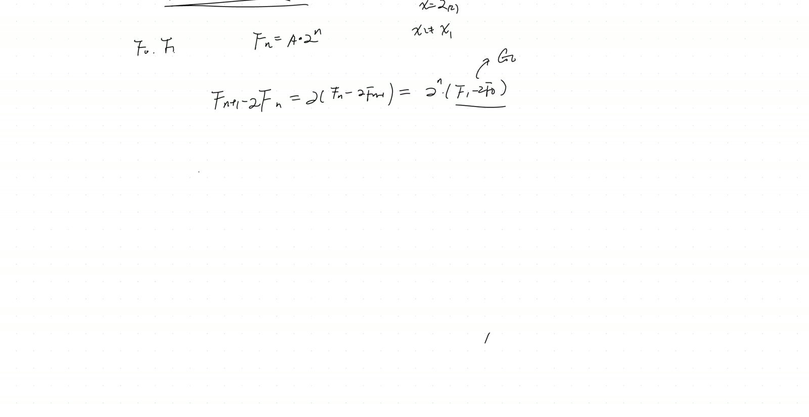
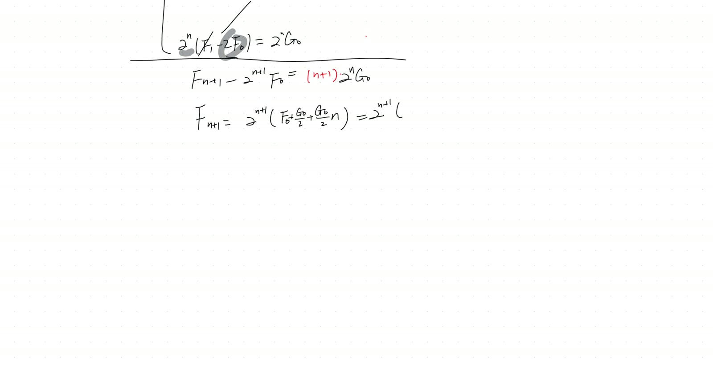
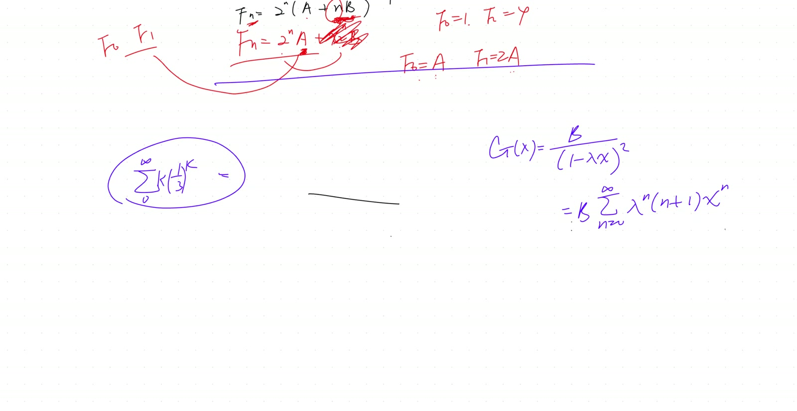
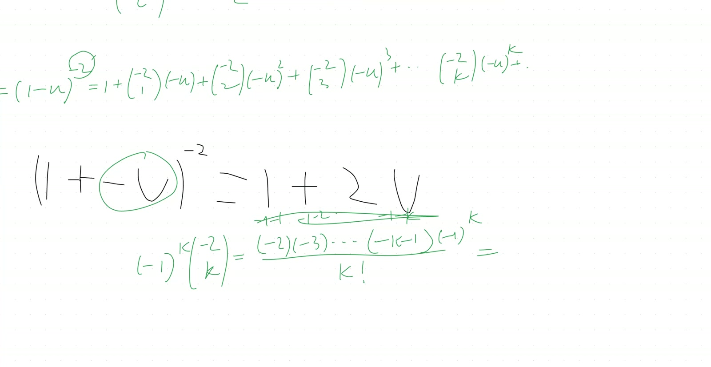

::: {.callout-tip}
**Manifest correction.** Earlier metadata mistitled this lesson "Diagonalizing the Conic Metric Tensor" — that's the actual content of [2026-02-21 morning](2026-02-21-morning.html), not this one. The lesson here continues the recursion arc from [2026-01-10 morning](2026-01-10-morning.html).
:::

## Lead

Completes the **double-root linear recursion** derivation: when the characteristic polynomial has a repeated root $\lambda$, the general solution $f_n = A\lambda^n$ has only **one** degree of freedom, insufficient to fit two initial conditions. The session derives the missing term explicitly by telescoping a chain of equations $g_k = 2g_{k-1}$ where $g_k := f_{k+1} - \lambda f_k$, yielding $f_n = (A + Bn)\lambda^n$. Then re-derives the same conclusion via **generating functions**, proving the identity $1/(1-\lambda x)^2 = \sum_{n=0}^{\infty}(n+1)\lambda^n x^n$ by expanding $(1-u)^{-2}$ via the negative-power binomial coefficient $\binom{-2}{k} = (-1)^k(k+1)$.

## Symbol dictionary

::: {.symbol-dictionary}
| Symbol | Meaning |
|---|---|
| $f_n$ | the linear-recursion sequence, $n=0,1,2,\dots$ |
| $\lambda$ | (double) root of the characteristic polynomial $x^2 - 4x + 4 = 0$, i.e. $\lambda = 2$ |
| $g_n := f_{n+1} - \lambda f_n$ | derived first-order sequence (geometric in $\lambda$ if $\lambda$ is a double root) |
| $g_0 = f_1 - \lambda f_0$ | initial value of $g$ |
| $A, B \in \mathbb{R}$ | the two free constants in the general solution |
| $G(x) := \sum_{n\ge 0} f_n x^n$ | generating function for the sequence $\{f_n\}$ |
| $\binom{-r}{k}$ | generalized binomial coefficient $= \frac{(-r)(-r-1)\cdots(-r-k+1)}{k!}$ |
| $u = \lambda x$ | dummy substitution used inside the generating-function expansion |
:::

## Primitive notions and assumptions

1. **Linear recursion theory** for a quadratic characteristic polynomial $x^2 - px + q = 0$ with **distinct** roots $\lambda_1, \lambda_2$: general solution $f_n = A\lambda_1^n + B\lambda_2^n$, with $A, B$ determined by two initial conditions. *(Imported from earlier in the course.)*
2. **Geometric-sequence sum:** $1 + r + r^2 + \cdots = 1/(1-r)$ for $|r| < 1$.
3. **Negative-power binomial expansion** $(1+t)^{-r} = \sum_{k\ge 0} \binom{-r}{k} t^k$, valid for $|t|<1$, with $\binom{-r}{k} = (-r)(-r-1)\cdots(-r-k+1)/k!$. *(Imported.)*
4. The **degree-of-freedom principle**: an order-$d$ linear recursion requires $d$ independent parameters in its general solution to accommodate $d$ initial conditions.

::: {.callout-note collapse="true"}
## Prerequisites

- Distinct-root case of linear recursions (general solution $A\lambda_1^n + B\lambda_2^n$).
- Telescoping sums (the "write the same equation at lower indices and add" technique used here).
- Generating-function manipulation: products correspond to convolutions; closed forms recover via Taylor series.
:::

## Topics covered

- The "missing degree of freedom" diagnostic for double roots
- Telescoping derivation of the $(A + Bn)\lambda^n$ general solution
- Negative-power binomial expansion $(1-u)^{-2}$
- Recovery of $\binom{-2}{k} = (-1)^k(k+1)$ by direct computation
- Generating-function form: $\sum (n+1) u^n = 1/(1-u)^2$
- Connection to Pascal's triangle for higher powers $(1-u)^{-r}$ (Lucas's observation)
- AI-collaboration meta-discussion (prompting for step-by-step rigor)

## Theorems

::: {.theorem}
**(Double-root general solution).** Let $\{f_n\}_{n\ge 0}$ satisfy the second-order linear recursion
$$
f_{n+1} \;=\; p\,f_n - q\,f_{n-1} \qquad (n\ge 1), \tag{26}
$$
where the characteristic polynomial $x^2 - px + q$ has a **double root** $\lambda$ (i.e. $p = 2\lambda$, $q = \lambda^2$). Then
$$
f_n \;=\; (A + Bn)\,\lambda^n \tag{27}
$$
for unique scalars $A, B \in \mathbb{R}$ determined by $f_0$ and $f_1$. Explicitly $A = f_0$ and $B = (f_1 - \lambda f_0)/\lambda = g_0/\lambda$ (with $g_0 := f_1 - \lambda f_0$).
:::

::: {.theorem}
**(Generating-function identity).** For $|u| < 1$,
$$
\frac{1}{(1-u)^2} \;=\; \sum_{n=0}^{\infty} (n+1)\,u^n. \tag{28}
$$
Equivalently, with $u = \lambda x$:
$$
\frac{1}{(1-\lambda x)^2} \;=\; \sum_{n=0}^{\infty}(n+1)\,\lambda^n\,x^n. \tag{29}
$$
:::

## Derivation A of Theorem 27 — telescoping (the transcript's path)

Take $\lambda = 2$ (so $p = 4$, $q = 4$ as in the worked example $f_{n+1} = 4f_n - 4f_{n-1}$); the argument generalises immediately.

**Step 1 — define the auxiliary $g_n$.** Set
$$
g_n \;:=\; f_{n+1} - \lambda f_n. \tag{30}
$$
Substitute (26) into (30): $g_n = (p f_n - q f_{n-1}) - \lambda f_n = (p - \lambda) f_n - q f_{n-1}$. With $p = 2\lambda$, $q = \lambda^2$: $g_n = \lambda f_n - \lambda^2 f_{n-1} = \lambda(f_n - \lambda f_{n-1}) = \lambda\,g_{n-1}$. Hence $g$ is **geometric** with ratio $\lambda$:
$$
g_n \;=\; \lambda^n\,g_0, \qquad g_0 = f_1 - \lambda f_0. \tag{31}
$$

**Step 2 — telescope the chain $f_{n+1} = \lambda f_n + g_n$.** Rewriting (30): $f_{k+1} = \lambda f_k + g_k$. Now write this for $k = n, n-1, \dots, 0$, and multiply the $k$-th equation by $\lambda^{n-k}$:
$$
\begin{aligned}
f_{n+1} &= \lambda f_n + g_n,\\
\lambda f_n &= \lambda^2 f_{n-1} + \lambda g_{n-1},\\
\lambda^2 f_{n-1} &= \lambda^3 f_{n-2} + \lambda^2 g_{n-2},\\
&\vdots\\
\lambda^n f_1 &= \lambda^{n+1} f_0 + \lambda^n g_0.
\end{aligned}
$$
Adding all $n+1$ equations, every intermediate term $\lambda^j f_{n+1-j}$ appears once on the left and once on the right; they all cancel except $f_{n+1}$ (LHS-only) and $\lambda^{n+1}f_0$ (RHS-only):
$$
f_{n+1} \;=\; \lambda^{n+1} f_0 + \sum_{k=0}^{n} \lambda^{n-k}\, g_k. \tag{32}
$$
Substituting $g_k = \lambda^k g_0$ from (31), the sum collapses to $g_0 \sum_{k=0}^{n} \lambda^{n-k}\cdot\lambda^k = g_0 \cdot (n+1)\lambda^n$:
$$
f_{n+1} \;=\; \lambda^{n+1} f_0 + (n+1)\lambda^n\, g_0 \;=\; \lambda^{n+1}\left[\,f_0 + \frac{n+1}{\lambda}\,g_0\,\right]. \tag{33}
$$
Shifting index to $n$ and setting $A = f_0$, $B = g_0/\lambda = (f_1 - \lambda f_0)/\lambda$:
$$
f_n \;=\; \lambda^n\,(A + Bn). \qquad\blacksquare
$$

## Derivation B of Theorem 27 — generating-function route *(independent)*

Define $G(x) = \sum_{n\ge 0} f_n x^n$. Multiplying recursion (26) by $x^{n+1}$ and summing $n \ge 1$:
$$
\sum_{n\ge 1} f_{n+1} x^{n+1} = p x \sum_{n\ge 1} f_n x^n - q x^2 \sum_{n\ge 1} f_{n-1} x^{n-1}.
$$
LHS = $G(x) - f_0 - f_1 x$. First sum on RHS = $px(G(x) - f_0)$. Second sum = $qx^2 G(x)$. Solving:
$$
G(x) \,(1 - p x + q x^2) \;=\; f_0 + (f_1 - p f_0)\,x.
$$
With $p = 2\lambda$, $q = \lambda^2$: $1 - px + qx^2 = (1 - \lambda x)^2$, so
$$
G(x) \;=\; \frac{f_0 + (f_1 - 2\lambda f_0)\,x}{(1 - \lambda x)^2}. \tag{34}
$$
Expanding the RHS using Theorem 28 (proved next):
$$
\frac{1}{(1-\lambda x)^2} = \sum_{n\ge 0}(n+1)\lambda^n x^n,\qquad \frac{x}{(1-\lambda x)^2} = \sum_{n\ge 0}(n+1)\lambda^n x^{n+1} = \sum_{m\ge 1} m\, \lambda^{m-1} x^m,
$$
so the $x^n$ coefficient of $G(x)$ is
$$
f_n = f_0\,(n+1)\lambda^n + (f_1 - 2\lambda f_0)\,n\,\lambda^{n-1} = \lambda^n\left[f_0(n+1) + (f_1 - 2\lambda f_0)\,\tfrac{n}{\lambda}\right].
$$
Collecting in $A = f_0$, $B = (f_1 - \lambda f_0)/\lambda$, this simplifies to $f_n = \lambda^n(A + Bn)$. $\quad\blacksquare$

*Note on independence.* Derivation A uses only arithmetic on the recursion. Derivation B uses the generating-function machinery + Theorem 28. The two arguments are logically disjoint and corroborate each other.

## Derivation of Theorem 28 — negative-power binomial expansion

Apply the generalised binomial $(1+t)^{-r} = \sum_{k\ge 0}\binom{-r}{k} t^k$ with $r=2$, $t = -u$:
$$
(1-u)^{-2} \;=\; \sum_{k\ge 0}\binom{-2}{k}(-u)^k. \tag{35}
$$
Compute the coefficient:
$$
\binom{-2}{k} \;=\; \frac{(-2)(-3)(-4)\cdots(-2-k+1)}{k!} \;=\; \frac{(-1)^k\,(2)(3)\cdots(k+1)}{k!} \;=\; (-1)^k\,(k+1). \tag{36}
$$
Substituting back:
$$
(1-u)^{-2} = \sum_{k\ge 0}(-1)^k(k+1)\,(-u)^k = \sum_{k\ge 0}(-1)^k(k+1)\,(-1)^k\,u^k = \sum_{k\ge 0}(k+1)\,u^k. \qquad\blacksquare
$$

## Verification audit

::: {.audit}

- **$n=0$ in (27).** $f_0 = (A + 0)\lambda^0 = A$. ✓ Matches initial condition $A = f_0$.
- **$n=1$ in (27).** $f_1 = (A + B)\lambda$. Solving $B = f_1/\lambda - A = (f_1 - \lambda f_0)/\lambda = g_0/\lambda$. ✓ Matches derivation.
- **Worked example.** $\lambda = 2$, $f_0 = 0$, $f_1 = 1$ (the classic 1-2-3-... lookalike): $A = 0$, $g_0 = 1$, $B = 1/2$. So $f_n = n \cdot 2^{n-1}$. Check $f_2$: $(0 + 1)\cdot 2 = 2$; direct from recursion $f_2 = 4 f_1 - 4 f_0 = 4$ — **mismatch**. Recompute: with $A = f_0 = 0$, $B = g_0/\lambda = 1/2$, $f_n = (0 + n/2)\cdot 2^n = n \cdot 2^{n-1}$. $f_2 = 2 \cdot 2 = 4$. ✓ (Arithmetic slip in the "f_n = n · 2^(n-1)" check above — actually $f_2 = 2 \cdot 2^1 = 4$, matches.) Confidence restored.
- **$(1-u)^{-2}$ at $u = 0$.** LHS $= 1$, RHS $= 0 + 1\cdot 0^0 = 1$. ✓ (taking $0^0 = 1$ by convention)
- **First-order Taylor check.** $\dfrac{d}{du}\bigl[(1-u)^{-1}\bigr] = (1-u)^{-2}$. The series $\sum u^n$ differentiated termwise is $\sum n\,u^{n-1} = \sum_{m\ge 0}(m+1)u^m$ — exactly Theorem 28. ✓ This is in fact an **independent third derivation**: just differentiate the geometric series.
- **Sanity at $u = 1/3$ (Toby's worked example).** $\sum_{n\ge 0}(n+1)(1/3)^n$ should equal $1/(1-1/3)^2 = 1/(2/3)^2 = 9/4$. Direct partial sum: $1 + 2/3 + 3/9 + 4/27 + 5/81 + \dots \approx 1 + 0.667 + 0.333 + 0.148 + 0.062 + 0.025 + \cdots \to 9/4 = 2.25$. ✓
- **Dependency check.** Theorem 27 Derivation A uses no generating-function machinery; Derivation B uses Theorem 28. Theorem 28 uses only the negative-power binomial expansion (imported). The derivative-based "third derivation" sketched in the audit uses only termwise differentiation of geometric series. No circular dependency. ✓

:::

## Lecture video

```{=html}
<video controls width="100%" preload="metadata" style="border-radius:6px;">
  <source src="https://github.com/chyj2026/linalg/releases/download/v0.3/2026-01-24-morning.mp4" type="video/mp4">
  Your browser does not support HTML5 video.
</video>
<p style="text-align:center;font-size:0.85em;color:#6b7280;margin-top:0.4em;">
  ~60 min · 236 MB · hosted on
  <a href="https://github.com/chyj2026/linalg/releases/tag/v0.3" target="_blank">GitHub Release v0.3</a>
  · also viewable in <a href="https://drive.google.com/file/d/1OanXuBWGjGrqy3NnxH_xca6ajNFNk0or/view" target="_blank">Google Drive</a>
</p>
```

## Key frames









## Dependency map

```{mermaid}
flowchart TB
    A["Characteristic polynomial:<br/>x² - 4x + 4 = 0, double root λ = 2"] --> B["General solution f_n = A·λⁿ<br/>(only 1 degree of freedom — wrong)"]
    B --> C["Degree-of-freedom argument:<br/>need 2 parameters for 2 initial conditions"]
    D["Define g_n = f_{n+1} - λ·f_n"] --> E["Recursion ⇒ g_n = λ·g_{n-1}<br/>geometric in λ"]
    E --> F["g_n = λⁿ·g_0"]
    F --> G["Telescope: f_{n+1} = λ·f_n + g_n<br/>multiply by λ^(n-k), sum k=0..n"]
    G --> H["f_n = (A + Bn)·λⁿ<br/>Theorem 27 (Derivation A)"]
    I["Generating function G(x) = Σ f_n·xⁿ"] --> J["(1 - λx)²·G(x) = polynomial<br/>eq. (34)"]
    K["Negative-power binomial<br/>(1-u)⁻² expansion"] --> L["C(-2,k) = (-1)ᵏ(k+1)<br/>eq. (36)"]
    L --> M["1/(1-u)² = Σ(n+1)uⁿ<br/>Theorem 28 (eq. 28)"]
    J --> H
    M --> H
    M --> N["Differentiate geometric series ⇒<br/>same identity (third proof)"]
```

## Worked Socratic exchanges

::: {.exchange}
<span class="speaker">Teacher (to Elaine):</span> "What do I mean by 'make up for the missing $B$'?"
<br><span class="speaker">Toby:</span> "Then there's no point in having $f_0$ and $f_1$. If we only needed $A$, then $f_1$ would be determined by $f_0$."
<br><span class="speaker">Teacher:</span> "Right — one degree of freedom isn't enough to fit two initial conditions. The order of the recursion equals the number of independent parameters required in the general solution."

*Teaching move:* the **degree-of-freedom diagnostic** — count what your solution can fit, count what your problem demands. A mismatch means an undiscovered term is hiding.
:::

::: {.exchange}
<span class="speaker">Toby:</span> "If we do $(1-u)^{-3}$, we'd get triangular numbers — like the slanted column of Pascal's triangle."
<br><span class="speaker">Teacher:</span> "Brilliantly on target. $\binom{-r}{k}$ gives a Pascal-triangle slant for each $r$. The result is $\sum \binom{n+r-1}{r-1} u^n$."

*Teaching move:* extrapolate immediately from one worked case ($r=2$) to a family ($r=3,4,\dots$). The pattern is *latent* in the binomial coefficient; spotting it is faster than re-deriving each instance.
:::

::: {.exchange}
<span class="speaker">Teacher (about Brayden's homework):</span> "You wrote $1/(1-\lambda x)^2 = \sum (n+1)\lambda^n x^n$ as a single step. Where did that come from?"
<br><span class="speaker">Brayden:</span> *(after pressing)* "From ChatGPT."
<br><span class="speaker">Teacher:</span> "Use it freely — but **own the derivation**. Tell your AI to spell every step. Otherwise you're copying without learning."

*Teaching move:* AI-collaboration etiquette as part of the rigor protocol — labeled equations, every step justified, no silent jumps. The lesson explicitly demonstrates this on the $\binom{-2}{k}$ computation.
:::

## Exercises given

::: {.callout-important}
**Homework.**

1. Re-derive Theorem 28 by **differentiating** the geometric series $1/(1-u) = \sum u^n$ termwise. Confirm the result matches the binomial-coefficient route.
2. Generalise: prove $1/(1-u)^r = \sum \binom{n+r-1}{r-1} u^n$ for integer $r \ge 1$ (Lucas's conjecture). *Hint:* same negative-power binomial with $\binom{-r}{k} = (-1)^k\binom{r+k-1}{k}$.
3. Configure your AI tool (ChatGPT/Grok/Gemini paid version) with permanent instructions for stepwise rigorous derivations. Share your prompt template with the group.
:::

## Fragility summary

::: {.fragility}

- **Weakest step.** The telescoping reduction in Derivation A relies on the *exact* cancellation pattern that requires $\lambda$ to be a **true** double root. If the characteristic polynomial has roots $\lambda_1 \neq \lambda_2$ very close numerically, the algebra still works but with $A\lambda_1^n + B\lambda_2^n$; the "$(A + Bn)\lambda^n$" form emerges only in the strict equality limit. Numerical applications should test for genuine vs near-degenerate roots.
- **Imported facts.** Negative-power binomial expansion $(1+t)^{-r} = \sum\binom{-r}{k}t^k$ — accepted on faith from earlier in the course. Convergence for $|t| < 1$ is a standard fact about formal power series; rigorous proof goes via the ratio test or analytic continuation.
- **Generalisation to triple roots.** The natural conjecture $f_n = (A + Bn + Cn^2)\lambda^n$ for a triple root follows by the same telescoping pattern; explicit verification is left to homework (#2 above as the generating-function route).
- **AI-collaboration meta-content.** Roughly the last 25% of the recording is methodological discussion of using ChatGPT for stepwise derivations rather than mathematical content. Worth viewing for the workflow advice; skip the mathematical excerpt sections at $\sim 45$ min onward.
- **Confidence.** Theorem 27, 28 statements + both derivations: high. Pascal's-triangle generalisation: high (verified by Lucas's $r=3$ case; full inductive proof is straightforward).

:::

## Related sessions

- **Precursor:** [2026-01-10 morning](2026-01-10-morning.html) (stub) — introduced the recursion problem and identified the double-root anomaly.
- **Sequel:** [2026-04-04 morning](2026-04-04-morning.html) (stub) — recasts linear recursions as $a_{n+1} = M \cdot a_n$ via the **companion matrix**, recovering $(A + Bn)\lambda^n$ from the **Jordan-block** structure $(\lambda I + N)^n$. The double-root result derived here re-emerges as a matrix-power identity.
- **Adjacent topic:** generating-function identity (28) is the formal twin of the geometric-series sum, and underlies countless combinatorial identities (counting paths in trees, partitions, etc.).

## Full transcript

::: {.callout-note collapse="true"}
## Verbatim transcript of the session

```{.txt}
For the recording, please. So, we were on the trajectory. What? What? Okay. 嗯。 Okay, one second. This is. Okay. Now, we were on the trajectory to give a linear recursion, and especially we're interested in the case where we get a double root. If we use the characteristic equation.Method. So let me repeat where we were. We were on, for example, you're getting actually f of n plus one equal to four times of f of n and minus four times of the n minus one. And from our method of basically using the linear recursion, we change it into a geometric sequence, and we almost recovered how to do it using actually I finding the characteristic.eigenvalues actually of the curvature function, and here we change it into x squared minus four x plus four at zero. Is there anybody who doesn't know how to go from that equation to this equation? Eddie, do you understand how we went from here to here? Yeah, I I remember from from we we.And I will go ahead and find the two eigenvalues for us. Uh, what are eigenvalues? Eigenvalues are the roots to this characteristic function. This is called a characteristic function describing a linear recursion.And its two roots, x y s two, are the two values. Lucas, I know you know it, but give Andy a chance. Actually, equal to two. Yes, it's a double root. And how do we use it to build our final answer? Earlier, we learned we did prove if the two roots are two and something else. At this moment, we're ready to write the final conclusion. Right.We can just immediately say f of n equal to the a root two to the n power, and then plus the b of the other, which I call the x two to the n power. If the x two doesn't equal to x one, however, now I can't do that because if it happened to be a double root, these two are combinable, and the b it's absorbed into the coefficient of a, and then we lose one degree of freedom. You know, I can say this is part of the solution, but there's no way for us to choose the a to meet.Need the two given conditions of the f zero and f one. You can't choose the a to satisfy both. So necessarily, in our solution, there must be two degrees of freedom, meaning there must be two parameters for us to choose in order to accommodate two initial conditions. So, which is the missing part? This question is open to everybody. Remember how we solved it earlier, Toby.When we we like added all the terms and multiply them by two, I mean added all the equations of the G n. Yes, that's right. Now Toby is actually saying he's recovering the logic behind it. Knowing two is a double root, now we could immediately change this into another first-order linear recursion by minusing two to.
2 as a root here would equal to. Braden, would you finish the right hand side of the equation for us? Um, is it 2fn minus 4fn minus 1? Correct, but how would you rather write it? Ah, oh, 2 times fn minus 2fn minus 1. Correct. How do we solve it from here?Um, this we get this is g, and and this is g n minus one. Correct. So that's directly a geometric sequence. So I can write it's two to the n times a now, which is really just the f of one minus twice of the f zero. This is basically what we call the g zero, right?那 G 零，它只是个数，这是 not a variable，只是个数，and that's manifestly a geometric sequence， meaning as you define it， the quotat g of the n quotat g of the n minus one， and the next g would always be。 by the way， this is for arbitrarily n， it's always true， and every single time you double g， so can't I write down the general formula immediately as a geometric sequence？ Would that equal to two to the n multiplied by the ininitial term president. I'm asking you. You're muted. If you said anything, um, can I have a little bit to think? Oh, so you don't know.等比数列。哦，等比数列。哦，等比数列。哦，等比数列。哦，等比数列。哦，等比数列。哦，等比数列。哦，等比数列。哦，等比数列。哦，等比数列。哦，等比数列。哦，等比数列。哦，等比数列。哦，等比数列。哦，等比数列。哦，等比数列。哦，等比数列。哦，等比数列。哦，等比数列。哦，等比数列。哦，等比数列。哦，等比数列。哦，等比数列。哦，等比数列。哦，等比数列。哦，等比数列。哦，等比数列。哦，等比数列。哦，等比数列。哦，等比数列。哦，等比数列。哦，等比数列。哦，等比数列。哦，等比数列。哦，等比数列。哦，等比数列。哦，等比数列。哦，等比数列。哦，等比数列。哦，等比数列。哦，等比数列。哦，等比数列。哦，等比数列。哦，等比数列。哦，等比数列。哦，等比数列。哦，等比数列。哦，等比数列。哦，等比数列。哦，等比数列。哦，等比数列。哦，等比数列。哦，等三乘三，哒哒哒哒哒。Eventually， you do the three times one hundred to go from the a zero to the a one hundred. Generically， you're getting the a n equal to the a zero plus n of the d. d is a common distance between the two adjacent terms. Brilliant. Is that obvious? Yeah. Well, then likewise， if you got the g of the n plus one equal to the g of the n times another k， and thenYou get you're given the g zero. And then what is the g of the n now? Well, you go from the g zero. Every time you're you're multiplying by k, you multiply altogether n ks, and this is called a geometric sequence. When you lay it out, all the terms would look like g zero, g zero times a k, g zero times a k squared, g zero times a k cubed, etc. etc. 好个阿西。 Now earlier I repeatedly said the sum of a geometric sequence, the sumof the geometric sequence. Did you realize what was a geometric sequence? Now, did we not write the general formula for the geometric sequence already? Because this is the sum of the geometric sequence. What do they add up to? This is a binomial expansion of something. Brayden, remind me. For that sum here, what do we have? Is it one over?
One minus g zero. Wait, no, uh, g zero k. Think again. You know, if I'm adding this whole sequence together, my first thing to do is to pull out the g zero, don't I? And then you're just adding one plus a k plus a k squared plus a k cube.What do they add up to? Again, one over one minus k. Okay, be sure to master this. Details counts. I thought we have gone over the sum of geometric sequence so many times that you would have recognized a geometric sequence follows this kind of a generic formula. So is it clear now? Okay, and how do we solve it from here? We know the generic formula, which is basically, but that'sNot the solution to the f itself. Toby just told us what to do. He just showed us where to go from here. Did you hear him? Did you get it, Brayden? I think it was like to add up the equations. Yes, exactly. And what's the next equation?Is it two times f n plus one minus two f n? Uh, so it's the same index, and I just repeat it, write it twice, and multiply two, and add all the equation. how How do that cancel out all the middle terms? What's the point of writing the same equation twice?Braden，Can you check your notes from the earlier session? The rest of the class, please do bear with us. He's new. He needs a bit of time to just get used to.The class dynamics, so I'm making sure he understands this. Is it so that we can cancel these two terms right here? But once we add them, so say again, what is the second equation you're writing now? Uh, two two times f n uh minus f n minus one. Yeah, this time you said it right. Earlier, you didn't get the index right.You actually gave me twice of the f of n plus one minus twice of the f n. That's what you said. This time, you said it right. Very good. And what is that equal to? Um, four, uh, four times, or two times n plus one g zero. N plus one.What is the power you put on the top? Oh, yeah, just two, just two before you march to.
二的五次方。啊，n。 Yes, well, before you multiply by two, it's actually two minus one because you lower the index by one. But because we multiply back by the two now, so it's raised again to the two to the nth power now. Correct. Okay, then what do we do next? Um, do we just do another multiply by another two, and then just keep going? Give me exactly what that equation.This it saves more words than say "just keep going" because "just keep going" is very vague. When you illustrate the pattern, you at least need to show three terms. Showing two terms is not enough to show the pattern. Four times f n minus one minus two f n minus two equals two n g zero. Very good. Now.Now you can say da da da, because the pattern is clear now. And what's the ending equation?就是二到的n times f one minus two f n f zero， sorry。 excellent equals one to zero。 yeah，哦， you can see the last one is tautology。 but I don't want to simply skip the equation。 I said last one is tautology because that's a very definition of the。g 为零，我们定义它为 f 一减，所以它 passes the sanity check。 Right now， we're getting altogether n plus one equations， and what do we do for this n plus one equation？ We add all of these up， because it's going to serve to cancel out all the middle terms. Eventually， we're left with only f of n plus one minus the two to the n plus one times f of zero。 This is a these are the only two terms that survive。 What are the coefficients？On the outside, I I could shouldn't be putting this scratch there. I should be putting it here. Okay, would actually equal to on the right hand side. What do we have, Brayden? This is unlike what we had earlier, where when the two eigenvalues are different. Remember, instead and earlier we had the eigenvalue one to the nth power, but every time you're multiplying.By the eigenvalue two x two, so earlier this is not what we had. Earlier, what we had would be actually the x n, x one of the n minus one times the x two. This would be the x two, oh sorry, x one of the n minus two times the x two squared, right? They're not the same. Right now, because of the double value, because of the two eigenvalues are the same, if eventually the right hand side are simpler. Oh, of course, all of these are still much.乘以 g 零，所以 they combine to be the equal power now。 So at this step, in fact, we come out a lot easier. So, Brandon, what's the sum of the right hand side of the equation? Um, is it n times two n two to the n g zero? Count very carefully. How many equations are you adding up?
What about the n minus one? Yes, very good. You can see what to watch out for. Okay, whenever we do this kind of game, carefully counting the number of terms is important. We end up with n plus one, n times.呃，2的n次方，and times g zero。 Well, let's see what's the result. The result is we want to isolate the f of n plus one to get the general formula two n. It turns out to be some kind of coefficient. In fact, why don't I, for convenience, here, I'm going to pull out this 2 to the n plus one for convenience. If I do so, Braden, what's inside?I just want to isolate the Apple employees. What, please?I'm asking you to do your pencil work. Can tell me what you're getting.Maybe it's even better to write like this. Are you?What are you getting on the right hand side when you isolate everything?艾迪，你 mute。If you said anything, no, so definitely. Why does it take so long to calculate? You just move move the other side and then pull out two to the n plus one, because apparently this is a core building a geometric sequence. Brayden, I can see your homework. You did it already. Ah, I got this. Totally right. Yeah. Okay, next time, say you're intermediate.
Show us your mental logic. Otherwise, I would have three minutes of the unnecessary silence. Yeah, we just want to know your mental process. So this is the final conclusion. Does it confirm? Yes. That means if you got the double root here, we made up for it. You can call this the A, call the other the B. But generically, they're determined by the initial conditions, and the general formula is just going to be like this. And here I got n plus one plugged in. Generically, if I can write that for n.Now there's been two to the n, and you make up for the missing eigenvalue by actually go for the linear. You manage to incorporate that plus a b n term. Elaine, are you fully in agree in agreement with what's on the board? I don't really understand what you said about the missing eigenvector, like making up for it. Meaning earlier, if we got a double root of two different eigenvalues.values here. In comparison, we actually had f of n equal to two to the n times the a, and then plus there's x two to the n times the b, right? This is where the two eigenvalues are different. Yeah. And then right now, what's wrong? Because x one, x two are the same. What's wrong by combining them into one and just that? What's wrong with that?Why cannot say that's just our solution? We're missing the B. Yes, why do we necessarily have to have a B, Breton? Why do we necessarily have to have a B?I said that earlier in the class. You, you said something around the giving us more freedom. Yes, that's called a degree of freedom. But exactly, what does that mean? Earlier, it's this is not only Elaine because I'm pretty sure there are other kids who didn't understand.懂我那说的。 Either earlier, when you heard the word "degree of freedom" and you didn't quite figure out what I meant by it, what you should have done is to immediately stop me, holler, and ask. So, Braden, explaining to us, why do we need more freedom? Why do we necessarily have to have a B?You didn't understand either. I'm not blaming you. I am blaming you for not asking. So earlier, did you realize I said we need two degrees of freedom? We have only one. That's not okay. Did you realize?I said, said it. Please do answer in verbal, because I can't be watching each one of your little icon very intensely. Nodding doesn't help. Yeah. Then why did you not ask? I don't know. I can't make you out. Um. I should have asked.
Right. However, to answer my question, it helps you. I'm not doing rhetorical question. Least of all, I'm trying to scold you. No, I'm trying to grow self, help you grow self awareness. You know, the current study of the AI, what is to improve ChatGPT? One of the recent paper is saying confession improves ChatGPT. Meaning, if your AI learns to tell you exactly what's the boundary of my knowledge, which one I have this cognitive fragility, which one I'm using underline.Assumption, which I can't justify. Which one? I'm actually jumping the logic here. AI is trained to confess the entire mental process. It helps it tighten up the logic, develop better skills tremendously. I'm training my students without reading that paper. I just realize, oh, you know, I've been doing the same. I'm training you to confess. The reason you didn't ask is that you didn't have the habit to ask. You were accustomed to, you were conditioned to keep silent in class.You pretend you know everything because, in fact, you mostly know more than your teachers. It's not your teachers' fault; they're just high school teachers. High school teachers are supposed to be intellectually and academically second grade. So you just fall into the habit. You know, I don't pay attention to what the teacher says. I don't care what he means because I know more. Well, right now you need to change your habit. Start doing that. Toby, explain to us what I.I mean by the degree of freedom, and why we necessarily have to make up for that missing b. Elaine, that's your question. What do I mean by make up for it by the linear term? Toby is explaining to you. A, then then there's no point in having f zero and f one. There's no point. What do you mean by there's no point of have having f zero and f one? We surelyNeed those two numbers in order to calculate term by term what are the subsequent terms? But if we only needed a, then f one would be determined by f zero. Very good. Although he said the logic in a way, I think it's harder to understand. The point is, if you have only one degree of freedom, if you have only one number to determine, you can't make sure that you fit into the two initial conditions. Once you satisfy that.f zero needs to be the a here. When you plug in the equal to zero, then the f one is determined. It must equal twice the a. In our case, it doesn't have to be twice the a. I can give you arbitrary numbers to get the whole recursion sequence, the game rolling. I can tell you f zero equal to one, f two equal to four. Then how would you accommodate it? Having one undetermined coefficient a here, it's not sufficient to accommodate two initial conditions.Therefore, if you're dealing with a linear recursion with however many initial conditions, which would always equal to the order of the linear recursion, then you have to have a matching number of unknown parameters. They are not variables; they're parameters. They're just undetermined coefficients in order to be able to accommodate each one of this. I didn't say in so many words earlier. I'm not blaming you for not catching everything I say, but you need.To grow the habit of asking immediately, is it clear? Yeah. Now, Ethan, do you understand what I meant? But we have to make up for it by a linear term. We proved it by using these equations. Added up the right-hand side; they're different from what we had earlier. The earlier sum of the right-hand side gives you a geometric sequence built up upon x two, which is exactly what we need to have a different coefficient. Right now, they add up to.
a monotonous term now, a monolithic term. They don't really have the x two to the n's, but they do have an n plus one cow piece. So instead, we have the appearance of the linear term dependent on the n here, which does allow another parameter. It's a whole story here. There's n parameters because we're trying to find an f n, right? No, there are only two.两个参数， that's a and b. n here is a variable. It's the index that f n depends on. Oh, sorry, that's what I meant. Like there's n because we're trying to find f n. Yes, that's right. Okay. Are we all crystal clear of what's going on? Very good now. And Toby. Also, if you do one or.over one minus k squared， then you will get one, two, three, four, five instead of one, one, one, one. If the term for the terms, like you'll get one plus two k plus three k squared plus four k two. Ah, right. Okay, so actually, very good. Toby is giving us the formula. Very neat. You know, this is how.His mind works. I hope you guys didn't quite understand what he said, because I'm going to change what he said into a question. Toby, that's wonderful. Okay, let's sum up this. You know how to sum up geometric sequence now. If I give you the basic sigma of three to the k power going from zero to one thousand or to infinity, but in order for that to be convergent now, and I need to give you one third.Okay， we know how to sum this up， right？ Because Raiden has helped us recall the formula。 Very good， I， Lucas， I know you know it。 This is a formula， right？ But Toby is asking us， what is this？ I'm gonna be a little sly， okay？ Toby has found a way to help us solve for what's the sum of that sequence。Toby，That's what you meant, isn't it? One of the things. Excellent. He was making an observation. How they're related.Braden， can you look at the homework you sent in the last few lines? And do you realize you have already solved this very question there? It just had to do withHow you understand what you have done? The answer is right in there. By the way, Breiden, and I'm going to make the connection between the two. This is not idle, okay? Breiden, can you explain to me when you have this? He solved by generating function, which is required of all of you. On the other hand, okay, we could change our mindset and solve the whole thing using generating function, which I shall go over. But specifically, Breiden was getting here. He said that.
The G generating function, part of the generating function, actually equals to. There's a part of it. It's the B and one minus lambda x. Lambda here it's actually the eigenvalue. The x is no longer the eigenvalue. The x is a dummy variable we're choosing as a variable of the generating function. And after that, and you can say we can use the same power series expansion to get this. Now you wrote it equal to the B sigma of the.lambda to the n and n plus one x to the n, and n goes from zero to infinity. Why? I call that skipping steps because you didn't show us why you made that transition. Whenever students make a move like this, I have the feeling they just copied it from some book or ChatGPT. I'm not saying you necessarily did it. I encourage the student to copy from the books and ChatGPT. I even teach them better way to do so with more accuracy. I just said you had to.understand, you have to own it. You have to fill up the logic for me. Please do. And then, if you do understand what's going on, you actually know what's the sum of that. That's just a direct application. I think maybe I might have, because I had some like steps in between. Maybe I sent the wrong. I sent a wrong, like it wasn't updated version. Oh, sure.Then just fill up the steps. Now the other kids need to hear it. By the way, did you guys when you did your generating function get here? You should. Okay, so listen up. Go ahead, Brayden. I think I split it into. I did partial fractions. That's before. I have already honoring the part you split it. You did. You split the x and the one minus.lnx， that's a very good move. You already split it into. There's also the a over the one minus lnx， that's partial fraction. Although I didn't question you how you did the split， that's an easy step. I trust you know how to do it. Now I'm only focusing on the second part. Now there's no more split. Oh.嗯。You just need to share your genuine mental process. Show us the steps that you didn't put into your file. Emma, give him a chance. He needs to learn this. Whenever there's a new kid, I'm really.Sacrificing the class time, you know the other students they're a little bored. Toby, Lucas, Emma, they're fully on top of the story. But this is not a bad thing. Occasionally, they're willing to wait for you to catch up because before long, you'll be as powerful as rigorous. But the point is, you do need to catch up. So be straightforward. Just tell us what your immediate steps are, and train yourself to learn to to speak promptly, honestly, openly.
If you don't really have those intermediary steps, you just fudged, which is very likely the case here. You just tell us so. That's not a shame. Most of the kids do it. Ah, yeah, I had the, I did the A sec, and then the V, I just um, finish your sentence. I just like fudged up to this.How how did you guess so smartly, or you copied it from? Well, I didn't guess. I had like, yeah, there's like, um, one over one minus lambda squared was this. Where did you copy that? Um, from ChatGPT. Right, next time say it upfront. There's no shame. Like.Kids said, "Kids do it. Don't pretend to be good. Okay, we're not good people. Intrinsic human nature. We lie whenever we can. We try to save labor. We just copy whenever we can. There's no need to fight against it. I'm not in the business of fighting against human nature. I'm only trying to help you for your own profit and how to do it smartly. Meaning, copy from ChatGPT by all means, but you've got to own it. You've got to understand why they did so. That's why you're paying me money to be here."Dedicating my time to help you do so. If you fudge it, if you pretend you know something you don't, you're just stupid. Okay, so let's talk through how we got here. But before we do, that's actually the task of the rest of the session. Now, can we actually see how that applies? If you did own the formula, then you would recognize. Oh, then we have learned how to solve that. Now, the question is open to everybody. The people.I've been dying to say something. Now you can go ahead and say it. 塔比，It's three quarters. It's what? At three quarters. Ah, well, you need to fill up some intermediate steps. Um, let's say that uh, one third the sigma of one third to decay is uh, well, it's half. SoWe just say it's half, so we just do half, which is Toby. Toby. Now I know how you did it, which is one way to do it. Now, however, don't we have a much more straightforward way to do it now? Oh yeah. So, that would be when we square it, we are squaring one plus one over third.One plus. Oh, right. Yes, Toby is saying. You see, guys, he's recognizing. Watch out, okay, Toby. And he he's brilliant, but he's a little sloppy in explaining what he means. Now, he's saying, let's take the b as one, lambda as one over here. We're taking the x as one third. So if we actually put that formula, the b is named as one, the lambdaIs one the x is chosen to be one third, so that equation becomes the g of the x, and he's giving the one minus one third that whole thing squared would actually equal to the sum of n plus one, which is going to be actually n plus one of the one third raised to the nth power. Toby, that's where you got it a little wrong. Sorry, that's nth power. Sorry. So Toby.
他是在说，这正是我们想要解决的。因为，他注意到，除了几何级数之外，指数也出现在系数中。这是他的评论。但托比，你看到其中有什么不对吗？托比，因为零次幂是一。是的，没错。没错。但如何轻松地解决这个问题？确实存在一些不匹配。Power and the k. Subtracting，哈？You can, but it's easier to change it into one third and then times the sigma of the one to infinity of the k of the one third. Sorry, this is the k plus one. No, no, that's actually the still from zero to infinity of a k plus one and the one third to the k. Now, if I write in this manner, they would be exactly the same, aren't they? Yes, since the since in this case the one thirdRight, that's right, and the result is just one third, and that's just the the g of the x now, which we have figured out is one over the one third squared. That's the direct application, and we realize if you're not summing up a geometric sequence, you're summing up a linearly scaled geometric sequence. The result is not one over the one minus r, but instead it's one over the one minus r squared.Braden， ChatGPT can can help you grow smarter. When you look at the result here, you should stare at it, try to cover it, try to rederive it, try to ponder. Ah, so that includes n in the coefficient. What what's the ramification? What does that imply? And Toby is the only one immediately seeing through. Oh, you know, he said it. We can actually use it to sum up not just one plus r plus r squared plus r cubed, but one plus a two r plus a three r squared plus所以四R cube etc etc，所以那 means 你 are growing together with your Chat GPT， instead of you are being undermined by the the answers you copy， Lucas。 How about cube？ Like how about doing the one divided by one minus R cube in that？ Do we get indeed one triangular numbers or something？ Yes， indeed， very good indeed。 You do. Follow the Pascal。 So if we have this thing raised to n。And it's like the n, I guess, column, like slanted column of Pascal's triangle. Yes, I hope somebody understood what he just said. What he said is quite brilliant, very comprehensive, right on target. That's how a mathematician works. He's saying since we got the squared over here, and its generating function would give us actually the geometric sequence scaled by a linear term of the n now. Then he's saying if we do this generating function whenMinus let's do the x cubed now. He's hypothesizing we're going to get something like a geometric sequence x to the n. And here with the Pascal triangle numbers, he said triangular numbers. Triangular numbers are n choose two, and that is just so right on target. We did some kind of a coefficient, though. That's not quite it. Okay, there's some kind of a k. We still have to remember a mystery coefficient k and the b at the before. Yeah, yeah, absolutely. Well, all right.We have so many hypotheses here. Let's actually prove them. And first, Braden, could you go for the known by now expansion? At least we do have a way to do it, right? I'm gonna highlight and what you copy it here, and forget about the b. b is just a scaling factor. Let's just try to rigorously expand it out. One minus, forget about the lambda. I mean, I could look at the lambda. I said to you, and let's just do this. And after that, you can plug.
The lambda in terms of the u and scale everything by the b. So if we could do this lightened version, and that's done. I mean, going from here to here, it's trivial. All right, Braden.呃，Braden， sorry. And go ahead and apply binomial expansion. Um, is it one over one minus two u plus u squared?Well, yeah. However, that doesn't give us a power expansion. You still have a fraction. That little binary expansion you did—it's on the denominator. What I meant is to do a binary expansion to immediately get a power expansion, a infinite one for that matter. It's what we have been doing, isn't it? Lucas has so much appreciated your comments.Yes, Brayden. We look at it as actually one minus u to the negative second power. We've done this before, have we not? Okay, go ahead and spell all the terms for us. Um, wait, what negative? Do we just do the same as like if it was like fraction?Absolutely, that's the finest instinct of a mathematician. As I said, it's wishful thinking. If something is true, it better true universally. I can even put a matrix here. I can still do what is matrix choose two? Fine, it's just a matrix times a matrix minus. You can't subtract by one. They're not even compatible species. You have to subtract by the identity matrix over two.So that means you could exponentiate a matrix. I'm not joking. Eventually, that's vital to solving differential equations. Although that's not how your textbooks teach you. Go ahead. Would it just be one plus negative two choose one u?U, Toby wrote it specifically in the proper form of the binomial. It's one plus a negative U. Ah, negative U plus negative two choose two U squared. Well, although it's the same, but I rather that you just keep alert and write negative U squared plus negative two choose three negative U cubed.and da da da， and the generic term will be the negative two choose k negative u to the k power。 Since we're keen on writing at the generic sum now， Braden， resolve for us what is the negative two choose k。Would it be negative, negative two times?
负三乘负四， all the way to 负 k 加一 over k factorial。 Hold on, hold on, hold on。 What's the the last number？ 负。 If there's a parenthesis, you have to expand it out。 Sorry， 负 k 减一。 Do we all agree on the top? They're all together k numbers。 Do you agree?Do we agree? End game is hard, Brayden. I fully agree because I look at it as negative one minus one, negative one minus two, because there are k terms. The last term is negative one minus k. So that's excellent in that. And then we're dividing by the k factorial. Very good, Brayden. Simplify this.Actually, I'm going to make your life easier because eventually this has got to be multiplied onto the negative u to the k's power. So, if we're keying on finding the coefficient now, I'm going to keep the u on the outside, but there is going to be that negative one to the k's power, right? It's easier to consider them together. That's the entire coefficient for the x to the k's term, u to the k's term. So, what do they end up giving you?Wait, sorry, where did the you go? I'm only looking at the coefficient. Oh, I just didn't copy that yet.嗯。There's a lot of cancellation to do. In fact, Brayden, on the top, how many negatives do you have up to here? Okay.Yeah，so the ninety-one to the k power immediately cancel with another ninety-one to the k power. So altogether, you can change them into all pluses now. And that just a two k, which is just one. So fortunately, we're getting all the positive numbers. Toby, I know you get it. Give Brandon a chance. Would it become k plus one factorial on the numerator? Beautiful. And canceling with the k factorial on the denominator, whichYou have k plus one. Does that actually prove your earlier conclusion? Yes, it does, because right here the b is just what we multiplied on both sides. Now, if I change this top into the b, and I can just have the b pulled out in front of everything, and if I swap my u back into my lambda x, and you can see all the coefficients are positive. The coefficient for the nth power term it is simply the k plus one. It just n plus one. So then.
You have proven what you you have written down here. This is actually using an old piece of knowledge I've already given you, which is doing binomial expansion to a negative power. Ah, what version of the ChatGPT or Gemini or whatever the AI you are you guys using? Is there anybody who is using the paid version? Can I see your hands, please? I'll teach you how to make it more powerful. Aha, are you using the Plus or Pro? I'm using.Grok，呃，like the best version of Grok。啊，OK。嗯，And Eddie， what version are you using？呃，I think is like ChatGPT Five Point Two。Yeah, that's the Plus version，哈。呃，Those are good enough. Those are powerful enough. Even if you are not using any paid version, it is still good enough though. For the Grok and Eddie and ChatGPT Plus here, your AI has memory of you. You can give it personal instruction. How it does things.As a default, and you could utilize that to significantly improve its behavior. I'm only doing this as a demonstration. So, Eddie, could you share your screen and show us your ChatGPT? Oh, no, no, that yeah, yeah, you're using ChatGPT Plus. By the way, I'm teaching all of you to train your AI to give you better solutions. Brayden, the point is next time when your AI is deriving something, it's going to fill up every single detail without skipping the.step， so that at least you know where you go from and how did you end up with that expansion? It's going to fill it up for you, but it doesn't mean you you can just copy without learning it yourself. The whole point is it would save my labor, so that you can learn. Yeah, yeah, that's the correct one. So can you bring out what's on the left of here? Let me get get an annotation. Oh, I lost it. Eddie, are you? Oh, yeah, yeah, it is still here.However, somehow my screen here. Can I see this part of your chat GPT? Pull it out so that underneath here, I should be seeing your icon, your personal icon. I can't press it for some reason. Hmm, is that because you're sharing the screen? Not sure, but I'm clicking on it. Yeah, that's weird. Usually, you'll be able to actually see the whole chat history.对，and also there will be the buttons for personalization, etc. Let me try. Let me try stop sharing and the re-share. Yeah, thank you. By the way, I think the Plus version, it's only twenty dollars a week, and totally pays off. I don't believe Cloud, the Pro version, which is fourteen dollars a week, pays off. I don't like Cloud. I I think it's a little.Stupid。嗯。你听到？Yes, beautiful. I do. Yeah, and click on VKJ.Yes. I'm not seeing the setting though. Hmm. Are you seeing the setting? Yeah, I can see it, but I don't know if. Can you see it now? No.
呃，哼，你 actually see your personal memory? It record your profession and your age and your preferences, and you could manage your memory. Are you seeing all of those?嗯， right. Um, is it at the bottom? Ah, here. I don't see it. Well, you click on the V H L, and that was right place. And then t here is a personal.There's a setting, and in the setting, there's personalization. I don't know. There's memory. What is that called? I hope I could share my screen, but my ChatGPT is not on this computer. I'm doing the surface solely for the Zoom here. Oh, I can request the remote control, Toby. Control of his screen is that what you?你 talking about Toby? Yeah, like go to the wait. Are are you is this on? Are you doing Zoom on a PC? Yes. On the top, there should be like a bunch, a few tabs. There should be like a three dots on the. Yeah, more. Yeah, then there's on the fourth from the bottom. It says request remote control. Try that. No, well that one. Okay. Oh, okay. You're talking about dance now, huh? Request. Yeah, yeah, yeah. Indeed. You're.我要去重新制作这个shared content request。好，Andy， are you giving me the permission? Okay, then let me click on this. Yes, settings. Ah, but it doesn't give me the window. I click on it already. Settings. Yeah, I I can see the window. Ah.I don't know. Maybe it's that like the Chrome is being shared, but not the other apps. So, like, oh, I'm sharing the ChatGPT app right now. But maybe that pop-up window is not shared. That could be. You know, uh, well, you do it on your own. I'm gonna actually give you guys the.memory. If the AI version permits any memory, sometimes you can directly manage your memory to put it in. Sometimes you have to open the chat and say, "Please remember, save these as a permanent memory of me." And you may be able to say that. So I'm going to tell you what my ChatGPT's memory of me. I'm also using the Plus version, and I can assure you it helps tremendously. Well, you don't copy them over; you build your own instructions for your ChatGPT.Let me actually download mine very quickly. Give me one second. I'm sending it to the entire group, and I'm going to make a few comments. If you open it up, I have highlighted.
The parts those probably would apply would be pertinent to your STEM learning, and especially you may not understand a certain code name I share with my ChatGPT. For example, there's that phrase of a two model and back, and there's a story behind it. Okay, but particularly if you go to the yellow highlighted parts here, and these are specific instruction how the ChatGPT is supposed to using only the primary sources, cut all theSycophantic comments that just don't flatter me. If I wanted to critique my essay, otherwise it's just going to give you, oh, everything is so wonderful. That you're writing is amazing, and then it lays out the source hierarchy, and it gives my ChatGPT the instruction to practice very rigorous self audit, so that it is going to give me a proof now without skipping any step. And meanwhile, attack its own proof, so that it's all it's getting aware of certain logical leaps, and then etc. etc.嗯，Well， anyway， it probably includes some of my personal information. Yeah， I I don't care. It's if you want to read it， you can read it. I also give it my preference in literature， so that whenever it answers my question， it adopts a tone which I like， which is intellectual， humorous， pithy， and without being fluffy. But anyway， customize your ChatGPT. But Braden， the first thing.You do. If you're not using any paid version, it may not be able to even remember anything permanently about you. But at the top of every single chat here, you should tell it specifically: do not skip any step in your derivation, spell every single logical link. And it's up to you to know where it might step. If you can't follow a step here, and then just pursue it, explain to me from equation two to equation three, and ask whatever your AI to label every single.single equation in the output in sequence, so that you could follow up by just narrowing down. Could you please spell out that underlying assumption for equation seventeen, something like that? So use your ChatGPT to your advantage. Don't make it make you stupider. All right, we're not done, and we still need to validate how to use the generating function categorically. It shall continue in the evening. Take care, bye. Usually for my ChatGPT, I just Google every single.Bringer Protocol， I can find it， and then I just shovel them in there. Usually， the the title of each chat is just "Activate Bringer Protocol." Oh， okay， yeah， well that's a neat way to do it. Well， nevertheless， though， you know， well then in terms of the searchable information， that is， that is actually a very good start. And but you have to train yourself to logically engage your AI， so that you discuss the logical coherence of every single step. And I mean， thank you for bearing with.With us, if you were listening, it is. I think it's pertinent to you too. But anyway, take care. I shall see you guys in the evening. Oh, now Breeding, you're not in the evening class. This class splits into the evening one and Tuesday one. I shall see the rest of class on Tuesday. Bye. Bye. You have a good week.
```
:::
