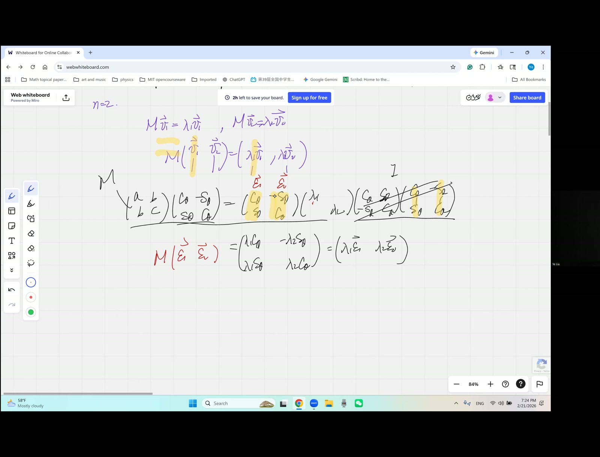
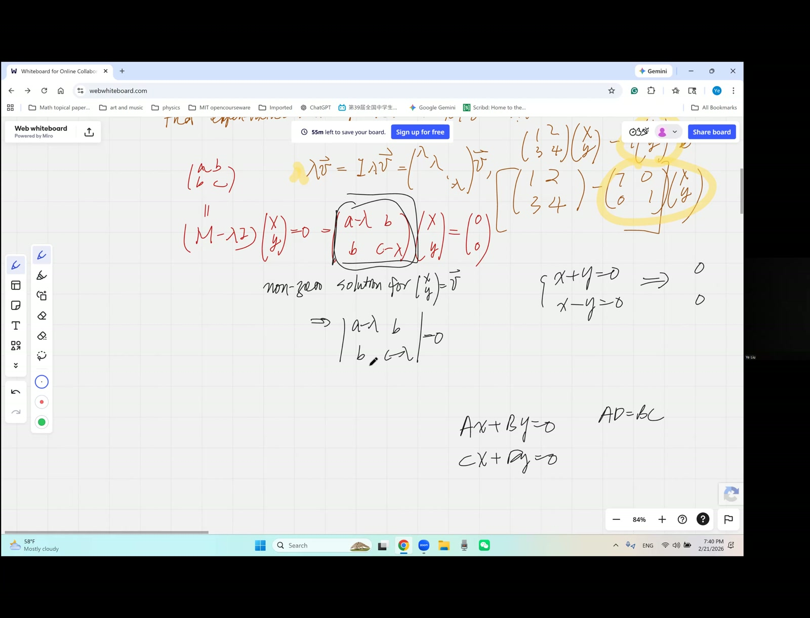
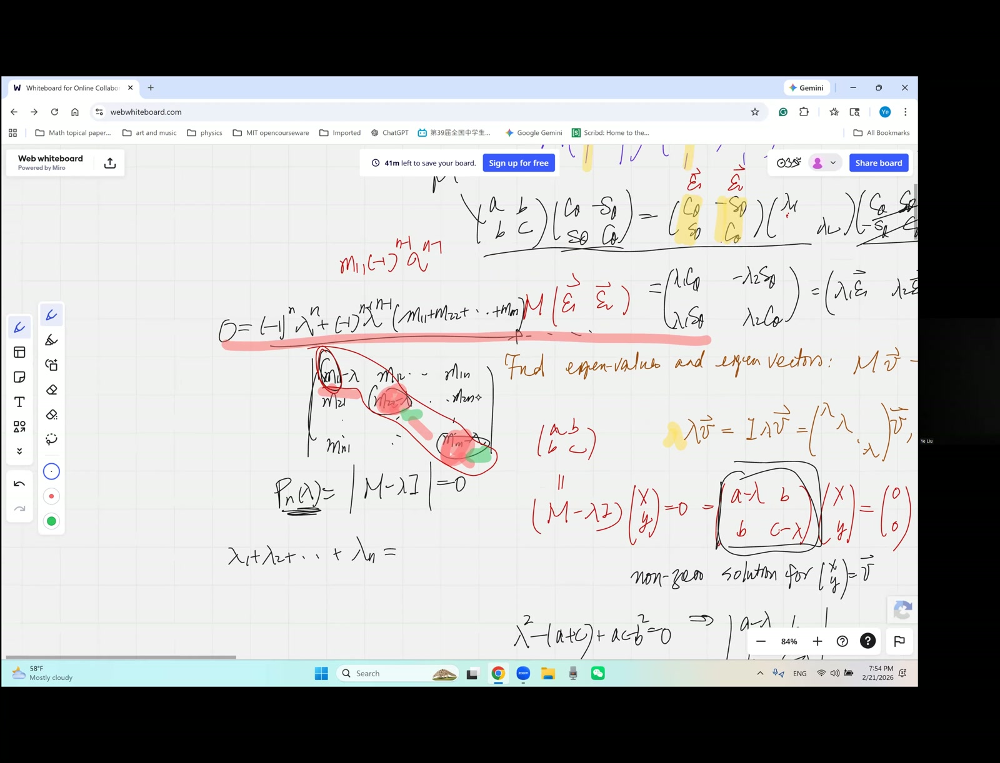

::: {.callout-tip}
**Manifest date flag.** `date_confidence: unknown` — the file `video1897151257.txt` has no parseable date. Content places it during the conic→eigenvalue transition window (late Feb 2026). Inferred date 2026-02-28; verify against Drive `createdTime` if precision matters.
:::

## Lead

Promotes the matrix eigenvalue equation $M \cdot E = E \cdot \Lambda$ ([Feb 21 homework](2026-02-21-morning.html)) to its per-vector form $(M - \lambda I)\mathbf{v} = \mathbf{0}$. The non-trivial-solution requirement gives **$\det(M - \lambda I) = 0$** — the **characteristic polynomial**. The session then proves that this polynomial has degree exactly $n$ in $\lambda$, leading coefficient $(-1)^n$, and (by Vieta) recovers the trace and determinant relations $\sum \lambda_i = \operatorname{tr}(M)$, $\prod \lambda_i = \det(M)$ — **without** assuming the matrix is symmetric or even diagonalisable. The constant-term-via-$\lambda=0$ trick gives the determinant identity in one line.

## Symbol dictionary

::: {.symbol-dictionary}
| Symbol | Meaning |
|---|---|
| $M \in \mathbb{R}^{n\times n}$ (or $\mathbb{C}^{n\times n}$) | general square matrix |
| $\mathbf{v} \in \mathbb{R}^n$ | candidate eigenvector |
| $\lambda \in \mathbb{C}$ | candidate eigenvalue (complex in general) |
| $I$ | $n\times n$ identity |
| $M - \lambda I$ | "shifted" matrix; diagonal entries $m_{ii} - \lambda$, off-diagonal entries unchanged |
| $p(\lambda) := \det(M - \lambda I)$ | **characteristic polynomial** of $M$ |
| $\operatorname{tr}(M) = \sum_i m_{ii}$ | trace |
| $\det(M) = p(0) \cdot (-1)^n$ | determinant (via characteristic polynomial evaluated at $\lambda = 0$) |
| "Fixed subspace" | a 1-dim subspace $\operatorname{span}(\mathbf{v})$ such that $M(\operatorname{span}(\mathbf{v})) \subseteq \operatorname{span}(\mathbf{v})$ |
:::

## Primitive notions and assumptions

1. **Cramer's rule classification** ([2025-10-11 afternoon, Theorem 24](2025-10-11-afternoon.html)): a linear system $A\mathbf{x} = \mathbf{0}$ has non-trivial solutions iff $\det A = 0$.
2. **Cofactor / Laplace expansion** of $\det A$ along any row or column.
3. **Vieta's formulas** for a degree-$n$ polynomial $a_n\lambda^n + a_{n-1}\lambda^{n-1} + \cdots + a_0$: sum of roots $= -a_{n-1}/a_n$, product of roots $= (-1)^n a_0/a_n$.
4. **Determinant geometry** (parallelepiped volume) — same as in [2025-10-11-morning](2025-10-11-morning.html).
5. **Imported facts:** existence of $n$ complex eigenvalues counted with multiplicity (fundamental theorem of algebra applied to the characteristic polynomial).

## Topics covered

- Linear-transformation viewpoint of $M$ acting on vectors $\mathbf{v} \in \mathbb{R}^n$
- "Fixed subspace" interpretation of eigenvectors (preserved direction, scaled by $\lambda$)
- Subtracting a *scalar* from a *matrix*: requires lifting $\lambda \to \lambda I$ first
- $(M - \lambda I)\mathbf{v} = \mathbf{0}$ as the per-vector eigenvalue equation
- $\det(M - \lambda I) = 0$ via Cramer's-rule non-trivial-solution criterion
- Degree analysis of the characteristic polynomial: leading term $(-\lambda)^n$
- The $\lambda^{n-1}$ coefficient: requires using $n-1$ diagonals, picking the constant on the remaining row
- Trace recovery: $\sum \lambda_i = \operatorname{tr}(M)$
- Determinant recovery: evaluate $p(\lambda)$ at $\lambda = 0$ to extract the constant term in one line

## Theorems

::: {.theorem}
**(Eigenvalue equation, per-vector form).** $\mathbf{v}$ is an eigenvector of $M$ with eigenvalue $\lambda$ iff
$$
(M - \lambda I)\,\mathbf{v} \;=\; \mathbf{0} \tag{42}
$$
with $\mathbf{v} \ne \mathbf{0}$.
:::

::: {.theorem}
**(Characteristic polynomial — eigenvalue criterion).** $\lambda \in \mathbb{C}$ is an eigenvalue of $M$ iff
$$
p(\lambda) \;:=\; \det(M - \lambda I) \;=\; 0. \tag{43}
$$
The polynomial $p(\lambda)$ has degree exactly $n$ in $\lambda$, leading coefficient $(-1)^n$.
:::

::: {.theorem}
**(Trace and determinant via Vieta — general $n$).** If $\lambda_1, \dots, \lambda_n$ are the eigenvalues of $M$ (with multiplicity, over $\mathbb{C}$), then
$$
\sum_{i=1}^{n} \lambda_i \;=\; \operatorname{tr}(M) \;=\; \sum_{i=1}^{n} m_{ii}, \tag{44a}
$$
$$
\prod_{i=1}^{n} \lambda_i \;=\; \det(M). \tag{44b}
$$
:::

## Derivation of Theorem 42 (per-vector eigenvalue equation)

Starting from $M\mathbf{v} = \lambda\mathbf{v}$ and bringing $\lambda\mathbf{v}$ to the LHS: $M\mathbf{v} - \lambda\mathbf{v} = \mathbf{0}$. **Cannot** factor as "$(M - \lambda)\mathbf{v}$" — $M$ is a matrix, $\lambda$ is a scalar; not the same kind of object. The fix: promote $\lambda$ to $\lambda I$ (the scalar matrix with $\lambda$ on the diagonal):
$$
\lambda\mathbf{v} \;=\; (\lambda I)\,\mathbf{v}.
$$
Now $M$ and $\lambda I$ are both $n \times n$ matrices, so
$$
M\mathbf{v} - (\lambda I)\,\mathbf{v} \;=\; (M - \lambda I)\,\mathbf{v} \;=\; \mathbf{0}. \tag{45}
$$
With $\mathbf{v} \ne \mathbf{0}$ as the eigenvector requirement. $\quad\blacksquare$

## Derivation of Theorem 43 (characteristic polynomial)

The equation $(M - \lambda I)\mathbf{v} = \mathbf{0}$ is a homogeneous linear system in $\mathbf{v}$. By [Cramer's-rule classification (Thm 24)](2025-10-11-afternoon.html), it has non-trivial solutions iff $\det(M - \lambda I) = 0$.

**Why degree exactly $n$, leading coefficient $(-1)^n$:** Write $M - \lambda I$ with diagonal $(m_{ii} - \lambda)$ and off-diagonal $m_{ij}$ unchanged. The determinant picks one entry from each row and column. The unique combination of $n$ entries all carrying a $\lambda$ is the diagonal product:
$$
(m_{11} - \lambda)(m_{22} - \lambda)\cdots(m_{nn} - \lambda) \;=\; (-\lambda)^n + (\text{lower in }\lambda).
$$
All other determinant terms involve at least one off-diagonal $m_{ij}$ entry, which is $\lambda$-free, giving lower degrees. So $p(\lambda) = (-1)^n \lambda^n + \cdots$, degree exactly $n$. $\quad\blacksquare$

## Derivation of Theorem 44a (trace recovery — Vieta on $\lambda^{n-1}$ coefficient)

Expand the diagonal product:
$$
\prod_{i=1}^{n}(m_{ii} - \lambda) \;=\; (-\lambda)^n + (-\lambda)^{n-1}\sum_{i=1}^{n} m_{ii} + \cdots
$$
The $\lambda^{n-1}$ coefficient is $(-1)^{n-1}\operatorname{tr}(M)$.

**Off-diagonal terms cannot contribute to $\lambda^{n-1}$:** any term using an off-diagonal $m_{ij}$ entry (with $i \ne j$) eliminates *two* diagonals at once (row $i$ AND column $j$ each lose their diagonal entry). So such terms have at most $n - 2$ $\lambda$-bearing factors, contributing only $\lambda^{n-2}$ or lower.

By Vieta on $p(\lambda) = (-1)^n \lambda^n + (-1)^{n-1}\operatorname{tr}(M)\,\lambda^{n-1} + \cdots$:
$$
\sum_{i=1}^{n}\lambda_i \;=\; -\frac{(-1)^{n-1}\operatorname{tr}(M)}{(-1)^n} \;=\; \operatorname{tr}(M). \qquad\blacksquare
$$

## Derivation of Theorem 44b (determinant recovery — the $\lambda = 0$ trick)

Constant term: $p(0) = \det(M - 0 \cdot I) = \det(M)$. By Vieta:
$$
\prod_{i=1}^{n}\lambda_i \;=\; (-1)^n \frac{p(0)}{(-1)^n} \;=\; \det(M). \qquad\blacksquare
$$

Dramatically shorter than the trace argument — entire determinant identity in one substitution.

## Derivation B of Theorem 44 *(independent — similarity invariance)*

If $M$ is diagonalisable, $M = E \Lambda E^{-1}$ with $\Lambda = \operatorname{diag}(\lambda_1, \dots, \lambda_n)$. Then by trace cyclicity ($\operatorname{tr}(ABC) = \operatorname{tr}(BCA)$) and multiplicative determinant law:
$$
\operatorname{tr}(M) = \operatorname{tr}(\Lambda) = \sum \lambda_i, \qquad
\det(M) = \det(\Lambda) = \prod \lambda_i.
$$
**Note:** this derivation imports two deeper facts and only works for diagonalisable matrices. Derivation A works for **all** matrices and uses lighter imports.

*Note on independence.* Derivation A: cofactor expansion + Vieta. Derivation B: trace cyclicity + det multiplicativity. Disjoint imports.

## Verification audit

::: {.audit}

- **$n = 1$.** $M = (m)$, $p(\lambda) = m - \lambda$, root $\lambda_1 = m$. Trace = det = $m = \lambda_1$. ✓
- **$n = 2$.** $M = \begin{pmatrix}a&b\\c&d\end{pmatrix}$, $p(\lambda) = (a-\lambda)(d-\lambda) - bc = \lambda^2 - (a+d)\lambda + (ad-bc)$. Vieta: $\lambda_1 + \lambda_2 = a+d = \operatorname{tr}$ ✓, $\lambda_1\lambda_2 = ad-bc = \det$ ✓. Recovers Theorem 38 from [2026-02-21 morning](2026-02-21-morning.html).
- **Worked $3 \times 3$.** $M = \begin{pmatrix}2&1&0\\0&3&0\\1&0&4\end{pmatrix}$, block lower-triangular. Eigenvalues $\{2, 3, 4\}$. Trace: $2+3+4=9$ ✓. Determinant: $2\cdot 3\cdot 4 = 24$ ✓.
- **Complex eigenvalues OK.** $M = \begin{pmatrix}0&-1\\1&0\end{pmatrix}$ (90° rotation). $p(\lambda) = \lambda^2 + 1$, roots $\pm i$. Trace $= 0 = i+(-i)$ ✓, det $= 1 = i\cdot(-i)$ ✓.
- **Defective (non-diagonalisable) matrix.** $M = \begin{pmatrix}2&1\\0&2\end{pmatrix}$. $p(\lambda) = (2-\lambda)^2$, double root $\lambda = 2$. Vieta: $2+2 = 4 = \operatorname{tr}$ ✓, $2\cdot 2 = 4 = \det$ ✓. Theorem 44 holds without diagonalisability.
- **Degree sanity.** $n = 3$: $p(\lambda)$ has degree 3, leading coefficient $(-1)^3 = -1$. ✓
- **Dependency check.** Theorem 42: algebra. Theorem 43: Cramer-classification + cofactor structure. Theorem 44 (A): polynomial-degree analysis + Vieta + $\lambda=0$ trick. Theorem 44 (B): trace cyclicity + det multiplicativity. No circularity. ✓

:::

## Lecture video

```{=html}
<video controls width="100%" preload="metadata" style="border-radius:6px;">
  <source src="https://github.com/chyj2026/linalg/releases/download/v0.4/2026-02-28-eigenvalues-followup.mp4" type="video/mp4">
  Your browser does not support HTML5 video.
</video>
<p style="text-align:center;font-size:0.85em;color:#6b7280;margin-top:0.4em;">
  Individual session (Catherine + Elaine) · hosted on
  <a href="https://github.com/chyj2026/linalg/releases/tag/v0.4" target="_blank">GitHub Release v0.4</a>
  · also viewable in <a href="https://drive.google.com/file/d/1LtCo11oGZ7DHZakVBuVA0DO0X8kq2lgC/view" target="_blank">Google Drive</a>
</p>
```

## Key frames








## Dependency map

```{mermaid}
flowchart TB
    A["M·v = λ·v<br/>per-vector eigen<br/><i>(Feb 21 homework)</i>"] --> B["Bring λv to LHS:<br/>M·v − λv = 0"]
    B --> C["Type mismatch:<br/>M matrix vs λ scalar"]
    C --> D["Lift λ → λI<br/>now both n×n"]
    D --> E["(M − λI)·v = 0<br/>Theorem 42"]
    F["Cramer classification:<br/>nontrivial soln iff det = 0<br/><i>(Oct 11 afternoon)</i>"] --> G["det(M − λI) = 0<br/>characteristic poly<br/>Theorem 43"]
    E --> G
    H["Diagonal product Π(m_ii − λ)<br/>gives (−λ)ⁿ leading"] --> I["p(λ) degree n,<br/>leading coef (−1)ⁿ"]
    I --> J["[λ^(n−1)] coef =<br/>(−1)^(n−1)·tr(M)"]
    K["Off-diag terms<br/>knock out 2 diagonals each<br/>⇒ only ≤ λ^(n−2)"] --> J
    J --> L["Vieta: Σλᵢ = tr(M)<br/>Theorem 44a"]
    M["p(0) = det(M − 0·I) = det(M)"] --> N["Vieta: Πλᵢ = det(M)<br/>Theorem 44b<br/><b>'λ=0 trick'</b>"]
    L -.matches.-> P["Feb 21 morning result<br/>for n=2 (Theorem 38)"]
    N -.matches.-> P
```

## Worked Socratic exchanges

::: {.exchange}
<span class="speaker">Teacher:</span> "From $M\mathbf{v} - \lambda\mathbf{v} = \mathbf{0}$, can I pull out $\mathbf{v}$ and write $(M - \lambda)\mathbf{v} = \mathbf{0}$?"
<br><span class="speaker">Catherine:</span> *(hesitates)*
<br><span class="speaker">Teacher:</span> "If I gave you $\begin{pmatrix}1&2\\3&4\end{pmatrix}$ and asked you to subtract 7, what would you do? Five dogs minus seven dogs is fine. But five dogs minus *one cat* — what's left?"
<br><span class="speaker">Catherine:</span> "Oh — different types."
<br><span class="speaker">Teacher:</span> "Right. Lift the cat to a herd: $\lambda \to \lambda I$. Now they're the same animal."

*Teaching move:* **type-system intuition** — algebraic operations require like-typed objects. Scalar–matrix mismatch is a real bug, silently fixed by inserting an identity. Making the lift explicit clarifies what was previously hand-waved.
:::

::: {.exchange}
<span class="speaker">Teacher:</span> "What's the constant term of this hugely complicated $n$-degree polynomial?"
<br><span class="speaker">Catherine:</span> "Too complicated to find by expansion?"
<br><span class="speaker">Teacher:</span> "Plug in $\lambda = 0$."
<br><span class="speaker">Catherine:</span> "Oh — and that's just $\det(M)$!"
<br><span class="speaker">Teacher:</span> "Brilliant. The whole determinant identity in one line."

*Teaching move:* **substitution as evaluation shortcut** — when only the value at a specific input is needed, substitute instead of expanding symbolically.
:::

## Exercises given

::: {.callout-important}
**Homework.**

1. Verify the $\lambda^{n-1}$ coefficient extraction for $n = 3$ by explicit expansion. Confirm against the trace prediction.
2. Compute eigenvalues of $M = \begin{pmatrix}3&-2\\1&0\end{pmatrix}$ via $\det(M - \lambda I) = 0$. Then find eigenvectors by solving $(M - \lambda_i I)\mathbf{v} = \mathbf{0}$ for each $\lambda_i$.
3. *Preview for next session:* what happens when the characteristic polynomial has a **repeated root**? Sketch the eigenvector picture.
:::

## Fragility summary

::: {.fragility}

- **Weakest step.** The $\lambda^{n-1}$ coefficient argument relies on the combinatorial claim "off-diagonal terms knock out two diagonals each." This is correct but the lesson sketches rather than fully formalises it. The formal proof: any non-identity permutation $\sigma \in S_n$ contributing to $\det(M-\lambda I)$ has at least 2 indices $i$ with $\sigma(i) \ne i$, so its contributing term has at most $n - 2$ factors of $(m_{ii} - \lambda)$.
- **Imported facts.** Cramer's-rule classification (proved [2025-10-11 afternoon](2025-10-11-afternoon.html)); cofactor expansion; Vieta's formulas; fundamental theorem of algebra. Multiplicative determinant law used only in Derivation B.
- **Diagonalisability silently varies.** Theorem 44 holds for all matrices (Vieta works on roots-with-multiplicity), but the lesson doesn't explicitly distinguish "$n$ eigenvalues" from "$n$ linearly independent eigenvectors." The Jordan-block case (defective matrices) gets formal treatment in [2026-04-04 morning](2026-04-04-morning.html).
- **Real vs complex eigenvalues.** Symmetric matrices guarantee real eigenvalues; general matrices may have complex ones (e.g., the 90° rotation example). All theorems hold over $\mathbb{C}$.
- **Confidence.** Theorem 42, 43 + proofs: high. Theorem 44 Derivation A: high (the trace argument needs the combinatorial gloss noted above). Derivation B: high but limited to diagonalisable matrices.

:::

## Explorative directions

- **Next brick (Mar 7):** Cramer's rule re-derived and the cofactor inverse formula proven *rigorously* — today's $\det(M - \lambda I)$ relies on cofactor expansion; Mar 7 makes that explicit.
- **Forward (Mar 28, Apr 4):** linear recursions reformulated as $a_{n+1} = M \cdot a_n$, eigenvalues of $M$ control the asymptotic growth. The characteristic polynomial derived today *is* the recursion's characteristic equation.
- **Forward (May 2):** Cayley-Hamilton — every matrix satisfies its characteristic polynomial $p_M(M) = 0$. Today derives $p_M$; May 2 substitutes the matrix into itself.
- **Open question:** the **trace** and **determinant** are *two* invariants under similarity. For $n\times n$, there are $n$ similarity invariants — the coefficients of the characteristic polynomial. Together they recover the eigenvalues (up to permutation). Forward-pointer: invariant theory and Cayley-Hamilton.
- **Open question (deeper):** for *non-diagonalisable* matrices, the characteristic polynomial doesn't fully determine the matrix up to similarity. We need the **Jordan canonical form** (Apr 4). The *minimal polynomial* is a finer invariant than the characteristic polynomial.
- **Connection back to Jan 3 (Vieta on transcendental):** $\det(M - \lambda I)$ is a polynomial in $\lambda$; its roots are eigenvalues. *Vieta on the eigenvalues* gives trace = sum, det = product. Same algebra as Euler's Basel problem at finite dimension.
- **Pedagogical thread:** two-independent-derivations for trace and determinant (combinatorial expansion in Derivation A; similarity-invariance in Derivation B) — different perspectives, same result. The *equivalence* of the two perspectives is the spectral theorem.

## Related sessions

- **Precursors:** [2026-02-21 morning](2026-02-21-morning.html) — matrix eigenvalue equation $M E = E \Lambda$ for $n=2$ symmetric case (Theorem 38) is the direct setup. [2025-10-11 afternoon](2025-10-11-afternoon.html) — Cramer's-rule classification (Theorem 24) is the load-bearing import.
- **Sequels:**
  - [2026-03-28 morning](2026-03-28-morning.html) (stub) — Gram-matrix rank tests; pivots to Gauss-Jordan inversion.
  - [2026-04-04 morning](2026-04-04-morning.html) (stub) — companion matrix + **Jordan-block** treatment of repeated eigenvalues (homework #3 above). Defective case formal treatment.
  - [2026-05-02 morning](2026-05-02-morning.html) (stub) — **Cayley–Hamilton** $p(M) = 0$ strengthens Theorem 43.

## Full transcript

::: {.callout-note collapse="true"}
## Verbatim transcript of the session

```{.txt}
Thank you. We're going to take the idea from the previous session. As you come in, let me turn on your recording. And somehow, Kay, I can't see your video. Are you here in the room? Yeah. Come on, but what's happening?One second. What's happening here? Why I can't? Huh? What's happening? Uh, somehow, Catherine, I can't see your video. Have you turned on your video? Yes. It actually shows on my screen now. I don't know whether you can see it.That somehow you're not turning it on, are you? Yeah, can I rejoin? Yeah, of course. Come on, let me actually clear the board. Otherwise, this is gonna make a what? Oh, shoot!What？看嘛，看嘛，啊！What？What？哎，so weird。Why can't I just? Okay. Alright. It's better. What? I didn't know that. Sorry.For so many mishaps, and Elaine, do you have any personal questions so far? Not really. Good, and I'm gonna slow down a bit. Now I can see you very good. Okay, sorry for going back and forth. Let me turn on your recording. I'm gonna slow down a bit. We are in the territory where this is a very deep linear algebra, and so I want you to take your.Time to really think through the ideas. Try to connect them. Don't hurry with the formulas. Why do I want to move a college course to middle schoolers? The reason is plethora, or I would say most pressingly, if you want to do any independent exploration in high school, do math modeling or going for any reading or research, or really just get hands on development of AI reasoning or whatever that's out there. That's all the rave.Fundamentally, number one skill you want is linear algebra. Linear algebra is not really dependent on a deep understanding of algebra or your calculational techniques or the idea of building up calculus tools. No, no, it is sort of a zero ground. Nevertheless, it's sophisticated thinking. It gives you idea a way to look at the universe as linear space, as linear combinations, and so it is actually doable to teach it to very
小 kid, young kids, and as long as you put your idea, your your your concentration, put your mental concentration on understanding the big picture, and you're beginning to learn basically a language. If you learn French, and you would have a sense, fundamentally, the pronunciations are of different style. your your your physiology, your tongue and your mouth, they're just they have a different feel when you speak French, and the way that you connect the the accents and move from one.one was to the next, they're all different. So, likewise, when you're learning algebra, it's a different flavor of matter, and that's why I want to slow down and then just give you the time to really savor it. Let's recap where we are. We're dealing with lifted as much as we can, okay, from quadratic equations now from conic sections. We are processing this matrix in the abstract sense. So, actually, I give you a two by two, which is aVery small dimension, but nevertheless, though it has a capacity to generalize onto higher dimensions. So for the time being, I give you the a, b, b, c, and our goal is to diagonalize it. We already know, and the diagonalization also requires we want to change the idea minimally, meaning we actually want to preserve the determinant. We want to preserve the volume. In the future, such a matrix here could also be looked at as aActually, the volume of a bunch of vectors in the n-dimensional space. So I want to keep that, and we figured out there's something intrinsic with actually a geometric meaning to it. That's a rotation that's going to realize our goal, meaning diagonalize it. So we're trying to come up with such a cosin data, sine data, and then that's the sine data, cosine data. Then we would have aa diagonalized form lambda one, lambda two, and followed by cosine theta, sine theta, negative sine theta, cosine theta. This is the goal. And we figured out if we want to go for a shortcut, okay, we can try to avoid the cosine theta and sine theta, and just directly work at lambda one and lambda two. We already know how to do that. But starting from now on, we're going to actually change our perspective. We think of a major矩阵 now as a linear transform, and I want to write it down. This is a linear transform. What does that actually mean? It operates on a vector. And for example, I pick a vector v now that is equal to a x and a y. And if I operate this a b b c on the x and the y now, right now it's not quadratic; it's just a linear transform. Now what we're getting would be I still get a vector. I get a vector.Vector that's a combination between the original x and y coordinates. So the new horizontal coordinate, well, the x coordinate here would become a a x and plus a b y, and the bottom coordinate would become a b x and plus a c y. It becomes another vector. And don't be fooled by this long expression here. I mean, that's just a single number. You have a a coordinate and a second coordinate, nothing else. So strictly speaking, it's just a vector.And the right hand side is a transformed form of the v. So fundamentally, you can write it as the matrix M now. It operates on the v would actually yield another vector, which I call the u now. Well, majority of the cases, this u probably after you mix your x and y has nothing to do with the original v. At least you can't really identify by eyeballing. Oh, somehow the u and v are correlated. They wouldn't be. Well, the
Majority of the cases, but we're particularly interested in those cases here that this complicated linear transform amounts to nothing but a dilation. Meaning, there will be cases here that M will not rotate your vector. It's not going to mix them. It's just a simple dilation. The resultant vector would still be parallel to the original one. By the way, these are actually what we call the fixed subspace. What does that mean?Well, each vector here is going to be a one-dimensional subspace of the higher-dimensional space now. And this M operates on it. It's not not going to turn this subspace into some other direction, but rather preserves it. So that means it's a fixed subspace. But I put at the subspace instead of just a fixed vector because we do allow a dilation, some kind of factor. And meaning this would equal to a lambda of the x and y. It just said the x and y coordinates are following.the same proportion. So this group of vectors, with the arbitrary choice of the lambda as a real number, they are all dilated version of the single vector now, or in other words, they are all parallel to the given vector, and that's called a subspace. So we're looking at the special choice of the x and y, so that it is a preserved subspace. Then what are we going to do? If somehow this lambda fits that, well, before we actually talk about howCould we find such direction, such a vector x y? And let's see what we have done earlier. How is that related to this idea of a fixed subspace? By the way, if this is true, if it turns out that your v turns out to equal to a lambda v, then the result of this linear transform does nothing other than dilated. We're going to actually assign them, and these are precious, very valuable vectors. Now we're going to call the lambda here the eigenvalue.And our v the eigenvector. And in the future, we're going to prove. And if your M starts with a symmetrical matrix here, you shall always end up with n eigenvector and n eigenvalues if it is diagonalizable. But occasionally, you would end up still n eigenvalues, but not really n eigenvectors and some eigenvalues.might be actually missing a eigenvector, but in reality, just that they're complex numbers. But in any case, this is the mindset we begin to be interested in this fortuitous case now. And now we're going to come back and relook at what we did before from with this new lens. We look at this linear transform. For that to be true, we need to do two things. Okay, number one, these are all matrices. We're not dealing with a column.向量。So we're gonna see what's gonna happen if you could find two such column vectors. Yeah, let's suppose your M operating on the v one that's gonna equal to lambda of the v one. Now M operating on the v two would give you lambda two would equal to lambda two of the v two. Somehow we found two such eigenvectors and associated two eigenvalues. Now suppose it is in two dimensional space. Now and just you.等于2。 Then can we combine them into one single matrix form? I want you to think about what's going to happen when you do the M multiply. M is a two by two matrix, but if I put the v1 as a column and the v2 also as a column, when I draw a dash here, I'm only indicating that it extends out to the whole row or to the whole column. And then knowing this is going to equal to lambda one times the v1.
Right, it's skinny and just a single column. Okay, and then the lambda two of the v two that's going to be the second column. Oh, I hope you don't misunderstand it. For the one, it's not. It's just going to be an entire column vector. Well, first, double check the notation. Do you think I can do this by lay them out side by side?Be sure to really think about it.And please do talk to me.Yes, it is. It is, it's guaranteed by the really just the operational rule when you multiply the two matrices, right? When you do the matrix multiplication, you grab the first column and you match with every single row of the M matrix to produce the numbers over here. So, indeed, the two.Two columns operated separately. I can bundle up the two equations into one now. That means M multiplied by another matrix would yield basically each column would be a transformed column vector. Okay, now if we do so, then let's see what is going to happen to this original equation. There's something not so balanced of the equation because we got one matrix on one side, three matrices on the other. Not to mention our goal is.is to really investigate what's the transform and this matrix represents. So we need to act upon some matrices. So I decide we're gonna actually make it into a transformation, act upon two vectors, and which let's actually multiply the a, b, bc, and now act upon this now the cosine data, now that sine data, negative sine data, and the sine data cosine data, butBut if I multiply that that matrices on the left here, I definitely need to do likewise on the right. Oh, that's not that that matrices. I'm going to copy in for the time being. And then lambda one, lambda two, and then followed by cosine, sine theta, sine theta, cosine, negative sine theta, and then multiplied by. Now, finally, I'm copying in cosine theta, sine theta. All of these mean theta. Sorry, sorry.Negative sine theta, cosine theta。 And let's actually see what is the multiplication of these two matrices。
It's a unit that um unit matrix. Yeah, I got the same thing. Yeah, exactly. For several reasons, now you can explicitly multiply them out and use the Pythagorean identity repeatedly, or you could.identify this is a pair of orthonormal basis. These two column vectors are each one a normal vector, meaning a unit vector. They're also perpendicular to each other. So when you do their mutual dot product, what you're getting is a bunch of a delta ij's, meaning they're either one or zero, and they're only one on the diagonal. So indeed, that's identity. Identity is as good as the one in the regular multiplication, so it can be neglected from our written form now. Multiply by I, it's the same.没在，not right，multiply by anything there. So in fact, that just gone. So this is the result. What does that actually mean? Have we found out the two eigenvectors for the matrix A B C? If I call that our matrix M, if you just tease out what it means now, let's again explicitly multiply the right hand side and see what you're getting.嗯。嗯。嗯。And feel free to keep me posted where you are.For the left hand side, I got a cosine theta plus b sine theta.
θ， and negative a sine theta plus b cosine theta, b cosine theta plus c sine theta, and negative b sine theta plus c cosine. 哦，哦，你是在看左手边， yeah， okay， you are right. Ah, but actually, the goal is to find out what's going to happen on the right hand side. Why? Because in fact, what I wantto say is M operating on epsilon one. I defined the two columns here just for simplicity. I define the first column as epsilon one. It's a vector, and perpendicular to the second vector epsilon two, which is defined as the negative sine theta cosine theta. So if I do so, I would know the left hand side of the equation means the M transformation is operating on epsilon one and epsilon two, and the result happen to be lambda one epsilon one, lambda twoλ到λ到λ到λ，right? Oh, yeah. When you really multiply them out, and you can see somehow this lambda simply scale up the first column, the lambda two scale up the second column. What does that mean? Have we not found out the two eigenvalues and eigen vectors? Yeah. And this is memorable, and we really want to generalize the process in the future.What we're getting is somehow in the future, if you really want to diagonalize it to find out what's the shape of your quadratic equation, we might as well just find the eigenvalues and eigenvectors. And now I'm going to actually take entirely a different approach, so that later this is fully generalizable onto higher dimensions. At the moment, here you know if we could really understand it as a rotation, then we're definitely confined to two D. If we're dealingWith a a conic section in three D now, we're talking about the paraboloid or hyperboloid, and honestly, the three D rotation would get so complicated that we lose the intuition. We lose every single step. There's a graphical direct graphical interpretation. We lose that. But the following approach now lifted from geometry, and we'll be able to generalize it fully onto arbitrary higher dimensions. So at this moment, having this new point of view.我们 gonna actually shift it to a new mindset. Now, we're really trying to do M operating on the on the 一寸丸。 Let's just do it one at a time. Let's say I have a matrix M now. So this is focus on the approach of finding the eigenvalues and the eigenvectors.Of arbitrary matrix now. So, what do you want to do is M times V operating on the V would equal to lambda times V now. Can I, if I want to subtract the two, okay, and then I want to pull out my V here. Well, I have a difficulty. Can I just do this, pull out the V and say I'm minus the lambda equal to zero? Can I do?That. Um. Yes. No. Why not? I don't know. You have the the in the feeling, huh? Since I'm asking you, what you learn? Why not? I don't know. Maybe maybe you can just try it. For example, if I give you one, two, three, four, my
minus seven， what do we get? Can you tell me? How do I subtract a number from a matrix? They're not the same kind of animal. Oh, well, you can say five dogs. You lose two, you're left with three dogs. But if you lose a cat from five dogs, what do you have left? So, in fact, they're not the same animal. You can't really subtract a number from a矩阵。However, though, now after the point is not to subtract them, but subtract this one. You see, I want you to write it in a different way, so that could work. What we want to be a one, two, three, four, and operating on x and y minus a seven times x and y. I want that to be zero. So, can I somehow pull out the x and y and write the rest of it into a matrix?meaning seven into a matrix， yeah， how do I do that？ seven one zero zero， or seven zero zero one。 close， but if you actually do the seven zero zero one now multiply x and one， can you compare the result here？ Basically， you you find out。What they come up with on the right, see if they're the same. Meaning, really, you can just focus on this part now. Are they equal? Are they the same? Not really. No.No， right? But you're already halfway right. So how do how do we fix it easily?Do we change the other one into a seven? Yes, that's right. So, in fact, the rule in the future, even in higher dimensions, if you want to lambda times, come on, if want to lambda times a vector now, and you want to in order to be combined with another matrix, it's easy to simply add identity in the front. You could always multiply this by identity. That's that identity is already a two by two matrix or n by n matrix now, and then you.Absorbed lambda into the identity, right? It just lambda, lambda, lambda, depending on how many dimensions. That's actually the cleanest, the cheapest, cheapest way to immediately make the lambda subtractable from a full-blown n by n matrix, so that you do understand whatever this scaling factor, a simple number, it's also operating like a matrix, right? Okay. Well, if that's the case, now I can just change it ever so slightly.And that's identical. To find the eigen vector and the eigen value, now we need to solve this equation, right? Connected to what you know about the solution to the linear equations. This m minus lambda, no matter what. For example, in the earlier case, now what we have m equals to that a b b c minus lambda i, and we want to solve for operating on x and y would equal to zero. And but if I
I plug in. What you're getting is, go ahead and simplify. What is m minus lambda i, please?嗯。Finding the m minus lambda i right. Yes. We're subtracting that lambda.forced into the same format as a matrix. That's right. A minus lambda v, v and c minus lambda, and operating on the x y will equal to zero. Well done, that's correct. And Catherine, are you getting the same? Yeah. Okay. Well, knowing this is so, can you remember we're solving a set of a set of algebraic equations?Remember, the x and y are the only two variables we're solving. What vector will be preserved with no rotation, but just only a dilation? Although, in order for that to happen, there are only certain lambdas that can make it so. But if you want to solve two equations here, yet your solution are not trivial, meaning your solution are not zero zero. I mean, zero zero always fit into any single matrix. If you I'm operating on the zero vector, you just get zero vector.So that's a trivial kind of a eigenvector. We do not count it. We want to have a non-zero solutions to this set of equation. What do you guys remember? When does that happen? If I want to have a non-zero solution, for when I say non-zero solution, I mean the pair of coordinates here. They can't be both zero for x and y for this vector now, which I've.破了壁。那，what does that require of the coefficients of this two by two linear system of equations?The coefficient must equal to zero. All the coefficients must equal to zero. No.
嗯，我们不 necessarily need that. Randomly, you try, for example, if I give you two equation, x plus y equal to zero, I'm giving you basically a minus lambda. As if this matrix here, it's replaced by just one one, and then the x minus y equal to zero. Then, in fact, there's no other solution other than zero zero, no doubt about it. In fact, we can use Cramer's rule, right?And the Cramer's rule always would guarantee you both are zeros. So, in fact, we're looking for the cases that we can't use Cramer's rule, which actually means what? When would you have infinite many solutions for this? Elaine, think about it. When.Could you like move some parts around？哈，x equals y。 Yeah, you can. And you plug it into the first equation, still zero. You didn't do anything wrong by moving them around to get a feel for the solution. But I want you to think back. Generally, if you have a three equations and three variables, right now, two.方程，两个变量， usually there's a unique solution. But what we want here, if you really you you think about the choice for the x and y, we have infinite many solutions. Because if the x y is a solution, then if I double the two coordinates, two x two y, it's definitely also a solution. You can scale it, so immediately you have infinite many. But if you have infinite many solutions here, what what does that imply about the two equations?You can give me a hint so that you, if you want me to start talking, but otherwise, I'm waiting for you to really think about it. It's important idea. Wait, so these two solutions? Ah, no, I'm talking.In general, if we have a really just the arbitrary matrix here, if I have a a x and then plus a b y equal to zero, and then c x and plus a d y equal to zero, when do we have not necessarily a unique solution, which is zero zero, but infinite many solutions, which is what we want. We want to find nontrivial eigenvectors, right? Negative a over b.Must equal to. Go on, you're right. Negative c over d. Yes, and Catherine saying they must have the same slope, meaning these two lines must be parallel. They can be really one equation, but they look different. Uh, because that may not. In fact, they could be the same, but they could also be different. But the second equation must be a scaled version of the first equation. You.Can write the way that you said, but that necessarily requires the b not to be zero. Or I can write the a over the c must equal to the b over the d, but that's also requiring that the c and d are not zero. So I would say the neat way to actually write the same condition without having to imply or be conditioned upon one of these numbers is not zero is that you can actually do the ad must equal to the bc, right? That's another way to say that all the two slopes are the same.
或 the coefficients are in proportions, right? Yeah, but to say ad equal to bc, isn't that saying that determinant this matrix must be zero? It's really just saying, and the necessary condition for that would be the determinant of this matrix now b and c minus lambda must equal to zero, right? That's really what it means. Yeah. Go ahead and expand it out. Ah, huh, yeah.啊，I love that sound. That you begin to see something，哈。Go ahead, go ahead, the sound for your lambda. Because you're going to encounter quadratic equation, you will see there are two lambdas.嗯。嗯。嗯。It is posted. What you're doing? Uh, multiplying the a minus lambda and the c minus lambda and using the quadratic equation. Very good. By the way, and at a certain point, you might well you can use quadratic formula, but you might also observe some of the at. And if you recognize something.That you had done earlier when we were dealing with a diagonalization, that shouldn't be surprising.嗯。
嗯。嗯。嗯。Tell me what's happening. I'm sure you both. Uh, I got the solution to lambda one, lambda two, and the.Only remind you the same solution as earlier, exactly what we had for the diagonalization of that quadratic. Right? In fact, for these two now, you're getting quadratic equations, lambda squared minus the a plus c, and then plus the ac minus b squared. That's the quadratic equation, isn't it? Yeah. Yeah. And then just from the Viet, you directly recognize it. Really means.是 lambda 一 plus lambda 二 equal to the a plus c， and lambda 一 times lambda 二 equal to the a c minus b squared， which is exactly the condition we recognize earlier when we try to identify. After this transformation， we're saying that something is being preserved. Back to the older matrix now， and what we had in the morning， meaning the trace remains unchanged. If you add up lambda 一 plus lambda 二， it should preserve a plus c。 Determinant remains unchanged。 That meansIf you multiply lambda one, lambda two, you should preserve the a c minus b squared. Then no doubt about it. In fact, we just end up with the same set of lambda one, lambda two. In the future, you don't even need to go through that elaborate game of a rotation anymore. You just know to find the eigenvalue. What do we do? We subtract. I'm I'm going to actually streamline, summarize what is the procedure to find the eigenvalue of a matrix. Now, what you do is that you take this M, you minus lambda I.You take the determinant, which necessarily would result in an n-degree polynomial regarding the lambda, which most of the time would give you n solutions, and set it at zero would yield n-degree polynomial. Why? It's n-degree polynomial regarding lambda. Why? Because for the n-degree matrix, n-dimensional matrix. Now, what you're getting is m one one minus lambda and m one two da da da m one and I'm spelling out all the terms, and that.
The M two one, M two two minus lambda, da da da, M two n, da da da, all the way till this is the M n one, to M n n minus lambda. You're subtracting by lambda only on the diagonal. When you take the determinant, you have to pick one element from each column and row, and multiply them together, and exhaust all n factorial such combinations, and you can see the highest power it can get. Eventually.It's all going to be a polynomial of the lambda, but then you get a combination of a complicated different powers of lambda. But the highest they could possibly get will be you have to multiply the whole diagonal together. That gets you actually the leading term must be the ninety-one to the nth power lambda to the nth power. That must be the leading term, and then after that you have a complicated other terms. In fact, here's a direct proof that the trace is being preserved. How come? Well, let us see what.Is going to be actually the lambda of the n minus first power. What's the entire coefficient? That means during this complicated grand expansion of the determinant, now we're looking for altogether n raised to lambda minus one power. Wouldn't that mean at least you've got to use n minus one of these diagonal elements? You can only skip one, right? So I need to use all of these now. But if you're using n minus one such,And what would be the remaining term? That means if I pick each one of these and minus ones, I pick all of these now. And then what element must I pick in the first column? I have to pick that one.I can't pick anything because we, in order to have a term here, we have to follow. We pick only one term from each column and each row, right? I pick this, this a minus one to get the lambda from them, but necessarily as a term in the final determinant, they have to be multiplied onto that term. But I can't have the lambda to the n power anymore. I've got to have a lambda to the n minus first power. What does that mean? That means you've got to actually one second.You've got to pick each of the lambda from each of these terms here, but then combine with that one, combine with the m one one. So you still have this whole product here. Except for you, when you do the grand foiling, we're gonna nail the term which is m one m one one, and multiplied by lambda one to the n minus first power, so many of the lambda of the n minus a lambda to the n minus first power, and that's one term.Did you trace what I talked about? Did you follow? Not really. How did you get though? I'm one one. Yeah. Well, visualize this. Maybe I'm gonna actually do a concrete one. If I have a a minus a lambda, and hold on, and this is going to be um a b and a c, and then theD and E minus lambda, F, G, H. Oh, I don't want to use I, J minus lambda. And you're working on the determinant thereof. Well, let's see how many ways can we get lambda cubed. There's only one way. You have to multiply. There are only three presence of the lambda. You have to be sure to multiply them together, right? And that means you have to multiply these three terms together. That gives you a negative lambda cubed.
Correct, yeah. Well, let's see how many ways to get under squared. To get under squared, at least you need to actually grab two of these. For example, I'm using those two, and not only I need to use those two, I'm also multiplying these two terms together, right? But the minute you're including those two yellow highlighted terms now, and then what is the term we pick from the third column to be multiplied onto it? It can only be this one.Right, yeah. But then I can't pick the lambda here because I pick the lambda necessarily. We're gonna have a lambda cubed, so I need to have lambda lambda squared. So I can need I only can multiply by the j. I have to multiply by the constant term here, and with those lambda terms. Do you follow? Yes. So that I know actually j appears, but the piSymmetry by equal opportunity. If the J appears, necessarily the E must appear, right? Yeah. And also A. So, is this pattern generalizable onto n dimensions? Yes. And do we see why? In fact, that term here you can write is a negative one to the n minus first power, and then inside all theCoefficients are the m one one plus the m two two，哒哒哒， all the way two plus m n n。 Yeah, yeah, you follow me, huh? Very good. And the n n哒哒哒， you know that polynomial is very long. But we do know, though, it's a polynomial of n's power regarding lambda. Make sense? Yeah. And in order to solve the eigenvalues, I need to set it to be zero.So I do said that to Zira, and I'm not going to solve it. It's just way too nightmarish. But from the Viet alone, eventually, remember, you know, this whole M matrix would be diagonalizable onto a set of lambdas. But even just using Viet, what do we know about the sum of all the roots for this polynomial? Which I don't even know the other coefficients. Now I only know the beginning few terms, but even so, that's enough. What's the sum of伊斯兰 does。嗯。Maybe because that polynomial is too huge, but in arbitrary a polynomial, higher degree polynomial, if we do the an, now.
lambda to the n，然后 plus a n minus one lambda n minus one，哒哒哒，plus a n minus two lambda n minus two，哒哒哒，plus a one lambda plus a zero equal，come on，plus a zero equal to zero。 What's the sum of all the roots by using the at in the higher dimensional form?I think it was only depends on the first two terms. That's right. Very good. In exactly what manner?呃，喂。Equals the negative of this a n term minus one divided by a n. Yes, very good. So the sumSum of lambdas here actually equals to i goes from one to n now equal to a n minus one minus negative of the a n. Well, then, then can we apply here? Apply to this pretty complicated. That's our a n, and this whole bundle is our n minus one.Um， can you scroll up a bit? Yes.Negative. Negative one to the n power minus one over negative one to the n power.哎，That's part of it. And of course, after cancellation, there's always going to be no negative left, becauseThere's additional negative, but they differ by one power of the negative, right? So according to what you're telling me, would equal to a negative one to the n minus first power over a negative over the negative one to the nth power. But you can see they cancel. But then don't forget, though, there's more to the coefficient. That's what we were spending so much energy finding out by looking at the matrix. Also, um.
Is it just that term? If the negatives cancel out, yes, I just said that m one one plus m two two plus da da da to the mnn, right? Yeah, don't we conclude that the trace is being conserved? That's really saying if the two matrices after diagonalization can be reduced at lambda one, lambda two now, then actually the sum of the lambdas would equal to the sum ofof the original diagonal elements. This is a proof; it's a rigorous one for the result we had earlier, intuitively and just concretely playing out by the two by two matrix. Meaning, this transformation preserves the traits. Makes sense. Okay, I'm going to actually ask you a seemingly very complicated question, but actually should be very simple. What about the product of all the lambdas? Because earlier.Here it happened to equal to the determinant, right? That means for the two matrices, the determinant is also being preserved. Then how do we know? Also from this huge polynomial, which I haven't finished writing yet. And then what is going to be the? We concluded here the lambda sigma of the lambdas equal to the sigma of the mii going from the one to n. What about the grand product? This is lambda one times lambda two and da da da multiplied.By the lambda n, I'll tell you a trick. Also, by the end, when you do the multiplication of all the lambdas, we're anticipating to actually have a the constant term, right? But then, in fact, you don't need to expand it out. There's a very neat way to get hold of the constant term. Do we know what that is? I'll tell you a trick. Meaning, if you want to find what is constant term of a polynomial, you can plug in a nice number.To find it, you don't need to worry about how many ways can we go without lambda to multiply out the rest of the m. It's just way too complicated. It's truly nightmarish. I don't even want you to think about it. But if you want to know what's the constant term of polynomial, what's the easiest way to do it? Plug in lambda equals to zero. Yes, brilliant. But if you do plug in lambda equals to zero, what do you have for this determinant? Isn't that just the determinant of the original matrix?Yeah， yeah， Santan， you have also proven that the trace is being preserved. Determinant is also being preserved because the product of all the lambdas it's naturally the determinant of the new diagonal matrix. Ah, you both did very well. Be sure to just reveal the whole story. Okay, think about it. Look forward to seeing you next Saturday. Keep up with good work. Bye, bye.拜。
```
:::
