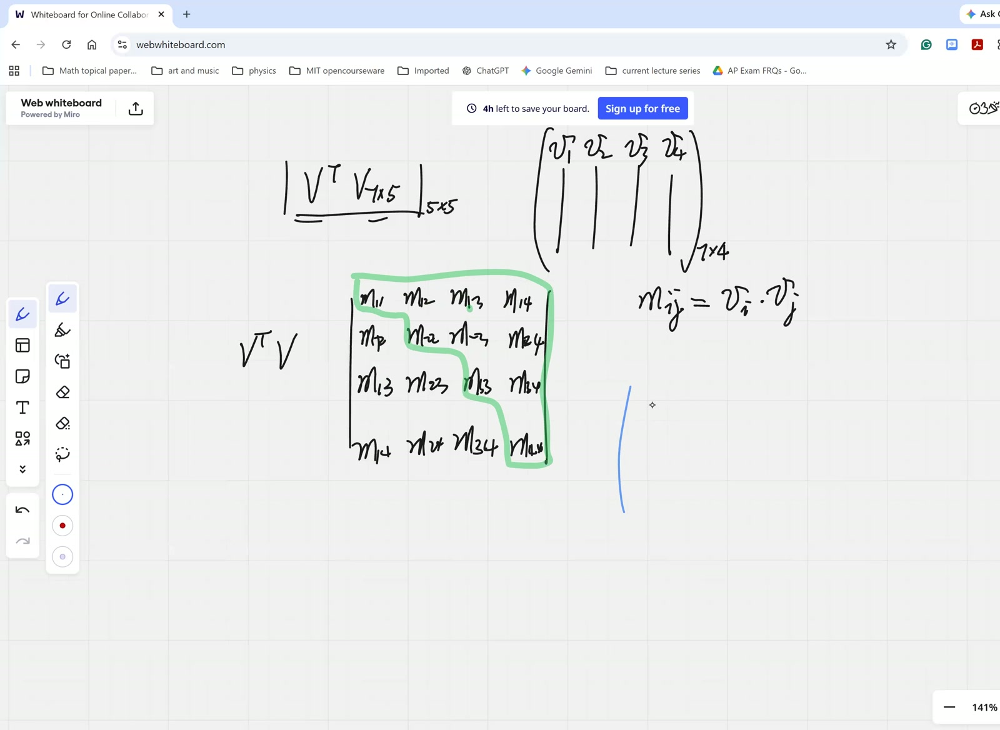
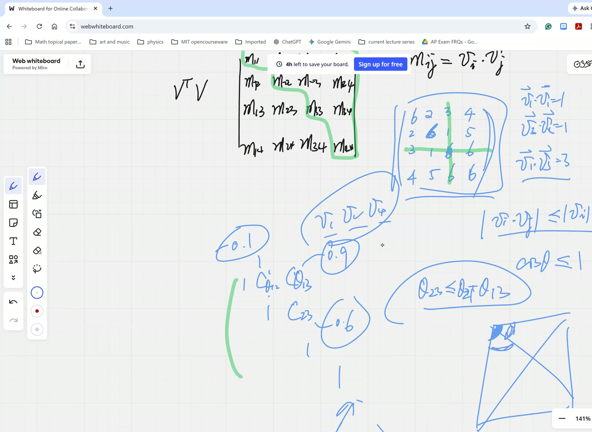
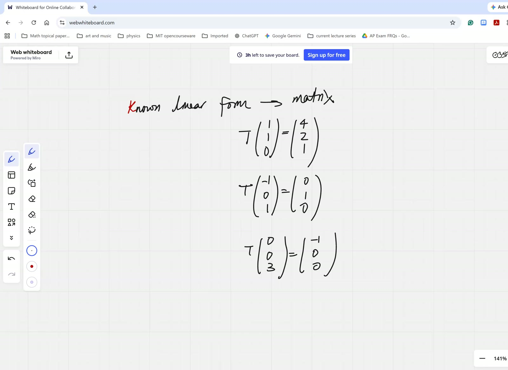

## Lead

Two distinct but linked developments. First, the **Gram matrix** $G := V^T V$ (where $V$ is $m \times n$ with column-vector basis candidates in $\mathbb{R}^m$) is shown to be a rank-detection tool: $\operatorname{rank}(V) = \operatorname{rank}(G)$, and sub-determinants of $G$ probe partial linear independence of subsets of columns. The diagonal entries are squared magnitudes; off-diagonal entries are dot products bounded by Cauchy–Schwarz; for the normalized case, $G$ has 1's on the diagonal and cosines off the diagonal. **Sub-volume inequalities** (one $\ge$ any cofactor $M_{kk}$ $\ge$ smaller cofactors $\ge \det M$) force layered constraints on the off-diagonal cosines. Second, an algorithmic shift: $\mathbf{T} = U \cdot V^{-1}$ recovers a linear transform from its image on a basis, and the row-reduction algorithm $[A \mid I] \to [I \mid A^{-1}]$ — **Gauss–Jordan inversion** — exploits the matrix-as-verb interpretation to invert without computing cofactors.

## Symbol dictionary

::: {.symbol-dictionary}
| Symbol | Meaning |
|---|---|
| $V = [\mathbf{v}_1\ \mathbf{v}_2\ \cdots\ \mathbf{v}_n] \in \mathbb{R}^{m\times n}$ | matrix with $n$ candidate basis vectors as columns (each in $\mathbb{R}^m$) |
| $G := V^T V \in \mathbb{R}^{n\times n}$ | **Gram matrix**; $G_{ij} = \mathbf{v}_i \cdot \mathbf{v}_j$ |
| $M_{kk}$ | $(k,k)$ cofactor of $G$ (delete row and column $k$) |
| $\theta_{ij}$ | angle between $\mathbf{v}_i$ and $\mathbf{v}_j$; $\cos\theta_{ij} = (\mathbf{v}_i\cdot\mathbf{v}_j)/(|\mathbf{v}_i||\mathbf{v}_j|)$ |
| $\mathbf{T}: \mathbb{R}^n \to \mathbb{R}^n$ | linear transformation, identifiable with an $n\times n$ matrix once a basis is chosen |
| $U = \mathbf{T}\,V$ | matrix whose columns are the images $\mathbf{T}\mathbf{v}_j$ |
| $[A \mid I]$ | augmented $n \times 2n$ block matrix with $A$ on the left and $I$ on the right |
:::

## Primitive notions and assumptions

1. **Dot product** $\mathbf{u}\cdot\mathbf{v} = \sum_k u_k v_k = \mathbf{u}^T \mathbf{v}$. Commutative, bilinear.
2. **Cauchy–Schwarz inequality** $|\mathbf{u}\cdot\mathbf{v}| \le |\mathbf{u}||\mathbf{v}|$ (imported; geometric proof via $\cos\theta$).
3. **Determinant geometry**: $\det V$ for $V \in \mathbb{R}^{n\times n}$ is the signed $n$-volume of the parallelepiped on the columns.
4. **Linear-system non-trivial-solution criterion** ([Oct 11 afternoon, Thm 24](2025-10-11-afternoon.html)): $A\mathbf{x} = \mathbf{0}$ has $\mathbf{x} \ne \mathbf{0}$ iff $\det A = 0$.
5. **Row operations on $[A\,|\,B]$ correspond to left-multiplication** by elementary matrices.

## Theorems

::: {.theorem}
**(Gram symmetry).** $G = V^T V$ is symmetric.
:::

::: {.theorem}
**(Gram rank).** $\operatorname{rank}(V^T V) = \operatorname{rank}(V)$. So $\det G = 0 \Leftrightarrow$ columns of $V$ linearly dependent.
:::

::: {.theorem}
**(Sub-volume inequalities, normalized Gram).** If $|\mathbf{v}_i| = 1$ for all $i$,
$$
1 \;\ge\; M_{kk} \;\ge\; M_{kk,\ell\ell} \;\ge\; \cdots \;\ge\; \det G \;\ge\; 0. \tag{48}
$$
:::

::: {.theorem}
**(Linear transform reconstruction).** If $V$ invertible and $U = \mathbf{T}V$, then
$$
\mathbf{T} \;=\; U \cdot V^{-1}. \tag{49}
$$
:::

::: {.theorem}
**(Gauss–Jordan inversion).** If $\det A \ne 0$, then row-reducing $[A \mid I]$ to $[I \mid \ast]$ produces $\ast = A^{-1}$:
$$
[A \mid I] \;\xrightarrow{\text{row reduce}}\; [I \mid A^{-1}]. \tag{50}
$$
:::

## Derivation of Theorem 48 (sub-volume inequalities)

Geometric chain (Emma's argument). $\det G = \det(V^T V)$ equals the **squared** $n$-volume of the parallelepiped on the columns of $V$. Each cofactor $M_{kk}$ is the squared $(n-1)$-volume of the parallelepiped on the columns *minus* $\mathbf{v}_k$.

**Height decomposition.** Let $\phi_k$ be the angle between $\mathbf{v}_k$ and the span of the remaining vectors. Then
$$
\sqrt{\det G} \;=\; \sqrt{M_{kk}} \cdot |\mathbf{v}_k|\,|\sin\phi_k| \;=\; \sqrt{M_{kk}} \cdot h_k.
$$
With $|\mathbf{v}_k| = 1$, $h_k = |\sin\phi_k| \le 1$. Squaring: $\det G = M_{kk}\,h_k^2 \le M_{kk}$.

**Iterate**: removing one more vector gives $M_{kk} \le M_{kk,\ell\ell}$, and so on, bottoming at $|\mathbf{v}_i|^2 = 1$. $\quad\blacksquare$

Equality iff the removed vector is in the span of the rest (parallel and $\sin = 0$) OR perpendicular to that span (no height loss).

## Derivation of Theorem 49 (linear transform reconstruction)

By linearity, $\mathbf{T}$ is determined by its images on a basis. Writing $\mathbf{T}\mathbf{v}_j = \mathbf{u}_j$ side by side: $\mathbf{T}V = U$. If $V$ is invertible, right-multiply by $V^{-1}$: $\mathbf{T} = UV^{-1}$. $\quad\blacksquare$

## Derivation A of Theorem 50 (Gauss–Jordan — "matrix as verb")

Row operation = left-multiplication by an elementary matrix $E$. A sequence reducing $A$ to $I$ is a product $E_k \cdots E_1$ with
$$
E_k \cdots E_1 \cdot A \;=\; I \;\Rightarrow\; E_k \cdots E_1 \;=\; A^{-1}.
$$
Apply the same product to $I$: $E_k \cdots E_1 \cdot I = A^{-1}$. Run both blocks of $[A \mid I]$ through the same row operations until the left becomes $I$; the right becomes $A^{-1}$. $\quad\blacksquare$

## Derivation B of Theorem 50 *(independent — column interpretation)*

Solve $A\mathbf{x}_j = \mathbf{e}_j$ for each standard basis vector. The solution is the $j$-th column of $A^{-1}$. Gauss–Jordan solves all $n$ systems simultaneously by stacking the right-hand sides as the columns of $I$ — the same row operations solve every system in lockstep, producing $A^{-1}$ column-by-column on the right. $\quad\blacksquare$

*Independence:* A uses elementary-matrix algebra (verb view); B uses simultaneous-system solving (column view). Same machinery, different perspectives.

## Verification audit

::: {.audit}

- **Gram symmetry, $V = \begin{pmatrix}1&2\\3&4\end{pmatrix}$**: $G = \begin{pmatrix}10&14\\14&20\end{pmatrix}$. ✓
- **$2 \times 2$ Gram inequality.** Normalized $|\mathbf{v}_i| = 1$, angle $\theta$: $G = \begin{pmatrix}1&\cos\theta\\\cos\theta&1\end{pmatrix}$, $\det G = \sin^2\theta$, $M_{11} = M_{22} = 1$. $1 \ge \sin^2\theta$ ✓.
- **Gauss–Jordan $2 \times 2$.** $A = \begin{pmatrix}1&2\\3&4\end{pmatrix}$. Reduce $\begin{pmatrix}1&2&1&0\\3&4&0&1\end{pmatrix}$: $R_2 \to R_2 - 3R_1$, $R_2 \to -R_2/2$, $R_1 \to R_1 - 2R_2$ gives $\begin{pmatrix}1&0&-2&1\\0&1&3/2&-1/2\end{pmatrix}$. Verify: $A \cdot \begin{pmatrix}-2&1\\3/2&-1/2\end{pmatrix} = \begin{pmatrix}1&0\\0&1\end{pmatrix}$. ✓
- **Spherical triangle inequality.** Cosines $0.5, 0.6, 0.9$: angles $60°, 53.1°, 25.8°$. Check all triangle inequalities: $60 \le 53.1 + 25.8 = 78.9$ ✓; $53.1 \le 60 + 25.8 = 85.8$ ✓; $25.8 \le 60 + 53.1$ ✓. Realisable.
- **Counterexample to "any three cosines work".** $\cos\theta_{12} = -0.1, \cos\theta_{13} = 0.9, \cos\theta_{23} = 0.6$: angles $95.7°, 25.8°, 53.1°$. Check $95.7 \le 53.1 + 25.8 = 78.9$? **No** — violated. So not realisable. Confirms Toby's extra constraint.
- **$\mathbf{T}$ reconstruction.** $\mathbf{T} = \begin{pmatrix}2&0\\0&3\end{pmatrix}$, $V = \begin{pmatrix}1&1\\1&-1\end{pmatrix}$: $U = \begin{pmatrix}2&2\\3&-3\end{pmatrix}$. $V^{-1} = \begin{pmatrix}1/2&1/2\\1/2&-1/2\end{pmatrix}$. $UV^{-1} = \begin{pmatrix}2&0\\0&3\end{pmatrix} = \mathbf{T}$. ✓
- **Dependency check.** Thm 48: height + induction. Thm 49: pure algebra. Thm 50: elementary-matrix or column-solving. No circularity. ✓

:::

## Lecture video

```{=html}
<video controls width="100%" preload="metadata" style="border-radius:6px;">
  <source src="https://github.com/chyj2026/linalg/releases/download/v0.5/2026-03-28-morning.mp4" type="video/mp4">
  Your browser does not support HTML5 video.
</video>
<p style="text-align:center;font-size:0.85em;color:#6b7280;margin-top:0.4em;">
  hosted on <a href="https://github.com/chyj2026/linalg/releases/tag/v0.5" target="_blank">GitHub Release v0.5</a>
  · also viewable in <a href="https://drive.google.com/file/d/1X0tpimqwpsbfcRGJIOw4dOzOKJ9TJVF9/view" target="_blank">Google Drive</a>
</p>
```

## Key frames







![**Frame @ 52m00** — Gauss–Jordan inversion in progress on $3 \times 3$; row operations tracked simultaneously on $[A \mid I]$.](../figures/2026-03-28-morning/frame-52m00.jpg)

## Dependency map

```{mermaid}
flowchart TB
    A["V ∈ R^(m×n), columns v_j"] --> B["G = V^T V<br/>Gram matrix"]
    B --> C["G symmetric (G_ij = v_i·v_j)"]
    D["Cauchy-Schwarz"] --> E["Off-diag ≤ diag<br/>(normalized: cos θ_ij)"]
    F["Geometric height (Emma)"] --> G["det G = M_kk·h_k², h_k ≤ 1"]
    G --> H["1 ≥ M_kk ≥ M_kk,ll ≥ ... ≥ det G<br/>Theorem 48"]
    I["Spherical triangle (Toby)<br/>θ_ij ≤ θ_ik + θ_jk"] --> J["Extra cosine constraints"]
    K["T linear ⇒ basis determines"] --> L["T·V = U ⇒ T = U·V⁻¹<br/>Theorem 49"]
    M["Row op = left-mult by elementary"] --> N["Sequence to I:<br/>E_k...E_1 = A⁻¹"]
    N --> O["[A | I] → [I | A⁻¹]<br/>Theorem 50<br/>Gauss-Jordan"]
    P["Solve A·x_j = e_j for all j"] --> O
```

## Worked Socratic exchanges

::: {.exchange}
<span class="speaker">Toby:</span> "If $\mathbf{u}, \mathbf{v}$ angle $\phi$, $\mathbf{v}, \mathbf{w}$ angle $\theta$, then $\mathbf{u}, \mathbf{w}$ angle $\le \phi + \theta$, right?"
<br><span class="speaker">Teacher:</span> "Yes — spherical triangle inequality. So Cauchy–Schwarz alone is too weak; the off-diagonal cosines have *layered* constraints."

*Teaching move:* student-driven discovery of additional structure beyond the obvious.
:::

::: {.exchange}
<span class="speaker">Teacher:</span> "Each matrix is a *verb*. $A^{-1}$ is the verb that undoes $A$. I don't *know* what $A^{-1}$ is, but I know its effect — row operations — and I track that effect on both halves of $[A \mid I]$ simultaneously."

*Teaching move:* the **matrix-as-verb** mental model unlocks Gauss–Jordan immediately. Used later in LU, QR, pseudo-inverse.
:::

## Exercises given

::: {.callout-important}
**Homework.**

1. **Finish the Gauss–Jordan worked example.** $A = \begin{pmatrix}-3&2&6\\1&7&2\\0&4&3\end{pmatrix}$: complete row reduction of $[A \mid I]$ and verify $A \cdot A^{-1} = I$.
2. **Spherical triangle.** Are unit vectors with pairwise cosines $0.5, 0.6, 0.9$ realisable in $\mathbb{R}^3$? Use the spherical law of cosines.
3. **Sub-volume saturation.** Find three unit vectors where $M_{33} = \det G$ exactly. What geometric configuration is this?
:::

## Fragility summary

::: {.fragility}

- **Weakest step.** Theorem 48 height argument assumes Gram-Schmidt-style orthogonal decomposition; true in finite-dim inner-product spaces.
- **Imported facts.** Cauchy–Schwarz; $\operatorname{rank}(V^T V) = \operatorname{rank}(V)$ via SVD (not derived here).
- **Spherical triangle inequality** stated without formal proof — requires spherical law of cosines.
- **Gauss–Jordan numerical fragility.** Numerically unstable without pivoting. Production code uses LU with partial pivoting or QR.
- **Confidence.** Theorems (sym), 49, 50: high. Theorem 48: high in normalized case; equality conditions subtle.

:::

## Related sessions

- **Precursors:** [2026-02-21 morning](2026-02-21-morning.html) + [2026-02-28 followup](2026-02-28-eigenvalues-followup.html) — eigenvalue framework. [2025-10-11 afternoon](2025-10-11-afternoon.html) — Cramer-classification (Theorem 24) is the load-bearing import.
- **Sequels:** [2026-04-04 morning](2026-04-04-morning.html) (stub) — companion matrices + Jordan blocks. [2026-05-02 morning](2026-05-02-morning.html) (stub) — Cayley–Hamilton.
- **Application:** Gauss–Jordan is $O(n^3)$ vs cofactor's $O(n!)$ — vastly faster for $n \ge 4$.

## Full transcript

::: {.callout-note collapse="true"}
## Verbatim transcript of the session

```{.txt}
每 every single piece of understanding. In case there's anything that you're not crystal clear about, do ask. Okay, we've been playing with vector bases, dimensionality of the subspace, and how to prove either they're perpendicular to each other or they're invariant, or what's going to happen when you perform linear transforms on that. Just overall, any questions from the previous sessions? 啊，都。Hello， I don't think I have any questions. No questions. No questions, huh? Well, if you don't, I do. All right, so we've been. I'm gonna go for online whiteboard. No, not that one. One second here. I need to get a one second.Could you see the whiteboard? Oh shoot! I don't want that. Get rid of this.One second. All right, we'll pick up pick up where we left.But I want you guys to understand what we mean by subspace, and if they are complementary in their dimensions here, then what would be in terms of the set? Do they give you? In what sense do they give you back the entire n-dimensional vector space? Well, last time we reviewed how do we judge the linear dependence and the real rank of a collection of vectors. I may give you five vectors in a seven-dimensional space, but they may have only a rank of two.So, in order to test out what's the exact rank, you've got to actually pull out all of the five and calculate the five-dimensional volume. If it's not zero, the rank is equal five. We know how to calculate the higher-dimensional volumes here. In the seven-dimensional, oh hold on, in seven-dimensional space,嗯，what? So, in seven-dimensional space, here,嗯，wait a second.Why is that so thick? Be seven by five. You put them as column vectors here, and then when you do the v transpose v, and you take the determinant, this is the best, the quickest way to judge whether the five-dimensional volume, because the resultant matrix is five by five, would be a the determinant is zero or not tells you whether the five.Given vectors have the full rank. Let's suppose it is zero, then the highest rank can only be four, and you try out the four by four matrices and look at what would be their determinant. However, though we don't really have to calculate them separately, because when you do this now, and it already includes all those combinations of the determinants. For example, I'm actually giving you this is necessarily a symmetrical matrix. Okay, let's.
I'll give you a five by five map of this uh dimension. Hold on, it's with actually the M one one four. You know, let me go for four by four. So basically, I'm giving you four vectors in seven dimensional space now, and that's going to be the M two one, which is equal to the M one two. It's necessarily symmetrical. The M two two, actually, yeah, okay, M.M two three, M two four, and this is M three one, but it's also M one three. Basically, in a second, I want you to tell me how many independent numbers we can pick to fill that in. So this is M two three, and as M three three, M three four, and then M four four, and this is M one four, M two four, and M three four, four four. Sorry, three four.哦， yes， okay， I'm sorry for. Okay， this is actually the v transpose v now. Once you're given， uh， for seven dimensional vectors， Toby。 Um， why are both of the rows like？ Why did I not transpose the indices？ Because I really mean these are the same number。Wait, so I really mean. Oh, so they're both one two and one two. Yeah. That's one of my questions here. Why do we know this must be the case? Why do we know this is necessarily a symmetrical matrix, where we have only a lot fewer degrees of freedom than the sixteen numbers we see, Lucas? Like we got this.Because we got the this reflective across the diagonal, because it's the transpose, and when you calculate it out, each term would be the same. And can you spell it out? Why they must be the same? Why these two numbers are necessarily the same? Why those two numbers are necessarily the same? Why these two numbers are necessarily the same? And these two are necessarily the same, and those are necessarily the same, etc., etc. Because it it would if we have the matrix.Like, because if we actually just name this Mij now, and which actually equals to if your V at the very beginning, it's made out of V one as a column, V two and V three, V four. This is our V matrix, which is going to be seven by four. So, what is that Mij? V V i times V j.Vi dot onto the vj， that's exactly right. So because of the commutability of the dot product， yeah， you're right. When we swap the index here， we're just swapping the order of the two dots， uh two vectors were dotting each other onto each other. Of course， it's symmetrical. Uh， second， can I arbitrarily throw in？ Well， to begin with， okay， I don't have the freedom to choose these sixteen numbers now， but do I have the full freedom to choose those numbers？Yeah, this can be four plus three plus two plus one, meaning ten numbers here, which I'm highlighting in this region. Do I have the free the full freedom to just write those ten numbers? Can it necessarily be a metric matrix, which is a V transpose V? For example, okay, if I just make make it up, okay, sorry, go ahead.
My only concern was that if we is what if we pick like a configuration where the only possible would be would be would be find would be doing a matrix with like determinant zero or something. Oh yeah, the determinant can be zero because these four vectors could be linearly dependent. My question is, well, if I actually give you this kind of matrix now, and that's the two two two three.三一五， and that's six. Could it be a legit V transfers V?Howie， I don't know， like you can find a set of vectors that dot onto that。 Right， that's the issue。 We're not going to work out the full set of vectors。 It's just way too tedious。 But are there telltale signs that you could immediately know that just cannot be？Lucas，I think I I think the like the the there's three ones on the diagonal that probably makes it a lot harder if it's possible. I don't think the uh-huh. Can you can you translate your intuition into more rigorous mathematical logic? I'm thinking that that would mean that it would have to be uh it would have to be v one squared is one v three squ I mean v one dot into v one is one vV three dot onto V three is one, V four dot onto V four is one, yet all their combinations are different. Uh-huh. What he meant by combination would be his right on target. He's saying we have the V one magnitude or dot onto itself that equal to the one. It's a unit vector. V three dot onto itself, it's also a unit vector, and yet you have your V one dot onto the V three equal to three. That's impossible. That really shows you the cosine angle.Between one and three vector would equal to three, because it should be the dot product over the magnitude. Absolutely. So in fact, there's a lot, a lot of constraint on this v transpose v now, because it's made up of the dot products. So necessarily, we're anticipating that the major diagonal would contain the biggest numbers, the off-diagonal numbers should be small. This is because of the inequality that necessarily, whenever you doing the vi down to the vj now, this is always the magnitude that's always small.equal to the vi magnitude.哎，this is actually哎，because the ratio is a cosine. This amounts to saying it is an inequality. That the cosine of arbitrary angle is always smaller than one. Projection is always smaller and equal to the magnitude itself. So yes, indeed, there's a lot of constraint on this matrix. Now let's suppose you you have a matrix. Now I'm going to actually increase these into a six, into a six, into a six. That shouldTo be fine, I I think, yeah, okay, okay, and and if I actually, well, just to be safe, okay, I'm gonna change that into a six too, just to be safe. All right, and let's suppose, although it may not be so, but if the determinant of this matrix turned out to be zero, actually it it's not, but okay, let's suppose it is. Then I know the rank is not four, at the most it could be three. Now.
What could you do after that? How would you actually not recalculate the after three combinations just to read off something from that same matrix? Can you tell what is the rank of the three vectors out of the four? For example, I want to test out whether the v one, v two, and v four they're linearly independent. Can I get all the information from that matrix? Yeah, we're supposedThose two， because it contains all the combinations of the dot product， right？ So， what numbers do we pick out？ What do we calculate to to know what is the rank among these three vectors？稍微，嗯，那我们做，做六，做二，做。The four, the five, and the six, like the. The Toby is saying, why don't we just pick out those places where we're talking about the v v two v v one v v two v four? They are mutual dual products, including all the three. That's right. So, in fact, fundamentally, it's easier to simply eliminate everything having to do with the three. So, we're canceling out that and looking at submatrix three by three submatrix and calculate what is the determinant.If we we try out for all such submatrices by canceling out a particular number from the diagonal. Now, if there's any one of them, the determinant is not zero. And immediately you can tell the rank of the four vectors, although not four, is a three. Are we comfortable, Toby? But like, if you have two vectors, the U and V, and the angle betweenbetween them is phi, and you have another vector w, and the angle between u and w is theta. Can't the an isn't the angle between v and w always gonna be less than or equal to phi plus theta? Yes, it is. So like, that's absolutely right. If you somehow found that like that didn't work with a set, thenThat would not work. Uh-huh. Toby is actually saying, uh, he's he's recognizing there actually is more. And however, Toby, what Toby is saying is this, and he's actually rewriting. Why don't we say without loss of generality, we're going to scale everything down by the magnitude. And to begin with, if you're given a collection four vectors here, then you have to have a well, we can always scale them down to unit vectors now. If that's the case, then necessarily this this matrix here.Can be normalized into one one one one, and here is a cosine theta. Actually, it's rather it's actually that's the cosine of the theta one three. But Toby is actually saying, and here you've got the cosine of the two three. Then these three numbers are not arbitrary, because we necessarily would have actually the theta two three must be less or equal to the theta one plus the theta.
呃，sorry， theta one two and plus the theta one three。 Toby is right. He's saying if we actually have this tetrahedron, then whatever the sum of these two angles need to be greater than the sum than the angle there. However, Toby, here's the key. Does that immediately translate into the condition about the numbers?I guess not, and it kind of looks like the triangle inequality. I think, ah, except for cosine is a decreasing function, and it could even be in the second quadrant that immediately your cosine would become negative. I think Toby is trying to say the following: Could we have randomly two, three numbers, as long as they're less than one, they're legit cosine numbers here? For example, can I have a randomly a zero one here?And a zero nine here, and maybe a zero six over here. Toby is saying, if I have such three numbers here, do they necessarily, or maybe I'll have a negative zero point one, positive zero point nine, positive zero point six? And he's asking, is there a chance that these three numbers simply cannot be a theta one two, theta one three, and theta two three? Toby, that's what you're looking for, isn't it? Uh-huh. What do you guys say?I agree， except I I say you also have to be take into account like what happens if it's in the other not not not in the first quadrant， then even if it's negative， adding it together would still make it greater， even though one of them is obtuse。So besides that, I agree. So besides like second quadrant, third. What do you think that besides that exception is really a counterexample to make it? We need additional constraint, or that's only something you can't see directly. But but they may not constitute the counterexample. I'll tell you, Toby. There's no concern. You couldn't give me arbitrary numbers. There's always going to be a legit.That's here, Toby. You can think of it like that. Now, I have well, this is without loss of generality. I'm putting the v one along the x direction, and we're given the particular angle between the v two and v one now. And the particular angle between the v two, the v one would actually give you the entire cone, right? I don't know which direction it is, but it could span out the entire cone. Toby, right? Hey, Toby, you're frozen.Yeah, okay. So this is going to be given the theta one two. Now we're also given the cosine of a one three. So that means that you're also given the theta one three. For example, it is actually on that one. And again, those vectors would fall on an entire cone. So that's the theta one three. My question would be: Are there any constraint between the angle of these two? Oh, yeah, there is a constraint. In fact, at the maximumMaximum, it can't be actually. Basically, it can only range between this angle. This is a maximum it could be possibly, and that angle. So yes, there's a constraint on the cosine. For example, if the other two are not the same, now, for example, I can even say one of this is a cosine is extremely close to one, and it's just going to be zero point nine nine nine, and that really means these two cones must be extremely close to each other. I'm actually saying.
The real angle between the two and three now, but nevertheless, here I'm giving you the the other two angles. Those are pretty apart. One is zero point two, the other is zero point eight, and we know for sure that in fact they just cannot be. So Toby, his his concern is entirely legit. I was hoping when I draw the graphs, somebody could really say it instead of me, but instead of that, I say it. But I request.Toby， your concerns are legit. So it's not that I can randomly throw the numbers and immediately they're going to fit into all of the three angles. Are we all clear? Okay. And okay. And coming back to my comment now, this is how you could determine the rank by reading off the bigger the thethe the bigger determinant, and if the bigger determinant is not zero, then immediately you can draw the conclusion that actually necessarily we have a full rank of four because the four D volume is not zero. But it also leads to something interesting. Doesn't that actually mean if got a four D volume, the determinant is not zero? But if I just randomly cancel out a column and a row from the diagonal now, now the remaining part of that cofactor.Something cannot be zero, right? They just can't be zero. Makes sense, right? Because it's like removing one dimension. It has already has four d four d hyper volume. Removing one dimension would still keep. Yeah, that's right. Keep it having one volume. By the way, Toby, this also ties back in what you said that there must be additional constraints. In fact, if we do normalNormalize every single vector. We're going to really just scale everything down so that on the diagonal we have only ones, so that off diagonal there are cosine values now. Then immediately it not only leads to the fact actually that forty volume cannot be zero. Once that's not zero, then any sub three by three these cofactors cannot be zero. We must also have a basically this three by three cofactor. As my example indicates, we're eliminating the third column and third row. I would say that determinant.Must be greater than or equal to the four D volume. And why that so? So we eventually this leads to a lot of inequalities, putting constraint on what those off-diagonal numbers can be. Why do I know there's going to be actually oblique cofactor of this?If I call that the M matrix now, the M cofactor three three, which actually means we're eliminating the third column and third row. If the diagonals are already normalized, I repeat, definitely would be greater than or equal to the determinant of the M itself. Toby, can you tell me why that is so? Ah, because of the cosine inside theM，嗯，I think I understand what you say， except for you didn't bring out the logic very clearly. Brayden， what do you say？嗯，I think like，嗯，we have equality when，嗯，like the。
But wait, hold on. Let me think for a second. Yes, absolutely. Whoever has the answer, go forward with it. You repeat your question. I was asking, how do we know for sure that the determinant? Because we already know this determinant, they are zero or not zero, indicates whether either the entire four vectors or a subset thereof are linearly dependent.But they not only indicate linear dependence by being zero, or linearly independent by being non-zero. The numerical value also shows something. They're also revealing. And when you think about the idea of these volumes here, I want to ask: if the total determinant is zero, I'm trying to say there's something really special about this v transpose v. Not all random matrices can claim to be a v transpose v. In addition to being symmetrical.In addition to being satisfying the inequality that the off-diagonals must be less than the on-diagonals, because the cosines they have to be less than one, there are even more. For example, this is one. Meaning, I'm actually drawing the conclusion that the M three three defined as a cofactor by eliminating the third row and the third column and calculate the determinant of the remaining nine numbers. Ah, that has got to be bigger than or equal to the determinant of M.一八年去，有的。The M three three cofactor， yes， and I'm asking why。 I think like one example would be like if the the vector that you removed is um it's like the the three remaining vectors all are all independent, but the fourth one is dependent, so it's zero.With the fourth vector, and then it's some positive value without it, and then like there's like equality when it's still like the three vectors remaining is still dependent. The three vectors are still dependent. Are you talking about the case where the determinant of M is already zero? Yeah, like when M three three equals M. Ah, one does M.三三 equal to the m determinant of the m. When does the equals sign hold here? Just say it again, because I couldn't make you out. Uh, like if you have like two vectors that are dependent, I guess. But if there are any two vectors dependent, then the the four collection can't be full rank. The determinant of the four vector would immediately be zero. So you're saying these two.Can only be equal when they're both zero, Toby. Uh, it's because it's just a projection. Yeah. So, uh, if you were, I think the cofactor it's you're projecting it by removing uh and I think you can't say your that's not the meaning of M three three. That's not the projection.Of projecting what? Only those three vectors, and then we don't need projection. Projecting those three vectors onto onto like a plane to remove one of the one of the like the third one, like the n something three. How come I I still can't follow you? Uh, do
any one of you follow Toby? Emma, you do? I can't hear. No. Um, anybody else? Maybe Toby, you're right. I just don't know what you mean. Like you're projecting it to remove one of the like, uh, like X, Y, Z.嗯，I still don't follow. What are you projecting onto? What directions? Onto what subject? Four columns onto some onto like a plane, so that it removes the the x one of the x y z things. Remove x.y z， removing three coordinates? No, one of them. Okay, we we we remove the three. I'm basically third column, third row. That means we we are removing the third vector in the the the the original collection of four vectors. Other vectors will be projected onto the remaining three vectors. But you have to understand how.嗯，这四乘四矩阵，它不是由七维向量组成的，它是由度量构成的，就是这些向量之间的内积。我不懂怎么投影一个度量，你可以投影向量。哦，想得更仔细一点，卢卡斯，提醒一下，度量的行列式不仅用来表示零或非零，它实际上给你了什么？真的物理。Lucas，I'm so not sure what to think. Do we understand the real physical meaning, graphical meaning of these determinants? I don't see what it means yet. Like, like I know that for the original, like the individual things.things would be like hyper volume, but yeah, Emma, I like have this thought that like the volumes span like by the all four vectors can't exceed the volume that is span by the first three, um, because the fourth vector like might lie partially inside the first three.Brilliant, very good. Brilliant, Emma is right. She's actually saying, notice here we have normalized each vector, every single vector has unit length, and she's saying here's the three-dimensional sub-volume marked by M three three. Actually, it's the square root of the M three three. Remember, these are not volumes; these are volumes squared. But if we're dealing with a inequality or comparison, that will be fine. Now, this M three three will be multiplying by the height. This is a four.
第三向量， which we actually eliminated as a third vector. Okay, and that's not this vector. This is actually its dot product onto each of the other vectors now. But in order to get the four-dimensional volume, I need to multiply this three-dimensional volume with a height. That height has only the magnitude one, but it doesn't have to be, or rather, the fourth vector. In this case, the third vector. It's the vector being eliminated, but it's not promised to be orthogonal. So we have to actually look.k compromised by the sine angle theta. So obviously, it's like saying if the base of the triangle is a k, and the height not the height, but rather the side length is one, then immediately we know that the higher volume would be actually, uh, it's not a triangle but rather parallelogram would be smaller than k because you have to compromise by the angle. I mean, it's absolutely right, and we have a chain of such inequality arbitrarily.And Lucas, I was gonna say if we had like if we also if we remove like say two of the two rows and two columns, we would that would also be have to be greater than or equal to to both the M three three the original M. So absolutely. So one which would be removing three vectors is greater than removing two vectors is greater than M three three is greater than. Well said. Well said. So no wonder the diagonal numbers.Must be the greatest, meaning none of this remaining magnitude, this determinant could be even greater than one, because one is actually the one-dimensional subvolume. So Toby brought in a kind of worms. He's saying they're more constrained upon these numbers a lot more than simply requiring the off-diagonal elements to be lesser or equal to one, and he's absolutely right, because they're really constrained upon by layers and layers of the subvolume.However, notice here, these cofactors are only limited to when you're removing a particular k k. It's cofactor k k now by removing the same column and row, because then the remaining numbers would be actually the dot products of the rest of the vectors, and they still need to be symmetrical. So this is actually all the features of this metric tensor when you do the v transpose v, and whether zero or not indicates.linear dependence or independence. What's the magnitude of that that determinant or a sub determinant? They're all on the primary diagonal. They're going to indicate the volume, specific volume. Putting the numbers in that matrix here under more constraints. Are we totally comfortable, Emma? That's really good work. Are we totally comfortable? Yes. Okay, now.Since we do know that whatever this matrix M means a linear transform, and and because of the linearity, the closedness regarding addition and superposition or products here, so we actually know for sure. If I don't tell you what is the matrix of the linear transform, but I tell you how it's going to act upon each of the vector basis, what's the effect? What would be the outcome when you try out?This linear transform, each member of the vector basis, then can we backward construct the M now? So this is actually backward from the known linear transform now. When I say known linear transform, we mean know its effect. It is only transform what vector to what vector. So for the known linear transform, how do we go back and reconstruct its matrix? You know, these two are not.
In form, they're not the same thing. In concept, the second one is a lot narrower than the first one. You could have a linear transform, and then especially you could write it down as a matrix. Toby, don't you just untransform it? What transform? Untransform. Say it again. Untransform. Sorry, you're breaking up. I can't make you.啊，开屏的 chat。 Yeah, sure. Untransform. Oh, well, you can't untransform unless your transform is invertible. Otherwise, look at how your basics your basic vectors change. Yeah, that's exactly right. I you.Lynn is right on target. She's anticipating what is the idea here. What's the investigatory process? So why don't I give you a concrete number to begin with, and then we're going to generalize. So if there's a linear transform T that operates on three D vector space now, and what we do now is that when the T operates on one one zero, would really make it into a four two one, and T operates on ninety one zero one would give you zero.零零一零，sorry， you can see I'm just arbitrarily give you numbers. We know they should all work. And then the T operates on the零零三， actually gives you a negative one零零。Toby，呃，wait， what is T even？哦，T is a linear transform。But like what？is a linear transform, or we define a linear transform at the very beginning. Now, matrix is only a representation; it's a way we write it. A linear transform, we define what is a linear transform. Emma, could you and remind Toby how did we define a linear transform?呃，线性变换是，嗯，had to do with the ei data and not necessarily a lot of linear transforms. I'm not linear transform, just a transformation that keeps linearity. Yeah, a transformation is a function, and a linear transform is a function. Now, meaning whenever we're defining the function that.maps a single vector onto a single vector. At this moment here, it doesn't promise injection or surjection or anything. And Lucas, I'm thinking maybe like I'm looking at the bottom one since zero zero three maps onto negative. Hold on, hold on. We're trying to reveal linear transform, so let's finish that and then we can come back to the question, shall we? A linear transform means, and whenever we define a function now, if it'ssatisfies minirality plus beta u would equal to alpha of the TV and plus the beta of the TU. We did this about a month ago. I'm glad we get to review it. As long as the function T satisfies this, although I'm combining three theorems into one, three lemmas into, or three conditions into one. One is scaling. In fact, very often in a textbook, what you're seeing is the following: it's broken down into three parts now, which writes in the
t of the lambda of the v must equal to the t of the lambda of the tv， and then t of the v plus the u must equal to the t of the v and then plus the t of the u。 This is usually how you're seeing the definition of a linear transform。 So it just means you you keep it centered at the origin and the lines are like parallel and evenly spaced。If you were to use grid lines, yeah, yeah, yeah, absolutely. That is the idea behind it. It just means if you know the a the function value of the two vectors, and you can look at arbitrary linear combination, and then which would result in meaning whatever this transformation penetrates linear superpositions. Uh, Breiden. Uh, wait. What's like injective and surjective? Oh, injective and surjective.Surjective means the following. Injective simply means there cannot be actually two of these mapping onto the one. So this is not injection. This is not injection. Injection must be actually one of this and distinct fundamentally. For every single distinct the independent variable, the output the dependent variable must also be distinct. That is injection. Surjection it's really just saying that every single elementIt's in the domain. It's in the range, meaning there cannot be anything that doesn't have a have a preimage. Meaning the whole the range here occupies the entire vector space. Now, once injection plus surjection and both are satisfied, what you have it would be a one-to-one mapping. That actually means you're mapping the whole whole vector space onto the whole vector space now, and every single preimage it's uniquely mapped with a distinct image.So that's one-to-one mapping. Injection part guarantees the uniqueness of the, basically guarantees it's invertible. Injection promises it's invertible. Surjection promises the range that is equal to the entire vector space. Lucas. So I I wanted to go back since we said that for if we have the linear transform. Yeah, now Lucas suggesting why don't we come back to this real problem now.And he's going to construct it back. Go ahead. If we transform a a lambda vector into that, when you transform that, it also has to be lambda transfer and then transform the vector or the whatever vector is. I'm looking at the bottom one and look and I'm seeing. So instead of t of zero zero three, I'm seeing three t of zero zero one would would equal negative one zero zero, which would turn into uh one of one of our basic basicbasis vectors zero zero one turns into negative one third zero zero. Oh, tell me what is your major goal you are pursuing? Why do you want to come up with such linear combinations? Not like trying to find the basis vectors and what they map to to start creating the matrix. And when you say the basic vector, are you talking about?啊，对，the basis vectors。呃，Well， they form a vector basis because they're linearly independent， so that's already a vector basis。 But do you mean the Cartesian vector basis？ Yeah， yeah。嗯，Very good。So， very good。Zero， zero， one， zero， zero， zero， one。Yeah。The bottom one is three times the zero， zero， one， so that's one Cartesian basis vector down。啊哈，So in fact， the Lucas is going to manipulate one equation at a time。呃，Breeden。
I think you can also do like t negative one zero one， and then subtract the t zero zero one to get t one zero zero。 Yeah, very good. So both of you are right. In fact, they're suggesting knowing well. Both of them have a very good insight. They're saying finding the matrix of the t is as good as finding what's the result of the t operate on one zero zero operate.乘的零一零，操作乘的零零一。Notice， I'm combining the three equations into one by laying the three vectors T 操作 on side by side. So if we could find out what is the image of this now, which is going to be actually it's easier to tell the third one because we can just scale it down by third, and that just ninety one third 零零。But we have this now, we can subtract it from the second one. We can do linear combination. So subtract that result minus that 零零。Subtracted from it would give me what's going to happen to the to the first one, except for we have to negate it. So in fact, what we're getting will be the ninety one third, and this is the ninety one and zero. And finally, once we have these two now, we can come back and subtract this from the first one. Sorry, say it again. Then do we do it again with the top equation? I got t of zero one.零是等于三和二 thirds one one。 Yeah, that's right. So, uh, no, we're subtracting that. So, I'm actually getting thirteen over three. We're subtracting this column from that one, and then that's a three, and then that's one. Don't we have to negate it? Because we're subtracting it, so we're actually adding it. Oh, okay. Right, I you guys are right, but what IReally like is your insight that we just need to know what T operates on the one one one. However, though, maybe well, remember what you told me really depends on the case. If you don't see concrete numbers here, then you hardly know how to proceed. You can't really manipulate them unless you actually observe certain nice things about these numbers. But if I just change every piece of data I give you into letters, now what would you do? It's actually a lot easier than you think. Well, to begin.I'm gonna write the result of the T here side by side. So whatever I give you, doesn't that mean the T operates on the one one zero, one zero one and the zero zero three would simply give you I the result and the one zero zero, right? Right. Well, then we can just invert it. What is not invertible? IfIt's not invertible. It just means the given information is not complete. It's not enough, meaning we don't know what is the behavior of the T on the vector basis. So this is if I actually call that to the V now, and then the T simply equal to you have to write and if that's the U, the U multiplied by the V inverse. That's it. It gives you the matrix of the T from the result. And remember that if it's V is not non-invertible, determinant zero, so something has to be.线性地 dependent， so it's there's not enough information. Correct. Okay. Does that make sense? Sorry, sorry, sorry, my bad. Now, this one gives you a trick, a a short, well, not necessarily a shortcut, because if we're decently good at finding the cofactors, I think we're we're okay, and
But it does tell you a trick by which you can find inverse. We don't need to take the cofactors anymore. I'm telling, I'm teaching you an independent way to do so. Using the idea of this inverse actually means a linear transform. So please sit together with you. Okay? We begin with the matrix A now, and I want to find its inverse. And for example, that A is three by three. I don't want to make it too complicated. I'm only illustrating the point here. AndAnd it's being filled with, let's say, negative three and two and six and seven, one two and zero four three. And I want to find what is inverse. Yeah, you could calculate the cofactors, but using this idea, you know, if you're inverting something, we can do linear transform. Whatever this T is, both a linear transform that does something and is also a matrix. And borrowing that idea.It's a very smart idea. So, watch what I do, okay? And I'm going to write it side by side. Toby, I want your attention. I actually want you to anticipate how I'm going to accomplish finding the inverse now. How do I do that without using the cofactor? Okay, I'm going to lay it side by side with actually one zero zero zero one zero and zero zero one. Do you follow? And then we'll talk.By transpose or something? No, okay. Now I would say, if I want to find the inverse, now it's as if I'm performing a linear transform on the left, and that is supposed to be the inverse, right? And if I do so, and eventually when that happens, the resulted anticipated to be identity here, and the inverse here, correct?So if I don't care about what that is, I just transform this using the line, this row operation, the row manipulation. I just transform that by doing superpositions here. With the goal eventually, I want to reduce everything to identity. But if I carry out the row manipulation to all of the everything, so we carry the manipulation on the second part, which is identity. Then after I transform the first half here into identity, then the second half.The original identity is necessarily transformed into the inverse, correct? Think about it. Okay, oh, why? Because this is my matrix A now. But remember that A inverse itself is a linear transform; it transforms the whole thing. So you could multiply separately. Basically, I'm saying the A inverse operating on the A I now would equal to the I.I inverse, right? I thought those are like separate thing, separate matrix. But I I put them side by side, and I like the A inverse to all them. But the beauty is, I don't know, I don't need to know what the A inverse is. I just need to work toward ident, we're making the left hand side into identity. So how do we do that? We are only permitted to manipulate them in terms of the row. We can't do that in terms of a column. Okay.If that's the case, to begin with, I'm going to actually clear this component now. I want to dig holes. Please follow me. This is a a very important algorithm when you learn linear algebra. So I would follow the order of digging out the holes from this side zero zero, and eventually from that side down. So that's my order. So let me see how I can do that. Well, this one is already zero now. And next, I want to change that.
Add into a zero, it can't be. But I can actually cancel this out by subtracting by the top. So what I do, I'm going to actually keep record about what we're doing. I know it's a little tedious, but stay with me, okay? We need to do it once. If I grab the row two, and then add onto one third of the row one. Oh, would somebody write this original matrix here? Because eventually I want to double check. It's negative three, two, six, one, seven, two.零四三，因为 later 这是 going to be all transformed。 If I do the row two add onto one third of the row one， this would become zero。 All these numbers are really nasty， and this one would equal to a twenty three over three。 Could somebody be careful enough to double check my work， please？ And this number would be four， and that one would be one third， and then these two don't change。I'm getting the same. Very good. And now I'm gonna actually make sure this number becomes a zero, so I can actually do the row three minus the row two, but then multiplied by a twelve divided by a twenty-three. Toby. Um, something happened with my internet, so um, like, how did you get that? Yeah.Yeah, sure. So if I do so, and then that's going to serve to cancel this out into zero. These are awful numbers. So this would actually become the three and a minus forty eight over a twenty three, which would actually give you a twenty three sixty nine. Huh? But why? Did anyone? Why? Because I want to reach.the goal of transforming the left hand side into identity. So, I begin to make the necessary numbers into zeros. So, if I actually do so, this number becomes sixteen minus, so that's twenty one out of twenty three, and that number becomes the zero minus. So, this number becomes a negative four over twenty three, and theThat number becomes the negative twelve over twenty-three, and that is still one. Do we agree? Hello. Do we agree? Give me a second to do it. Yeah, please do it. Do your your pencil work. I wouldn't go over this.and unless it's a necessary skill that you have to be tested on linear algebra, so please. I still don't get why we're subtracting the rows and the columns. We're only doing the row manipulation because when you left multiply by a matrix, it.在做填 doing superpositions of the rows. So I want to take advantage that whatever that unknown A inverse is, it just amounts to a bunch of row manipulation. So I don't care what the A inverse is. I just manipulate the rows and carry the same manipulation throughout the whole matrix. Now to ensure on the left, I I want to end up with the identity. That's all there is to it. A is a linear transformation. Yeah, we realize every single matrix.
means also a verb. It's a transformation. Transformation, the verb. I mean, it does something. It's a verb instead of just a noun. A matrix is a noun, but it also does something. It operates. It executes. It manipulates. Okay. Well, then, what do we do next? I want to make this number a zero, and if I want to do that, I need to.to do the row one and subtracted by the row two multiplied by a six divided by a twenty three. So that's the ninety three. This becomes a zero now, and that number would actually become a six minus a twenty four over a twenty three, which actuallyAfter simplification, would actually become a twenty-three. That's such a chore. Just really a six and one minus a four, so this is nineteen. So, in fact, we're getting. See whether you agree with me.And this number becomes one minus eighteen, so that's five over twenty-three. And that number becomes negative of the six over twenty-three, and that is still zero. So the numbers change again. They become like that now. Then there's one final step. Now, lastly.I'm recording all the steps we have taken. Now, I want to take the first row and using the third row in order to cancel out these numbers here. I know it's a little nasty, but we have to subtract by the row three and scale down by twenty one, scale up by one one four. I mean, they can cancel with the three now. So this is really scale down by a seven and scale up by a three.三八， thirty eight. This is pretty tedious. So, is it homework? Oh, well, it's not tedious. It' we're because we're so close to victory now. But yes, finish it. Finish it. That's homework. Well, after you clear away all these numbers, yeah, we also need to. Finally, we need to cancel that one into a zero. Cancel that one into zero. Both, and then there's the last step. We just needed to do the R. Sorry, R two and.Then minus the R three multiplied by the twenty three, and times of four divided by the twenty one. So you record all the numbers, and then finally you scale the third three rows to make the diagonals into ones. And of course, everything on the right needs to be scaled, a likewise. And then you can double check the set of numbers that you get here, and by explicitly multiply back by the a, and what you're getting would be the inverse.So yes, that is homework. Please do finish it. Oh, by the way, in fact, in the future, whenever you are doing this kind of manipulation, it's a little hard to program your LaTeX to produce the matrices. What you can do is you can write them on paper, just do handwriting, and scan into your ChatGPT, make it into let it make it into PDF file for you, give you the LaTeX code. For me, it saves a lot of time.
As long as you're the person driving the ideas, I don't care who is doing the formatting for you. Okay, be be sure to finish this. I appreciate your good work. I shall see you guys in an hour. Some of you, bye. Okay, bye. Thank you.
```
:::
