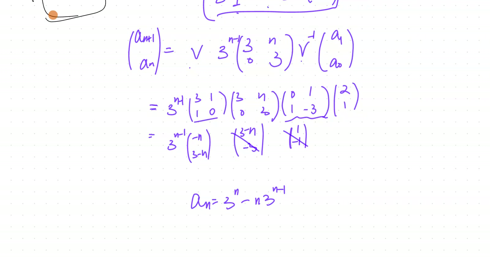
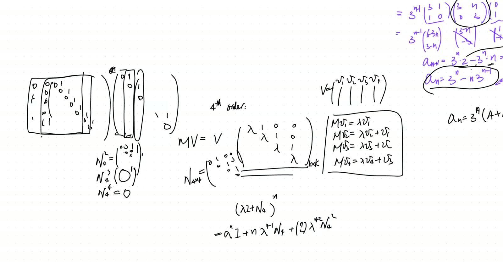
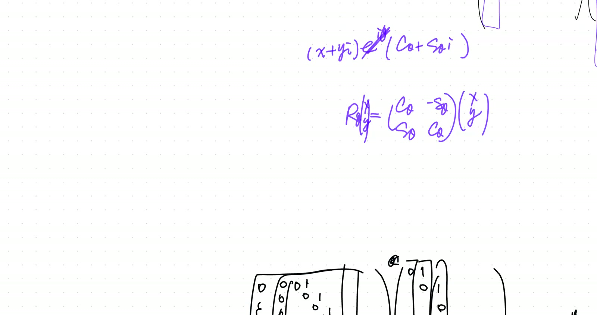

## Lead

Continues [2026-04-04 morning](2026-04-04-morning.html) by *explicitly computing* the closed form $a_n = (A + Bn)\lambda^n$ from $\mathbf{a}_n = V(\lambda I + N)^n V^{-1}\mathbf{a}_0$. Generalises to $k \times k$ Jordan blocks: $N^j$ shifts ones to the $j$-th super-diagonal, $N^k = 0$, and the binomial expansion of $(\lambda I + N)^n$ truncates after $k$ terms, producing $\lambda^n$ times a polynomial in $n$ of degree $k - 1$. Closes by introducing the **rotation matrix** $R(\theta)$ as an example of a matrix that is **not diagonalisable over $\mathbb{R}$**: its eigenvalues are complex $e^{\pm i\theta}$, with no real-direction eigenvector.

## Symbol dictionary

::: {.symbol-dictionary}
| Symbol | Meaning |
|---|---|
| $J = \lambda I + N$ | Jordan block ($k \times k$); $\lambda$ on diagonal, 1's on subdiagonal |
| $N$ | nilpotent: $N_{i+1,i} = 1$, all other entries 0; $N^k = 0$ |
| $\binom{n}{j}$ | binomial coefficient |
| $R(\theta)$ | 2D rotation matrix $\begin{pmatrix}\cos\theta & -\sin\theta\\\sin\theta & \cos\theta\end{pmatrix}$ |
| $e^{\pm i\theta}$ | complex eigenvalues of $R(\theta)$ |
:::

## Primitive notions and assumptions

1. **Jordan-block decomposition** ([morning Theorem 53](2026-04-04-morning.html)).
2. **Matrix binomial expansion** requires the matrices to commute. $\lambda I$ commutes with everything, so $(\lambda I + N)^n = \sum_j \binom{n}{j}\lambda^{n-j} N^j$.
3. **Nilpotent shift behaviour:** $N^j$ has 1's on the $j$-th sub-diagonal; $N^k = 0$.
4. **Euler's formula:** $e^{i\theta} = \cos\theta + i\sin\theta$.

## Theorems

::: {.theorem}
**($k \times k$ Jordan block power).** For $J = \lambda I + N$ with $N$ the standard $k \times k$ nilpotent:
$$
J^n \;=\; \sum_{j=0}^{k-1}\binom{n}{j}\lambda^{n-j}\,N^j. \tag{55}
$$
:::

::: {.theorem}
**(Closed form for $k$-fold-root linear recursion).** A linear recursion with characteristic polynomial having a single root $\lambda$ of multiplicity $k$ has general solution
$$
a_n \;=\; \lambda^n \cdot P(n), \qquad \deg P \le k - 1. \tag{56}
$$
$P(n) = A_0 + A_1 n + \cdots + A_{k-1}n^{k-1}$ has $k$ free coefficients, fitting $k$ initial conditions.
:::

::: {.theorem}
**(Rotation matrix has complex eigenvalues).** $R(\theta)$ has characteristic polynomial $\lambda^2 - 2\cos\theta\,\lambda + 1$, with roots $\lambda_\pm = e^{\pm i\theta}$. Real eigenvalues only when $\theta \in \pi\mathbb{Z}$. For generic $\theta$, $R(\theta)$ is *not* diagonalisable over $\mathbb{R}$ — no real eigenvector exists.
:::

## Derivation of Theorem 55 (Jordan block power)

**Commutativity.** $\lambda I$ commutes with $N$ (scalar matrices commute with everything). The matrix binomial theorem applies:
$$
J^n = (\lambda I + N)^n = \sum_{j=0}^{n}\binom{n}{j}\lambda^{n-j} N^j.
$$

**Truncation.** $N^j = 0$ for $j \ge k$, so the sum collapses to $j = 0, \dots, k-1$. $\quad\blacksquare$

**Explicit $k = 4$ case** (worked in recording):
$$
(\lambda I + N)^n \;=\; \lambda^n\begin{pmatrix}1 & 0 & 0 & 0\\ n/\lambda & 1 & 0 & 0\\ \binom{n}{2}/\lambda^2 & n/\lambda & 1 & 0\\ \binom{n}{3}/\lambda^3 & \binom{n}{2}/\lambda^2 & n/\lambda & 1\end{pmatrix}.
$$
Each $j$-th subdiagonal entry is $\binom{n}{j}\lambda^{n-j}$; pulling out $\lambda^n$ yields the form above.

## Derivation of Theorem 56 (polynomial-in-$n$ closed form)

From $\mathbf{a}_n = V J^n V^{-1} \mathbf{a}_0$, the first component (reading $a_n$) is a linear combination of $\binom{n}{j}\lambda^{n-j}$ for $j = 0, \dots, k-1$. Each $\binom{n}{j}$ is a polynomial of degree $j$ in $n$, so the linear combination yields $\lambda^n$ times a polynomial of degree $\le k-1$:
$$
a_n = \lambda^n \sum_{j=0}^{k-1} A_j \binom{n}{j}\lambda^{-j} = \lambda^n \cdot P(n).
$$
The $k$ coefficients $A_j$ are determined by the $k$ initial conditions $a_0, \dots, a_{k-1}$ via the Vandermonde-like linear system. $\quad\blacksquare$

## Derivation of Theorem 57 (complex rotation eigenvalues)

$R(\theta) - \lambda I = \begin{pmatrix}\cos\theta - \lambda & -\sin\theta\\\sin\theta & \cos\theta - \lambda\end{pmatrix}$. Determinant:
$$
\det(R - \lambda I) = (\cos\theta - \lambda)^2 + \sin^2\theta = \lambda^2 - 2\cos\theta\,\lambda + 1.
$$
Quadratic formula: $\lambda_\pm = \cos\theta \pm \sqrt{\cos^2\theta - 1} = \cos\theta \pm i|\sin\theta| = e^{\pm i\theta}$ (using $i^2 = -1$). Discriminant $\cos^2\theta - 1 < 0$ unless $\theta \in \pi\mathbb{Z}$. $\quad\blacksquare$

*Geometric meaning:* $R(\theta)$ preserves no real direction for $\theta \notin \pi\mathbb{Z}$. Complex eigenvectors $\mathbf{v}_\pm = (1, \mp i)^T$ live in $\mathbb{C}^2$. Over $\mathbb{C}$, $R(\theta) = U \operatorname{diag}(e^{i\theta}, e^{-i\theta}) U^{-1}$. Over $\mathbb{R}$, it isn't diagonalisable.

## Verification audit

::: {.audit}

- **$N^2$ for $k=3$.** $N = \begin{pmatrix}0&0&0\\1&0&0\\0&1&0\end{pmatrix}$. $N^2 = \begin{pmatrix}0&0&0\\0&0&0\\1&0&0\end{pmatrix}$. $N^3 = 0$. ✓
- **Truncation at $k=2$, $n=5$.** $(λI+N)^5 = \lambda^5 I + 5\lambda^4 N + 0 + \cdots = \lambda^5 I + 5\lambda^4 N$. Matches morning Theorem 54. ✓
- **$k=3$ closed form.** Triple root $\lambda$ gives $a_n = \lambda^n(A_0 + A_1 n + A_2 n^2)$ — three free constants for $a_0, a_1, a_2$. ✓
- **Rotation eigenvalue at $\theta = \pi/2$.** $\lambda_\pm = \pm i$. Char poly $\lambda^2 + 1$, roots $\pm i$. ✓
- **Rotation at $\theta = \pi$.** $\lambda_\pm = -1$ (double real root). Char poly $(\lambda+1)^2$. ✓ ($R(\pi) = -I$ is trivially diagonal.)
- **Dependency check.** Thm 55: binomial + nilpotent (clean). Thm 56: Thm 55 + linear combination + Vandermonde (imported). Thm 57: characteristic polynomial (clean). No circularity.

:::

## Lecture video

```{=html}
<video controls width="100%" preload="metadata" style="border-radius:6px;">
  <source src="https://github.com/chyj2026/linalg/releases/download/v0.7/2026-04-04-afternoon-2.mp4" type="video/mp4">
  Your browser does not support HTML5 video.
</video>
<p style="text-align:center;font-size:0.85em;color:#6b7280;margin-top:0.4em;">
  hosted on <a href="https://github.com/chyj2026/linalg/releases/tag/v0.7" target="_blank">GitHub Release v0.7</a>
  · also viewable in <a href="https://drive.google.com/file/d/1eZTAtBvFal7QcC-U0oFppBSHspT1dvcB/view" target="_blank">Google Drive</a>
</p>
```

## Key frames








## Dependency map

```{mermaid}
flowchart TB
    A["Jordan-block J = λI + N<br/>(morning Thm 53)"] --> B["λI commutes with N<br/>⇒ binomial applies"]
    B --> C["J^n = Σⱼ C(n,j) λ^(n-j) N^j"]
    D["N^k = 0<br/>(nilpotent)"] --> E["Truncate at j = k-1<br/>Theorem 55"]
    C --> E
    E --> F["a_n = λ^n · P(n),<br/>deg P ≤ k-1<br/>Theorem 56"]
    G["R(θ) char poly<br/>λ² - 2cos(θ)·λ + 1"] --> H["λ_± = e^(±iθ)<br/>Theorem 57"]
    H --> I["Complex eigenvalues:<br/>no real eigenvector<br/>NOT diag over R"]
    I -.-> J["Diag over C via Pauli sigmas<br/>(next session)"]
```

## Worked Socratic exchanges

::: {.exchange}
<span class="speaker">Teacher:</span> "$4 \times 4$ Jordan block to the $n$-th power. What's $N^4$?"
<br><span class="speaker">Helms:</span> "Zero."
<br><span class="speaker">Teacher:</span> "Binomial truncates after $k = 4$ terms. $\lambda^n$ on diagonal, $n\lambda^{n-1}$ on first sub, $\binom{n}{2}\lambda^{n-2}$ on second, $\binom{n}{3}\lambda^{n-3}$ on third."

*Teaching move:* nilpotent shift makes the binomial truncate. The Pascal-triangle-like sub-diagonal coefficients are the **same combinatorics** as Lucas's $1/(1-u)^r$ hypothesis from [Jan 24](2026-01-24-morning.html).
:::

::: {.exchange}
<span class="speaker">Teacher:</span> "$R(\theta)$ — eigenvalues?"
<br><span class="speaker">Helms:</span> "$\cos\theta \pm i\sin\theta$."
<br><span class="speaker">Teacher:</span> "$e^{\pm i\theta}$. Complex. Geometrically?"
<br><span class="speaker">Helms:</span> "Rotation doesn't keep any real direction."
<br><span class="speaker">Teacher:</span> "Right. Eigenvectors live in $\mathbb{C}^2$. *Not* diagonalisable over $\mathbb{R}$."

*Teaching move:* algebraic fact (complex eigenvalues) ↔ geometric fact (no preserved real direction).
:::

## Exercises given

::: {.callout-important}
**Homework.**

1. Write out $(\lambda I + N)^n$ for $k = 5$ — all $5 \times 5$ entries.
2. Show: a $k \times k$ Jordan block has *only one* eigenvector (1-dimensional eigenspace), regardless of $k$.
3. For $R(\theta)$ with $\theta = \pi/3$, find complex eigenvectors and the change-of-basis $U$ such that $U^{-1}R(\theta)U = \operatorname{diag}(e^{i\theta}, e^{-i\theta})$. Verify.
:::

## Fragility summary

::: {.fragility}

- **Weakest step.** Theorem 56's claim that $k$ free coefficients $A_j$ uniquely fit $k$ initial conditions requires non-degeneracy of a Vandermonde-like linear system — imported, not proved.
- **Matrix binomial theorem** requires commutativity. $\lambda I$ commutes with everything, so OK here.
- **Complex eigenvectors** live in $\mathbb{C}^2$. The real-Schur decomposition (block-diagonal with $2 \times 2$ rotation blocks) provides a real treatment but is not derived here.
- **Confidence.** Theorems 55, 57: high. Theorem 56: high with the Vandermonde import.

:::

## Related sessions

- **Precursors:** [Apr 4 morning](2026-04-04-morning.html) — Jordan-block setup. [Jan 24 morning](2026-01-24-morning.html) — telescoping route. [Feb 28 followup](2026-02-28-eigenvalues-followup.html) — eigenvalue framework.
- **Sequels:** [May 2 morning](2026-05-02-morning.html) (stub) — Cayley–Hamilton. Future Pauli-sigma / complex-diagonalisation sessions previewed.
- **Tuesday rerun:** [Apr 4 tuesday-rerun](2026-04-04-tuesday-rerun.html) (stub).

## Full transcript

::: {.callout-note collapse="true"}
## Verbatim transcript of the session

```{.txt}
Just dealt with, and I want to pick up where we left off. However, alternatively, because we won't be doing anything more about the topic of those non-diagonalizable matrices until the next group session, and so there's an alternative. So tonight, I can actually look at more examples of really just using the diagonalizable matrices to do stuff. However, I do want to finish where we were in our example.meaning I wanted to recover for that two by two linear recursion. Whenever we're doing a double root, why in our final result here and there came that n term? The dependence not only as a geometric sequence, but also depends on the linear term of the n. So I do want to finish that much. And after we finish it, I'll go back and show you more some other related examples. Okay, come back to our recursion. We actually have this now: a n plus.Plus one. Hey, come on. Sorry, a n plus one. One second. Let me actually just. Okay. Okay. So this is where we got our recursion. A. Okay, one second. Is the a n plus one equals to six of the a n minus nine.of the a n minus one, but after translating it into the vector form, what we're getting is that a n plus one equal to this matrix negative uh six negative nine one zero, which we call the m now operating on the a n, and eventually we got to the place where in fact our a this matrix m now, and this one gives us a final formula for the a n, a n simply equal to the m raised to n power times the a one, which is I gave you as a.零等于一，a一等于二。That's the initial condition I gave ourselves, is it not? So that we defined the a zero simply as one, two. Now, so this is a m to the n power times one, the two. We know eventually the initial condition and find the eigenvectors or those secondary eigenvectors. They only serve to nail exactly what would be the coefficients. What's really important is that matrix term. What's going to happen there?Inside that matrix, because that's the one dependent on the n here. So we have achieved the following: we found two eigenvectors. One is a three one. This one is genuinely an eigenvector, so that whenever you operate the M on it here, it's going to give you three times of that three one itself. That's actually easily double-checked. Makes.That's this. This equal to three, three, one. Oh, we solved it. Remember, we actually went through, and this is what we did in the previous session. We found the eigenvalue by looking at the I minus lambda I determinant, actually equal to the six minus lambda negative nine one minus lambda, and this one multiplied by the x and y would equal to zero. Oh, to begin with, we.Need the determinant to be equal to zero, and that leads to a quadratic equation which has a double root. This gives us lambda squared minus six lambda plus nine equal to zero. Remember? Yeah. And that gives a double root lambda equal to three. And now we're actually solving the m minus the lambda minus three i now, which gives us a three negative nine one negative three, and operating on the x and y would equal to zero.
We're solving for the nontrivial solution, which gives us the only eigenvector. It's arbitrary scaled version of the three one. Makes sense. But at the same time, though, we also found a v two, which is by no means the eigenvector. The v two actually follows if you operate the m on the v two, and would give you three times the v two, and then plus the v one, so it gives you the actual the v one. Let's double check the the v two we found. It's actually this is what.We did in the previous session, so I'm not going to repeat the process. I remember we found one zero. Let's try it. If we operate this six negative nine one zero operating on the V two now, and the meaning one zero, what we're getting is simply going to be the six of a one, and would that equal to the three times of the V two?m plus another three one, which is a v one. Yeah, everything is perfect. And knowing the behavior of the m now, it operates on the v one, meaning we're we're combining these two behavior into one. Oh, sorry, I have already written this down. And m operating on the three one gives you three times of three one. Meanwhile, m operating on the one zero give you three times of the one zero and add onto a three one. So I want to bundle up this.Behavior into I'm operating on the three one one zero would equal to a column manipulation. So I copy down the three one and the one zero, the multiplied by one. I want to fill in the numbers in order to capture this column manipulation. So what numbers do I fill in?And remember, you think of the result on the second column. It's a three times of the first column, and plus, sorry, three times of the second column, plus one copy of the first column.嗯。嗯。I don't know how to do that. Let's see. This is a column manipulation. I'm glad you're saying this because we just covered that. Very new, and it takes a lot of practice to begin with. And remember, when you multiply on the right by a matrix, now you're getting a column manipulation. So we're going to deal with it generically. So if I have the v one and v two, each one is a column all the way to the v n now, and I.
I want to write in a matrix here so that I can achieve the certain result. Okay, and meaning, if I finally know the result on the first column here, it turns out to be four times of the v one minus three times of the v two plus seven times of the v six. If this is the result eventually on the first column, so where do we fill in the numbers? Well, to begin with, by the rules of a multiplying matrix.If I want to end up the numbers on the first column, then I'm only using one column in the second matrix. I'm only using the first column. No other columns will be participating, right? Because remember, grabbing the numbers here, matching it with individual rows here, would give you individual elements here in the first column. So we do know all the numbers need to show up right here. Now the question would be, what where do we put the scaling factor of the first column for?When you think of it, it's being filled with different numbers now. When you do the dot product, when you do the match, which coefficient would be matched with these numbers? The first one would be. Yeah, you're right. It's the first one, the count to the equal to the index here. So we put the four here. And three is the second one. That's right, exactly. We put the nine to three. The second, whatever the row in that order on the column here matches with the column number on the left.And then finally, there's a positive seven, and these are zeros. And there's going to be a positive seven on the sixth number, so this is positive seven. And and those are so fundamentally knowing what's going to be the result of the first column helps me nail what what are the coefficients on the first column of our unknown matrix. Do you follow? Yeah. Okay. Now, what if the second column would it turn out to be the third column? I'm justMoving the third column onto the second column, then how would you fill up this set numbers? So it would just be one and B three at the third row. Say it more clearly. Just read off all the numbers from top down, please. Zero, zero, one, and then rest of it's all zero. Yeah, brilliant. You got it. Let's come back. Then knowing the result here.would be the result operating on the three one is simply three times of itself. So we actually know the result m operating on the vector one would give us because it's eigen vector would give us three times of v one. It operates on the v two won't give us three times the v two because we won't be able to find another eigen vector. So it gives us second best. It will give us three times the v two now, but plus another copy of the v one. So this is the result of the column manipulation.So how do we fill in the numbers now? Here. So the first column there will be um three and three zero. Yeah. And then the second column will be um one three. Yeah, you got it. That's excellent, like that. So although that's not a diagonal matrix, and it's not as convenient if.Want to power it up, but it's pretty good. We can still do it now, and we'll see what we have for the m now. The m would equal to, and these are the seven vectors we found. I'll just call that the v now, because eventually to understand the structure, we know they just contribute to pretty tedious calculations of the coefficients. These are no numbers, so there's a v here and there's a v inverse. Except for in the middle, it's not diagonal anymore, but instead it's almost diagonal with a new.
Hilten matrix, meaning it is only filled on the secondary diagonal with those ones here, but it is two D, so that's easy enough. Make sense? Okay, and our job is to actually take m to the nth power. We want to find out what's going to happen, and because that's our final answer, we actually know our a n now simply equals to whatever this m.raise to the nth power, then multiply the a zero vector now. So it is vital that we know how to raise its m to the nth power. And let's do so. So we're getting actually m raise to the nth power would actually equal to the v, and we're really just raising this middle. And however, I would encourage encourage you to write it as the three lambda, and then plus the new potent matrix zero one zero zero, and that whole thing raise to the nth power.和 b 翻转，正确。 OK， well， let's power this up。 I recommend we do binomial expansion。 Well， to to do that， you probably want to figure out what is going to be this guy squared to begin with， and what is that guy cubed or raised to the third power。所以，他们纯粹就是，嗯。So, no matter how high the power is on the nature, so always Pearson, it's zero, right?Yeah, yeah. In fact, when you square it, we're already getting zero. Cube, that they're all zeros. So only the first power is not zero, and that's pretty good. And then let's see what's happening. This is three lambda. Oh, that's not three lambda. Three is a lambda. That's three i. Sorry, I miswrote here. Then could we actually take the binomial expansion of this? What is going to become of it when you raise it to the nth power?So, first is n choose zero, which is one. So, a yeah, yeah, the binomial expansion, the first term is.三到的 n 次方， right? Yes. But it's still going to be a matrix. Remember, every single term in our result has got to be a matrix. And then we're adding the second term. And then the second term would be n n times.
Um, three and minus one.嗯，I. And then, uh, this zero one zero zero matrix. Beautiful. That's it. The n here is coming from the combinatorics. It's a binomial expansion number. And then it will be n choose two. Excellent. And then.Um, three to the power of n minus two i， and then just zeros. Uh-huh. So in fact, we do know the minute we're distributing more than two powers onto that new potent part, they all vanish. So that's it. All the subsequent terms are zeros, aren't they? Yes. Let's reassemble them together. These are the only two terms we're getting, and what we're getting, I can.Pull out a three to the n power now, and the inside would be a one and a one. These are just a diagonal. Oh, let me actually pull out a three to the n minus first power. Then, in fact, the diagonal are left with a three and three. So this is the contribution from the first term. And second term, you see, they're independent of each other because they have non-zero elements in non-overlapping locations. So that's just going to be remaining n here, right?That's all there is. And on top of it, you got your V, and you got your V inverse, and you have your a zero, which is made up of a zero, a one. Oh, sorry, the other way around, a one, a zero. These two make sense. And this will give you your a n plus one and a n. Now, why don't we expand them out? I know these are pretty nasty numbers, but remember, they're just numbers.Whatever inside the V and V inverse are just numbers now. And let's see what's going to happen. Let's focus on what is going to be the A n then. When you do all of those, you're going to end up with. If you really want to, you can plug in those numbers. Yeah, it's not horrible. Why don't we do it? Why don't we do it for once? And our B is found as actually the one three one and the one zero, right? That's our V one, the V two. Yes.You know, that's all horrible, and then followed by three to the n power, which I can pull up front now and save it for the very last, and then multiply by the three n zero three, and then followed by the v inverse. To get the inverse, we oh, you you work it out yourself, and then we can match the answers.嗯。嗯。
And give me a signal to tell me whether you're getting the same. Here, I worked out the inverse by using the cofactors.Yeah. All right, now let's work out. And just, I actually want to simplify everything into a column vector, so that I have a closer formula for a n, and then we can plug it back in, double check whether it works. So this is a.嗯。嗯。嗯。嗯。How did you simplify after the three n minus one times six minus three n and then three? Yeah, exactly. This is correct, but I try to rewrite it. I did some algebra to rewrite it in a way that's consistent.than with this, so what I did is that I actually give it, you know, I'm going to actually tell you what I did. I made it into the three n times of three instead of times of two. But if I write it the three n times of three, I need to subtract it by another three n, right? And now I'm going to combine it with the other subtraction, so it becomes n plus one. Do you see? On that, I can rewrite it in this form, which is exactly the same closed formula, except for.
or I just a scaled version where the index upgraded from the n to the n plus one. Makes sense. Yeah. Let me actually turn on my phone. So usually when I'm working, my phone is always turned off. But I had a miscaption.Morning. So when I came back home, I turned on my phone. But anyway, so now you see, we get the perfect solution. And can we go back and try? First, is this consistent with what we had earlier? Our general theory. If the three here is a double root, we do know that the a n would equal to three to the n power. But now we don't really have another geometric sequence. Instead, we make up for it by there's a a and then plus a b n. This is a our general theory that we worked out.Before, by actually just doing algebraic cancellation, a very tedious manipulation of those recursive equations, right? We reached that conclusion before. Now we're reaching it. I would say maybe not through a simpler route, but definitely from a different point of view, so that the structure would be obvious. Whenever we actually diag or almost diagonalize the matrix here, up to the diagonal, and plus the presence of a nilpotent matrix, which actually.if outside the n presence here that term of the n there makes sense啊，yes. My question would be: To what extent is this generalizable? Meaning, if I want to immediately change it into a fourth degree recursion, where we have a quadratic root, all of those are true. Well, in this case, I'm not going to even bother setting things up. I would really just say it really focuses on the following: What if it's a fourth order now?And we end up facing the task of powering up such a matrix. It is going to be a two-two. I mean, the lambda is two. In fact, let me just generalize it with after lambda. So our matrix is lambda and lambda, lambda, lambda, and then followed by a one, one, one. Why do I fill it up in such a manner? This is a generalization, meaning we find a first eigenvector so that M upper.乘的 v 一， actually give us lambda times the v 一， but m operating on the v 二， I can't find a second eigenvector now， so we want that to be the second best。 It would be the lambda times the v 二， and plus one version of the v 一。 Likewise， the m operating on the v 三 would give us lambda times the v 三， but plus one version of the v 二， and m operating on the v 四 would give us lambda of the v 四 add onto a v 三。 If I want to achieveAchieve this now. To begin with, can you tell me? Are you convinced this is that matrix? Meaning, this is the matrix you're left multiplying. What we're getting would be this now. I'm operating on the this v v is made up of the four columns. Basically, it's the v one as a column, v two as a column, v three as a column, v four as a column now. Then I'm operating v would equal to the v times this. Use the same idea.Please practice again, because we know how to write those column manipulation. Double check, or do it yourself. Can you fill up that matrix according to this result? And if you agree with me, you want to give me a signal.
嗯。嗯。And then the other side is just all zero. You're right. Yeah, yeah, you're reaching the same part.Getting used to and this idea. In fact, later in math modeling and in deeper STEM subject here, this new potent matrix, in combination with the diagonal matrix, show up so consistently. So that's why they're worth studying. If that's the case, we're trying to power this up now. And instead of a two by two, right now it's four by four, and I'll generalize it into k by k. You know, I have upgraded the corner a this power now, or rather the dimension. And I want you to observe what changes.What doesn't? We're still facing the the issue of I want to do the lambda i and then plus this new potent matrix. I'll still call it the n now, except for it's n four by four now instead of n two by two, and that n is defined as the zero zero zero zero with the one on the off diagonal. Okay, so what's going to happen when you do this n four by four raise to the nth power? This n could be really huge, because we're looking at this n has a potential of approaching.Infinity。 We're working out what is going to be the a n now, and can you carefully do the binomial expansion of this? To begin with, Helms, can we work out what is n squared? This n four squared, what is n four cubed? What is n four fourth power? It takes a bit of work, but it's not horrible.嗯。嗯。
嗯，这 also be all zero. Now you have to be a bit more careful.嗯。嗯。The second tower would be.零零一零，然后零零零一，然后的guess是just zero。嗯，In fact, actually, Helms, as a good practice here, let's actually think in this manner. In the future, you could have an of arbitrary high dimension, which is made up of the diagonals, arbitrarily long, and with only the one on the off diagonal, right? And you want to square it, but why don't we look at是 column manipulation。 It's zero, zero, zero, zero, and one, and one, and that that one. If you understand, it's a column manipulation. What is going to become of the first column? The first column definitely would be zero, right? And what's going to become the second column? Also zero. What's these two numbers? What do they mean? SoThe first number means that, like in the result, there will be one, like one. Yeah, and the second number is that is there's none. Yeah, that's right. So, in fact, we're saying the second column would would be the original first column. Meaning, after we do this column manipulation, the first column would actually become the second column, and the second column we become the third column, right?So it really just says we're pushing all the columns to the right by one unit and fill in a new column filled with zeros. This is what's going to happen, right? Yeah. And when you multiply by that new potent matrix again, you're doing that pushing that that shift. You shift all the columns to the right. The earlier column becomes the next column now, and on the very left, we're filling in another zero column. No wonder the result is every single time you're raising to a higher power.
We're just pushing that ones to the right upper corner by one more place. So basically, this this matrix would be having fewer and fewer ones. Every single matrix, when you go for a higher power, would have one fewer one in it. And eventually, when you do the fourth, it would become zero. But these won't. So the squared would actually become zero zero, and you got the tertiary diagonals occupied by the ones. There are only three, uh, two ones now. And cubed, there's only one one in the very这个角，和其它位置都是零，明白吗？OK，那么有了这个在你腰上，我们来仔细做这个展开，看看我们得到什么。所以，沿着n times lambda to the power of n times i， and then plus we have a lambda to the n power times i， very good。 lambda times n minus one， and then times the this matrix， the original matrix。Yeah， but don't we have the combinatoric coefficient? There'll be n choose one, so also, of the n. Yeah, that's right. We still have the n, but we don't stop here. Then what? And choose two times lambda n minus two plus the n four to the power of three. Correct. I mean, yeah, two.And you go for n to three, and lambda lambda minus three, and n four cubed. And we stop whenever. In fact, right now we can stop right here, because the next one involves n four to the four, which will be zero now. Meaning, once we have the power matching with the dimensionality of the Neumann matrix, that's where the Neumann matrix power will become zero. We could stop. It's always going to be a finite expansion. All right, then can we write it back into a four?Rifle matrix， then where do we fill in the numbers?Those first, like right and L. Yes. Well, to begin with, they're occupying different locations. Yeah, so you can just fill them in. First, we have a lambda to the end, all on the diagonal. No doubt about it, right? Yeah. And go carefully fill out the rest, please.And then the second diagonal would be all n times lambda n minus one. Yes, so in fact, we do have the presence of the n here.
Not multiple of the lambda and minus one. Eventually, we do know, no matter every, no matter what, everything is scaled by lambda to the end. So, why don't we pull out the lambda to the end? If we do so, it becomes actually easier, cleaner. So, what we have would be actually this now. All of these are ones, one, one, one, one, and on that section, we just have a n over lambda, right? And these are secondary diagonal all the way to the n over the lambda. What about the tertiary diagonal?Um, and then it would be n choose two. Yeah, but it's going to include the n squared now plus the n and over the lambda squared. So this is what we're having. Oh, sorry, that's n minus n because it's n choose two. So that it begin with the n times n minus one. Da da da.And finally, we got a one last term here, which is n choose three, which is n times n minus one times n minus two. No matter what, it's cubic, and over the three factorial of the lambda cubed, right? Yeah. Okay. Now, remember, this is going to be the middle bulk part of the m raised to the nth power. We still need to multiply by a bunch of numbers. Those are the v inverses, and then there's going to be the a three, a two, a one, a zero, because remember.Number, this is a fourth order recursion. We have to actually lay side by side four consecutive terms in the sequence as a vector now, and this is our v now. But no matter what, I mean, however complicated that these terms are, they're just numbers. They're just a bunch of numbers. Oh, hold on, I shouldn't include this. Those are just numbers now, and the dependence on the n shows up only in the middle part. And this is actually where we actually highlight our dependence on n, correct?Yeah. Okay, could you envision what's going to happen when you isolate your AN now, which is on the very bottom? What do those terms include?嗯。嗯。嗯。
嗯。So we have to plug in the lambda equals three. I no, you don't have to. Or just know whatever the lambda is, number whatever the a two, a three. I didn't even give you what they are. I wanted to focus on treating the numbers that finally a melange of the numbers that could be bundled up into the coefficients. You can call them finally after you do all the calculation, they just become a.capital ABCDs， but then focus on what's dependent on n， because that's what's going to finally remain in the formula. Right? In the earlier form here, remember what we did here. You just multiply all those numbers, and eventually the dependence on n show up in such a form. And this is what we were confirming. Do you follow? Yeah. So I I know this is a little tedious, but I want toto be able to see through something, not being affected by them, and just know if we're only concerned with the final component here, the a n now, what would be the terms and their dependence on n that's going to remain? If there's a huge calculations of a bundle of numbers here, eventually you get a number. I just feel free to call that number arbitrary number, capital A, capital B, etc., etc. So it will be a nequals capital A plus and then capital B n plus capital C n squared and then capital D n q。 So you're saying there's a and everything.Is scaled by the lambda n, so let's get that right first. On the right, on the outside, I still can write this, right? Yeah. And then inside, we have some kind of a number. And multiply the n cubed. We know that for sure. There's gonna be some n, but I want you to see though. There's contribution to the n term from here, from here, and from here. When you expand out the numerator, they all contribute the n term. The power, the first, thePower then, but who cares? All of these are linearly combined, so you are right by just putting everything, throw everything into that coefficient a, and there's just be a n term. I agree with you. And then, and there would be a b n squared term, right? Yeah. And that that's coming from here and from a sum term over here. And finally, there's a c n cube the term, although the only contribution from here. But just remember, they will be multiplied across.The term here, and then there will be a constant term because after all, there will be out. Oh no, no, these are divided by n here, but we do have a constant term right there. So there's going to be a d here. Done. By the way, this is what our old theory told us. Whenever we have multiple roots, now we're making up for the missing independent lambdas by these increasing powers of n, so that your final sequence would be a linear.
组合，或一个阶乘序列的兰姆达 raised to the n 次方， scaled by a polynomial version of the n。 here。 I hope you still remember that's a standard result。 Tell me that to you。 Yeah。 Yeah, there you have it。 So this is basically another take on higher order linear recursions, and that's a discrete version. In fact, one later.When you learn calculus, and or you do mathematical physics, or you do engineering, you shall encounter two copies or two versions. This is a discrete version. There's a continuous version. And there, instead of solving for recursion, we're solving a differential equation. And the same structure, the same matrix here, will show up. The same manipulation between the diagonal part and the nilpotent part, and the structure of the final solution, all of these will be copying what we're doing now. So that is why this is a of so much.Much importance. Are we completely comfortable? Yeah. Okay. Now let's actually come back to more diagonalization. And we do realize here, diagonalizable matrices are convenient because they just you can immediately change them into diagonals. And however, though, how do we know for sure that a matrix is diagonal? I give you examples where you can eyeball they're not diagonal, diagonalizable. But can we tell for sure what can矩阵是可对角化的。Well, to begin with, if we investigate the two by two matrix matrices now, and then let's actually look at a special type. If they have to do with rotation, and we have already figured out, right? Rotational matrix by the angle of the theta in the two D. What is that rotational matrix? If it doesn't do any dilation, it doesn't change the metric or the distances, it does a pure rotation. We covered that.That a while back. Sin, cos. Yes, it begins with the cosine. Um, cosine theta. Yes. And then. Sin theta. And then. Helms, you want to do? Apparently, you do remember, but maybe.Maybe not very accurate in the detail. Remember, in two D, there's something really convenient. If you operate on x and y now, you're trying to fill in these numbers. But fortunately, it's equivalent to multiplying the complex numbers. Remember? Yeah, that's what's so beautiful about two D. So whenever in doubt, you could double check by going for the complex number x plus y i and multiply by the e i theta. This is supposed to be what the rotation is about. But you can.Translated into the RCS form, into the cosine theta plus the sine theta i, and then multiply things out, and do your matching, and fill them into the matrix. There will be negative sine theta. Yes, that's it. But what about the second row? And then sine theta cosine.Yeah, very good indeed. Then, can we try to find out what are the eigenvalues and the eigenvectors of this equation? Hey, before you do that, can you both make a guess? Maybe zero for the eigenvalue.
嗯，Remember the eigenvalue means something. It means after the rotation, we're getting the same vector itself, except for a scaling factor. So, what should be the eigenvalue? Well, if you don't see through it, well, you're more than welcome to simply solve it. Because every single practice of solving the eigenvalue is a very useful one. This is actually more.more useful than others. Go ahead, try to find the eigenvalue. So we cosine theta minus um lambda, and then negative sine theta.然后，sin theta，然后cosine theta，minus lambda，determine that equal to zero。嗯哼，You're right. And go ahead and solve that equation.嗯。嗯。嗯。嗯。嗯。
嗯。嗯。So it's cosine theta， and then plus or minus i sine theta。 That's right。 So in fact, you. realize the two eigenvalue themselves are complex numbers. We don't have real eigenvalues. What does that even mean? I mean, in terms of the vector, the x and y are real. And if we're looking for a special direction where this rotation keeps the direction, only dilating it, it doesn't exist. Except for there's one case if the theta happen to be equal to zero or ninety degrees, oh sorry, one eighty degrees, then in fact the eigenvalue becomes theReal becomes real now, becomes a positive one. That is true. But majority of the cases, the eigenvalue themselves are irreducibly complex. That actually means the rotation is a rotation. It's a rotation. There's no direction kept, and the eigenvalue themselves are the complex numbers. And if that's the case, do we call that diagonalizable or non-diagonalizable? We call that non-diagonalizable. The reason is that if you use that a complex值，ei theta itself is the eigenvalue, right? But if you actually plug that in, well, the your solution to the xy coordinates are also imaginary, they're also complex numbers. We won't be able to get a real direction, because like we said here. In fact, even intuition assures us this rotation will not actually leave any direction unchanged. So this is a two D case where it is very simple. It won't be diagonalizable.It doesn't really have eigenvectors because a pair of eigenvalues, they're both imaginary, complex. They're not even real numbers. Then how do we treat this kind of an equation? How do we square them up or power them up? In fact, the rotation matrices are very nice. They are connected to what we call the three sigmas. And more on that in our next session. We did cover significant ground now. Well, this week has been dense, so I would say take your time to really grapple with it.Thank you for being here and taking the recording for other kids. Have fun! Keep up your good work, Holmes. You've been really doing well. Thank you. Thank you.
```
:::
